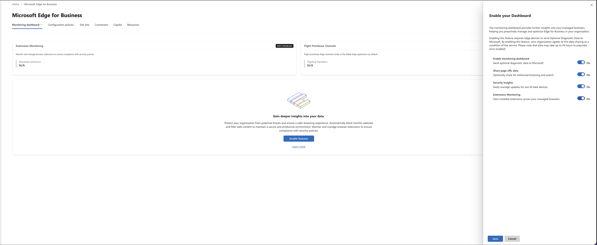
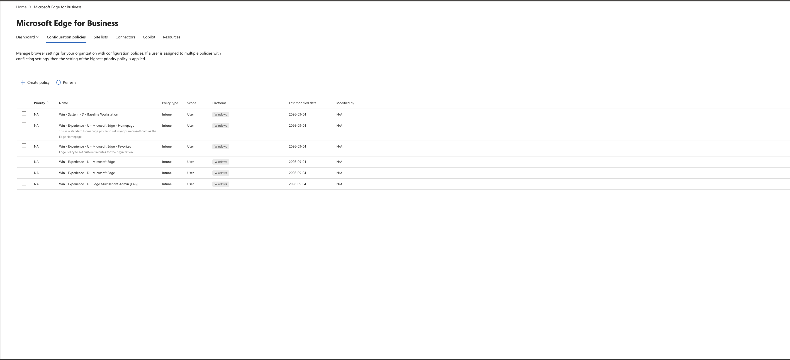
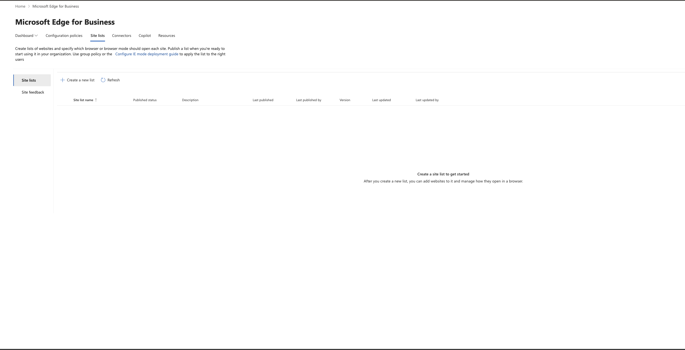
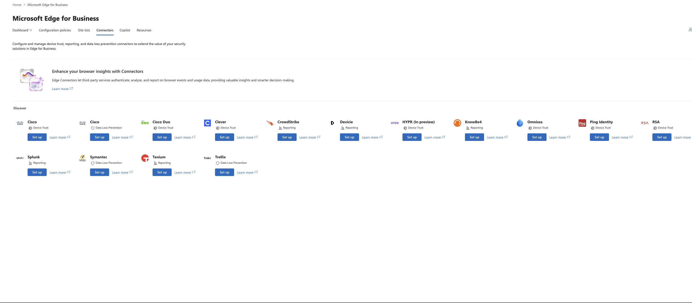
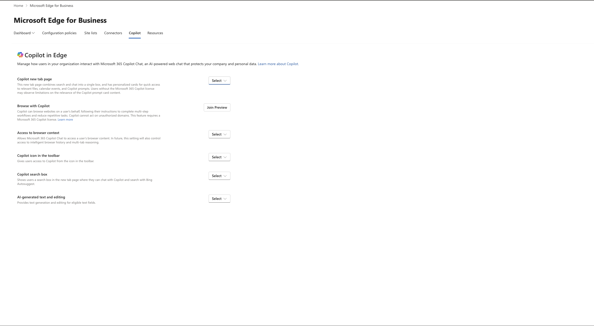
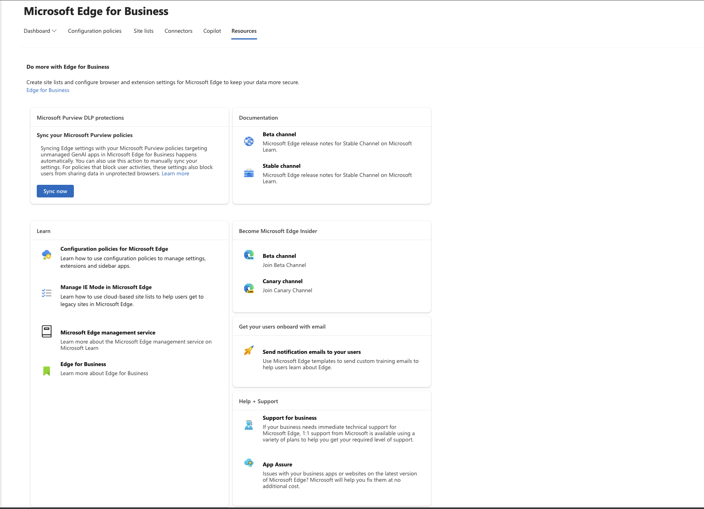

# Microsoft Edge for Business: Cloud Management Walkthrough and Security Guidance

A practical walkthrough of the **Microsoft Edge management service** in the Microsoft 365 admin center (**Settings > Microsoft Edge**), covering every tab in the current portal, what each control actually does under the hood, and how to configure it with a security-first mindset.

> **Verified against Microsoft Learn:** 27 September 2026. Edge ships a new major version roughly every four weeks and this portal changes frequently. Anything flagged **Preview** or **Portal/Docs mismatch** below should be rechecked before you build a customer baseline on it.

---

## Contents

1. [Prerequisites and access](#1-prerequisites-and-access)
2. [How cloud policy fits with Intune and GPO](#2-how-cloud-policy-fits-with-intune-and-gpo)
3. [Tab 1: Monitoring dashboard](#3-tab-1-monitoring-dashboard)
4. [Tab 2: Configuration policies](#4-tab-2-configuration-policies)
5. [Tab 3: Site lists (IE mode)](#5-tab-3-site-lists-ie-mode)
6. [Tab 4: Connectors](#6-tab-4-connectors)
7. [Tab 5: Copilot](#7-tab-5-copilot)
8. [Tab 6: Resources (and Purview DLP sync)](#8-tab-6-resources-and-purview-dlp-sync)
9. [Recommended security baseline](#9-recommended-security-baseline)
10. [Feature status matrix](#10-feature-status-matrix)
11. [Known gaps and gotchas](#11-known-gaps-and-gotchas)
12. [Sources](#12-sources)

---

## 1. Prerequisites and access

| Requirement | Detail |
|---|---|
| Portal path | [admin.cloud.microsoft](https://admin.cloud.microsoft/?#/Edge) > **Settings** > **Microsoft Edge** |
| Admin role | **Edge Administrator** (Entra built-in role). Global Admin also works but is not least privilege. |
| Minimum browser | Edge 115.0.1901.7 for configuration policies. Edge 135.0.3179.85 for Connectors. |
| Client platforms | Windows, macOS, iOS, Android (configuration policies). Connectors: Windows 10/11 and Server 2016+. Monitoring data: **Windows only**. |
| User sign-in | Users must be **signed in to Edge with their Entra ID work account** to receive cloud policy. |
| Sovereign clouds | Edge management service is **not available to GCC** customers. |

> **MSP / partner note:** Microsoft Learn states *"GDAP roles are currently not fully supported"* for this experience. Test your GDAP relationship with the Edge Administrator role before assuming you can manage this portal from a partner tenant. If it fails, you will need a native admin account in the customer tenant.

Source: [Get started with configuration policies](https://learn.microsoft.com/deployedge/microsoft-edge-management-service)

---

## 2. How cloud policy fits with Intune and GPO

This is the part most people get wrong, so read it before creating anything.

### Two policy types

When you create a configuration policy you choose between:

| | **Cloud policy** | **Intune policy** |
|---|---|---|
| Where it lives | Edge management service only | Edge management service **and** Intune (Devices > Configuration), kept in sync |
| Priority ordering | Yes (0 = highest) | **No.** Conflicts are not auto-resolved |
| Extension requests workflow | Yes | No |
| Organization branding | Yes | No |
| Secure Password Deployment | Yes (cloud only) | No |
| Scope tags / RBAC | No (no role restrictions inside the Edge service) | Yes when created in Intune |
| Assignment | User groups only | User **and** device groups, exclusions, assignment filters (when created in Intune) |

### Precedence rules

1. **GPO / MDM beats the Edge management service.** If a setting is configured locally by GPO or MDM, cloud policy for that setting is ignored.
   - To flip this, set `EdgeManagementPolicyOverridesPlatformPolicy = 1` (registry only, `HKLM` or `HKCU\SOFTWARE\Policies\Microsoft\Edge`).
2. **Device policy beats user policy.** Group assignment in the portal applies as *User* policy. Policy delivered via `EdgeManagementEnrollmentToken` applies as *Device* policy.
   - To flip this, set `EdgeManagementUserPolicyOverridesCloudMachinePolicy = 1`.
3. **Cloud policy priority** only resolves conflicts between cloud policies. Intune policies show `NA` for priority.

### Kill switch

`EdgeManagementEnabled` (Windows, Edge 115+) controls whether the browser checks in with the service at all. It is on by default for Entra-signed-in profiles. Setting it to `Disabled` stops cloud policy retrieval. Treat this setting as security-relevant: if a user or rogue GPO disables it, your cloud controls silently stop applying.

> **Recommendation:** Pick **one** authoring plane per setting. If you already run Edge through Intune Settings Catalog (as in the example tenant below), keep security-critical settings there and use the Edge management service for the cloud-only features (branding, extension requests, connectors, Copilot tab, monitoring). Do not configure the same setting in both.

Source: [Get started with configuration policies](https://learn.microsoft.com/deployedge/microsoft-edge-management-service), [EdgeManagementEnabled](https://learn.microsoft.com/deployedge/microsoft-edge-policies/edgemanagementenabled)

---

## 3. Tab 1: Monitoring dashboard

The monitoring dashboard is **opt-in** and requires Edge to send **optional diagnostic data** to Microsoft. Data takes up to 24 hours to appear after enabling. Monitoring data is **Windows only**.

### Toggles in the current portal

| Portal toggle | What it configures | Security / privacy guidance |
|---|---|---|
| **Enable monitoring dashboard** | Sets `DiagnosticData` at tenant level to send optional diagnostic data. Mandatory for everything else on this panel. | Acceptable for most orgs. Check against your data-processing agreements and any regulated-industry (HIPAA, public sector) privacy commitments first. |
| **Share page URL data** | Enables `UrlDiagnosticDataEnabled`, sending page URLs and per-page usage to Microsoft. | **Recommend OFF** unless you have a specific need. It is on by default in the panel. None of the security features below depend on it according to the docs. |
| **Security Insights** | Edge update status and security update alerts (CVE-driven). | **Recommend ON.** This is the most valuable security feature on the dashboard. |
| **Extensions Monitoring** | Configures `CloudProfileReportingEnabled` across the tenant. Surfaces extension inventory and user extension requests. | **Recommend ON.** Extension visibility is a major gap in most tenants. |

> ⚠️ **Portal/Docs mismatch:** Microsoft Learn describes a single *"Enable version monitoring"* toggle with two radio options (*with* / *without* URL data). The live portal (screenshot above, Sept 2026) shows four separate toggles, all defaulting to **On**. Behaviour appears equivalent, but the defaults matter: **untick "Share page URL data" before saving** if you want the privacy-preserving option.

### What you get once enabled

**Edge update status**
- Device count per channel (Stable, Extended Stable, Beta, Dev, Canary).
- *Update available*: not on latest version.
- *Update recommended*: two or more releases behind.
- Actions:
  - **Force auto restart when device is idle** (20 minutes of no input; tabs restore, but unsaved form input can be lost).
  - **Recommend restart** (notification only).
- Devices silent for 30 days are purged from the view. Actions can take up to 90 minutes to reach clients.

**Security update alerts**
- Configurable minimum severity threshold.
- Shows version, severity, CVEs addressed, affected devices by channel, latest version per channel.
- Includes zero-day fixes.

**Extensions monitoring**
- Aggregated view of installed extensions across managed browsers and where extensions are blocked.
- **Extension requests**: users who hit a blocked extension can request it; you approve or deny per configuration policy, then *Mark as resolved*.
- Only reports profiles whose identity tenant matches the managing tenant. For users on multiple devices, only the most recently signed-in device reports.

> **Recommendation:** Set the security alert threshold to **High** as a minimum, and pair "Update recommended" devices with the **Force auto restart when idle** action on a scheduled cadence. Browser patch lag is one of the easiest exposures to close.

Sources: [Monitoring dashboard](https://learn.microsoft.com/deployedge/microsoft-edge-management-service-monitoring-dashboard), [Extensions monitoring](https://learn.microsoft.com/deployedge/microsoft-edge-extensions-monitoring)

---

## 4. Tab 2: Configuration policies

This is where every Edge policy lives, whether authored here or in Intune. The example tenant shows six existing **Intune**-type policies, which is why **Priority** shows `NA`.

### Creating a policy

1. **Create policy** > name, description, choose **Cloud** or **Intune** type.
2. Configure settings in the **Policies** tab (full ADMX-equivalent setting set).
3. Use the **Customization settings** tab for the curated experiences below.
4. Assign to **All users** or Entra groups.
5. Optional: **Deploy > Copy policy ID** and push it as `EdgeManagementEnrollmentToken` via GPO/Intune to apply it as *device* policy.

Other actions: **Export** (JSON), **Copy policy**, **Reorder priority** (cloud policies only). When importing an exported policy, cloud-only settings such as branding are stripped.

### Customization settings (the "new" cloud controls)

#### Enterprise secure AI
- **Block access to other LLM chatbots**: adds a Microsoft-maintained dynamic URL set to `URLBlocklist` (ChatGPT, Gemini, Claude, DeepSeek, Perplexity, Grok, Meta AI, Grammarly, Notion, DeepL and around 30 more).
  - The list is managed by Microsoft and **can change without notice**. Disabling the feature removes those URLs from `URLBlocklist` **even if you had added them manually**.
  - This is an Edge-only block. It does nothing for Chrome or Firefox unless you also use *Block other browsers* or the Purview automation in section 8.
- **Copilot settings**: availability depends on whether Copilot and the Edge sidebar are enabled for the tenant.
- **Other AI features**: checkbox list of AI-driven Edge features.

#### Organization branding (cloud policy only)
- Organization name (profile pill), accent colour, logo (SVG, max 150 KB), taskbar icon overlay (square SVG, max 480x480).
- Security value: users can visually tell their **work profile** from a personal profile, which reduces data landing in the wrong profile.

#### Automatic profile switching
- Category toggles force known work hostnames to open in the **work** profile.
- **Switch list** for per-hostname overrides, including a target domain for users with multiple work profiles (format `*username@company.com`).
- Security value: keeps corporate SaaS sessions inside the managed profile where DLP and Conditional Access apply.

#### Security settings
| Setting | Guidance |
|---|---|
| **Enhanced security mode** (Balanced / Strict) | **Enable Balanced** as a baseline. Disables JIT JavaScript and adds OS mitigations on unfamiliar sites. Test **Strict** with line-of-business apps first. |
| **Block other browsers** | Requires an **Intune licence**. Creates a new Intune policy automatically. Do not edit that policy in two places; Microsoft warns of *"unexpected behaviors"*. |

#### Secure Password Deployment (cloud policy only)
- Pushes a shared credential for a login URL so users can sign in **without ever seeing the password**.
- Licensing: Microsoft 365 Business Premium, E3, E5.
- Use case: shared vendor portals and kiosks. It is **not** a replacement for SSO; prefer Entra SSO wherever the app supports it.

Sources: [Get started with configuration policies](https://learn.microsoft.com/deployedge/microsoft-edge-management-service), [Customization settings](https://learn.microsoft.com/deployedge/microsoft-edge-management-service-customizations)

---

## 5. Tab 3: Site lists (IE mode)

Cloud Site List Management replaces the on-premises XML host for **Internet Explorer mode** site lists.

### Walkthrough

1. **Create a new list** (name and description) or **Import list** from your existing XML.
2. **Add a site**: URL and engine (IE mode vs Edge). Add comments for change tracking.
3. Optionally add **shared session cookies** (session cookies only; persistent cookies with an `Expires` attribute cannot be shared).
4. **Publish site list**. Entries show *Addition pending* / *Delete pending* until published.
5. Point clients at it with `InternetExplorerIntegrationCloudSiteList` (the site list ID). This requires `InternetExplorerIntegrationLevel` to also be configured, and **overrides** `InternetExplorerIntegrationSiteList`.
6. **Site feedback**: enable `InternetExplorerIntegrationCloudUserSitesReporting` and `InternetExplorerIntegrationCloudNeutralSitesReporting` to see sites users added locally and misconfigured neutral sites.

### Security guidance
- **Only three published versions are kept.** Export before every publish if you need a longer history.
- IE mode runs the legacy Trident engine. Keep the list **as short as possible**, review it quarterly, and treat each entry as technical debt.
- If you do not need IE mode, **leave this empty** and do not configure `InternetExplorerIntegrationLevel`.
- Site lists can also be managed through Microsoft Graph (`browserSiteList` resources), which is useful for automation and drift detection.

> ⚠️ **Portal/Docs mismatch:** Learn still documents the path as **Settings > Org settings > Microsoft Edge site lists**. The current portal surfaces it as a **Site lists** tab inside Settings > Microsoft Edge.

Sources: [Cloud Site List Management for IE mode](https://learn.microsoft.com/deployedge/edge-ie-mode-cloud-site-list-mgmt), [InternetExplorerIntegrationCloudSiteList](https://learn.microsoft.com/deployedge/microsoft-edge-policies/internetexplorerintegrationcloudsitelist), [Edge API in Microsoft Graph](https://learn.microsoft.com/graph/browser-edge-concept-overview)

---

## 6. Tab 4: Connectors

Connectors let Edge for Business plug into **third-party** security stacks. You need at least one configuration policy before you can set up a connector, because every connector is bound to a policy.

**Requirements:** Edge 135.0.3179.85+, Edge Administrator, Windows 10/11 or Server 2016+.

### Connector types

#### Device Trust
Sends device posture signals from Edge to a third-party IdP during authentication.

| Providers | Cisco Duo, Cisco Secure Access, RSA, Omnissa, Ping Identity, HYPR (preview), Clever |
|---|---|

Signals shared include: manufacturer, model, OS and version, **serial number**, **hostname**, **MAC addresses**, **DNS servers**, Windows machine/user domain, disk encryption state, firewall state, screen lock state, Secure Boot (Windows), browser version, site isolation state, password protection warning trigger.

> **Privacy note:** This is a lot of device-identifying data going to a third party. Document it in your DPIA and make sure the IdP contract covers it.
>
> **Microsoft-stack note:** If your IdP is Entra ID, you do **not** need a Device Trust connector. Use **Conditional Access** with device compliance / Entra hybrid join, which Edge supports natively.

#### Data Loss Prevention
Edge sends content from **paste, print and upload** actions to an on-device DLP agent and waits for a verdict.

| Providers | Symantec DLP, Trellix, Cisco Secure Access |
|---|---|

Key decision during setup: **fail behaviour** when no verdict arrives in time (*Allow* or *Block*). Symantec's documented recommended values use `default_action: allow` with `block_until_verdict: 1`. Choose **Block** for high-sensitivity user groups where availability loss is acceptable.

> **Microsoft-stack note:** If you are licensed for Purview, **Endpoint DLP** and **Purview in-browser DLP** are native in Edge and need no connector. See section 8.

#### Reporting
Streams browser security events to a SIEM / XDR / security-awareness platform.

| Providers | Splunk, CrowdStrike, Tanium, KnowBe4, Devicie |
|---|---|

Configured via the `OnSecurityEventEnterpriseConnector` policy, which **can only be set through the Microsoft 365 admin center**.

| Event | Why you want it |
|---|---|
| Unsafe site visit | SmartScreen block shown or **bypassed** |
| Malware transfer | SmartScreen download block or bypass |
| URL filtering interstitial | Web content filtering hit |
| Browser extension install | Extension added, updated, removed |
| Password reuse | Enterprise password reused on external site |
| Password breach | Password found in a known breach |
| Password changed | Change after a reuse warning |
| Login | Successful sign-in to listed domains |
| Sensitive data transfer / Content unscanned | DLP verdicts (requires a DLP connector) |
| Browser crash | Only with device-level reporting |

> **Recommendation:** If you run one of these platforms, enable at minimum **Unsafe site visit, Malware transfer, Password reuse, Password breach and Browser extension install**. SmartScreen *bypass* events are high-value hunting signals.

Sources: [Security Connectors overview](https://learn.microsoft.com/deployedge/microsoft-edge-connectors-overview), [Device Trust Connectors](https://learn.microsoft.com/deployedge/microsoft-edge-connectors-general-device-trust-overview), [DLP Connectors](https://learn.microsoft.com/deployedge/microsoft-edge-connectors-data-loss-prevention-overview), [Reporting Connectors](https://learn.microsoft.com/deployedge/microsoft-edge-connectors-general-report-overview), [Symantec DLP Connector](https://learn.microsoft.com/deployedge/microsoft-edge-connectors-symantec), [OnSecurityEventEnterpriseConnector](https://learn.microsoft.com/deployedge/microsoft-edge-policies/onsecurityevententerpriseconnector)

---

## 7. Tab 5: Copilot

Each dropdown sets **Enabled** / **Disabled**, then you **Assign configuration** to a new or existing configuration policy. Changes can take up to 90 minutes to reach clients; use `edge://policy` > **Reload policies** to test.

| Portal setting | What it does | Underlying policy (where documented) | Guidance |
|---|---|---|---|
| **Copilot new tab page** | Unified search + chat box on the NTP, with cards for files, calendar and prompts. Users without an M365 Copilot licence get less relevant cards. | `CopilotNewTabPageEnabled` (Edge 148+, Entra profiles only) | Enabling it **also enables the other recommended Copilot settings**. Review each dropdown after you switch it on. |
| **Browse with Copilot** | Agentic browsing: Copilot navigates sites and completes multi-step tasks for the user. | `AllowBrowsingWithCopilot`, `BrowsingWithCopilotAllowList`, `BrowsingWithCopilotBlockList` (also requires `Microsoft365CopilotChatIconEnabled`) | **Preview.** Requires an M365 Copilot licence. EEA tenants excluded. See below. |
| **Access to browser context** | Lets M365 Copilot Chat read page content (and in future browsing history / multi-tab reasoning). | `EdgeEntraCopilotPageContext` (Edge 130+) | **Decide explicitly.** If unset, it is **on by default outside the EU** and off inside it, and users can toggle it. Copilot cannot read DLP-protected pages even when enabled. |
| **Copilot icon in the toolbar** | Shows the Copilot button. | `Microsoft365CopilotChatIconEnabled` (per the browsing FAQ) | Needed for Browse with Copilot. |
| **Copilot search box** | Copilot chat + Bing Autosuggest on the NTP. | Not stated on the Copilot features page | Verify the policy name in `edge://policy` after assigning. |
| **AI-generated text and editing** | Compose-style generation in eligible text fields. | Not stated on the Copilot features page | Consider disabling for users handling regulated data until Purview DLP coverage is confirmed. |

### Browse with Copilot: security controls

- Copilot can **only** act on domains in the allow list. If the allow list is empty, the feature is unavailable.
- **Block list always wins** over the allow list; more specific subdomains win over less specific.
- Microsoft offers a curated *"commonly used sites for work"* list. Review it before enabling rather than accepting it wholesale.
- Copilot pauses for user input on authentication steps and final save / submit actions, and respects existing DLP and policy configuration.

> **Recommendation for a pilot:** Enable Browse with Copilot for a named pilot group only, **do not** enable the curated list, add a short explicit allow list of internal / low-risk SaaS, and block finance, HR, admin portals (`admin.microsoft.com`, `portal.azure.com`, `entra.microsoft.com`, `intune.microsoft.com`) and banking domains. Agentic browsing inside privileged admin sessions is a risk you should not accept by default.

Sources: [Configuring Copilot Features](https://learn.microsoft.com/deployedge/microsoft-edge-management-service-copilot-features), [Configure the Copilot new tab page](https://learn.microsoft.com/deployedge/microsoft-edge-management-configure-the-copilot-new-tab-page), [Configure browsing with Copilot](https://learn.microsoft.com/deployedge/microsoft-edge-management-browsing-with-copilot), [CopilotNewTabPageEnabled](https://learn.microsoft.com/deployedge/microsoft-edge-policies/copilotnewtabpageenabled), [EdgeEntraCopilotPageContext](https://learn.microsoft.com/deployedge/microsoft-edge-policies/edgeentracopilotpagecontext)

---

## 8. Tab 6: Resources (and Purview DLP sync)

Mostly links, but the **Microsoft Purview DLP protections > Sync now** card is operationally important.

### What the Purview automation does

When you save a Purview DLP or collection policy that targets **unmanaged (GenAI) apps in Edge for Business**, the Edge management service **automatically creates**:

| Created object | Where | Purpose |
|---|---|---|
| Edge config policy: *Purview - Allow Purview collection policies to apply to all users* | M365 admin center > Edge | Enables collection policies. Scoped to all users. |
| Edge config policy: *Purview - Block use of browsers where DLP protections for unmanaged Generative AI apps don't apply* | M365 admin center > Edge | Activates in-browser DLP. |
| Intune policy: *Edge policy to block use of browsers where Purview DLP protections for unmanaged AI apps don't apply* | Intune > Devices > Configuration | Blocks Firefox and other browsers for in-scope users. |
| Intune policy: *Edge policy to block use of unmanaged GenAI apps in browsers where in-browser protections don't apply* | Intune > Devices > Configuration | Blocks listed GenAI apps inside Chrome. |
| Security group: *Purview DLP browser protection - included users* | M365 admin center > Groups | Scope. |
| Security group: *Purview DLP browser protection - excluded users* | M365 admin center > Groups | Scope. |

These objects are **read-only** and fully managed from Purview. Delete all relevant Purview policies and they are deleted too.

### When to press "Sync now"

Use it when Purview shows an activation error. The most common cause is that the admin who saved the Purview policy **lacked** one of the required roles:

- **Edge Administrator** (Edge config policies)
- **Intune Administrator** + **Edge Administrator** (Intune policies)
- **Directory Readers** + **Edge Administrator** (security groups)

The resync will not work unless the admin pressing it holds these permissions. The error can persist for up to a day after a successful resync.

> **Baseline / drift tooling note:** These auto-created Intune policies and groups will appear in any tenant export (Inforcer, Microsoft365DSC, IntuneManagement and similar). **Exclude them from baseline deployment and drift remediation.** Re-deploying or "correcting" them from a baseline will fight the Purview automation.

Source: [Automatic activation of your Microsoft Purview policy in Microsoft Edge](https://learn.microsoft.com/deployedge/microsoft-edge-dlp-purview-configuration)

---

## 9. Recommended security baseline

Derived from Microsoft's *Edge for Business Recommended Configuration Settings* plus the controls above. Licence tier in brackets.

### All tenants (E3 / Business Premium)

- [ ] Assign **Edge Administrator** to named admins only; no standing Global Admin use.
- [ ] Decide your **authoring plane** (Intune vs cloud) per setting and document it.
- [ ] Protect `EdgeManagementEnabled` so it cannot be disabled on managed devices.
- [ ] **Conditional Access** requiring compliant or Entra-joined devices for browser access to M365 and SaaS.
- [ ] **Microsoft Defender SmartScreen** on and **not bypassable** for sites and downloads.
- [ ] **Typosquatting protection** on.
- [ ] **Enhanced security mode**: Balanced minimum.
- [ ] **Extensions**: default-deny with an allow list; enable **Extensions Monitoring** and the request workflow.
- [ ] **Monitoring dashboard**: Security Insights on, **Share page URL data off** unless justified.
- [ ] **Security update alerts** threshold: High or above, with a forced idle restart cadence.
- [ ] **Organization branding** and **Automatic profile switching** so corporate apps stay in the work profile.
- [ ] **Tenant Restrictions v2** for multi-tenant users.
- [ ] **Copilot**: explicit decision on *Access to browser context*; do not leave it unconfigured.
- [ ] **Browse with Copilot**: pilot only, explicit allow list, admin portals blocked.
- [ ] BYOD: **Intune MAM for Edge** on desktop and mobile.

### Add for E5 / E5 Compliance

- [ ] **Purview Endpoint DLP** and **in-browser DLP** for sensitive data to unmanaged AI apps.
- [ ] **Defender for Cloud Apps in-browser protection** for session controls in Edge without the proxy suffix.
- [ ] **Insider Risk Management** browser signals.
- [ ] **Block other browsers** (via the Purview automation or the Security settings toggle) for in-scope users.

Source: [Microsoft Edge for Business Recommended Configuration Settings](https://learn.microsoft.com/deployedge/microsoft-edge-for-business-config-recommendations)

> This baseline is **not** a CIS mapping. If you need CIS alignment, map each item against the CIS Microsoft Edge benchmark separately. No CIS benchmark was consulted for this document.

---

## 10. Feature status matrix

| Feature | Status (per Learn, Sept 2026) | Notes |
|---|---|---|
| Configuration policies (cloud and Intune) | GA | Not available in GCC |
| Monitoring dashboard / update status / security alerts | GA | Windows only |
| Extensions monitoring and requests | GA | Windows only |
| Cloud site lists (IE mode) | GA | Worldwide and GCC per site-list doc |
| Device Trust / DLP / Reporting connectors | GA | HYPR connector labelled **In preview** in portal |
| Copilot new tab page | **Verify** | Beta 147 notes said public preview with GA expected April 2026; `CopilotNewTabPageEnabled` requires Edge 148+. Current Learn page has no preview banner. |
| Browse with Copilot | **Preview** | Sign-up form, M365 Copilot licence, non-EEA only |
| Purview DLP auto-activation | GA (docs carry no preview label) | Depends on Purview feature status for unmanaged AI app policies |
| Secure Password Deployment | Available | Cloud policies only; BP / E3 / E5 |
| GDAP management of this portal | **Not fully supported** | Per Learn |

---

## 11. Known gaps and gotchas

1. **Intune-type policies have no priority.** If two Intune Edge policies conflict, nothing resolves it. Check for overlaps before assigning.
2. **Portal-created Intune policies target users only.** For device targeting, exclusions or filters, create the policy in Intune instead.
3. **No RBAC inside the Edge service.** Anyone with Edge Administrator can edit every cloud policy. Scope tags only apply to Intune-authored policies.
4. **The dynamic AI block list changes under you.** Record what was blocked at deployment time if you need audit evidence.
5. **"Block other browsers" creates an Intune policy you should not hand-edit.**
6. **Monitoring defaults are permissive.** All four toggles default to On, including URL sharing.
7. **Example tenant check:** in the screenshot, *Win - System - **D** - Baseline Workstation* and the other `D` (device) named policies show **Scope: User**. Confirm in Intune whether they are actually assigned to device groups. If the portal is displaying Edge user-scope settings correctly, the naming convention and the scope do not line up.
8. **Cloud policy only reaches Entra-signed-in profiles.** Personal / MSA profiles and signed-out sessions do not get it. Enforce sign-in (`BrowserSignin`) and restrict profile creation if this matters to you.

---

## 12. Sources

All retrieved from Microsoft Learn on 27 September 2026.

- [Get started with configuration policies (Edge management service)](https://learn.microsoft.com/deployedge/microsoft-edge-management-service)
- [Customization settings](https://learn.microsoft.com/deployedge/microsoft-edge-management-service-customizations)
- [Monitoring dashboard](https://learn.microsoft.com/deployedge/microsoft-edge-management-service-monitoring-dashboard)
- [Extensions monitoring](https://learn.microsoft.com/deployedge/microsoft-edge-extensions-monitoring)
- [Cloud Site List Management for IE mode](https://learn.microsoft.com/deployedge/edge-ie-mode-cloud-site-list-mgmt)
- [InternetExplorerIntegrationCloudSiteList](https://learn.microsoft.com/deployedge/microsoft-edge-policies/internetexplorerintegrationcloudsitelist)
- [Use the Edge API in Microsoft Graph](https://learn.microsoft.com/graph/browser-edge-concept-overview)
- [Edge for Business Security Connectors](https://learn.microsoft.com/deployedge/microsoft-edge-connectors-overview)
- [Device Trust Connectors](https://learn.microsoft.com/deployedge/microsoft-edge-connectors-general-device-trust-overview)
- [Data Loss Prevention Connectors](https://learn.microsoft.com/deployedge/microsoft-edge-connectors-data-loss-prevention-overview)
- [Reporting Connectors](https://learn.microsoft.com/deployedge/microsoft-edge-connectors-general-report-overview)
- [Set up a Symantec DLP Connector](https://learn.microsoft.com/deployedge/microsoft-edge-connectors-symantec)
- [OnSecurityEventEnterpriseConnector](https://learn.microsoft.com/deployedge/microsoft-edge-policies/onsecurityevententerpriseconnector)
- [Configuring Copilot Features](https://learn.microsoft.com/deployedge/microsoft-edge-management-service-copilot-features)
- [Configure the Copilot new tab page](https://learn.microsoft.com/deployedge/microsoft-edge-management-configure-the-copilot-new-tab-page)
- [Configure browsing with Copilot](https://learn.microsoft.com/deployedge/microsoft-edge-management-browsing-with-copilot)
- [CopilotNewTabPageEnabled](https://learn.microsoft.com/deployedge/microsoft-edge-policies/copilotnewtabpageenabled)
- [EdgeEntraCopilotPageContext](https://learn.microsoft.com/deployedge/microsoft-edge-policies/edgeentracopilotpagecontext)
- [EdgeManagementEnabled](https://learn.microsoft.com/deployedge/microsoft-edge-policies/edgemanagementenabled)
- [Automatic activation of your Microsoft Purview policy in Microsoft Edge](https://learn.microsoft.com/deployedge/microsoft-edge-dlp-purview-configuration)
- [Understand DLP in Microsoft Edge for Business](https://learn.microsoft.com/deployedge/microsoft-edge-security-dlp)
- [Edge for Business Recommended Configuration Settings](https://learn.microsoft.com/deployedge/microsoft-edge-for-business-config-recommendations)
- [Release notes for Microsoft Edge Beta Channel (v147)](https://learn.microsoft.com/deployedge/microsoft-edge-relnote-beta-channel)
- [Manage Microsoft Copilot settings in the Microsoft 365 admin center](https://learn.microsoft.com/microsoft-365/copilot/microsoft-365-copilot-page)
