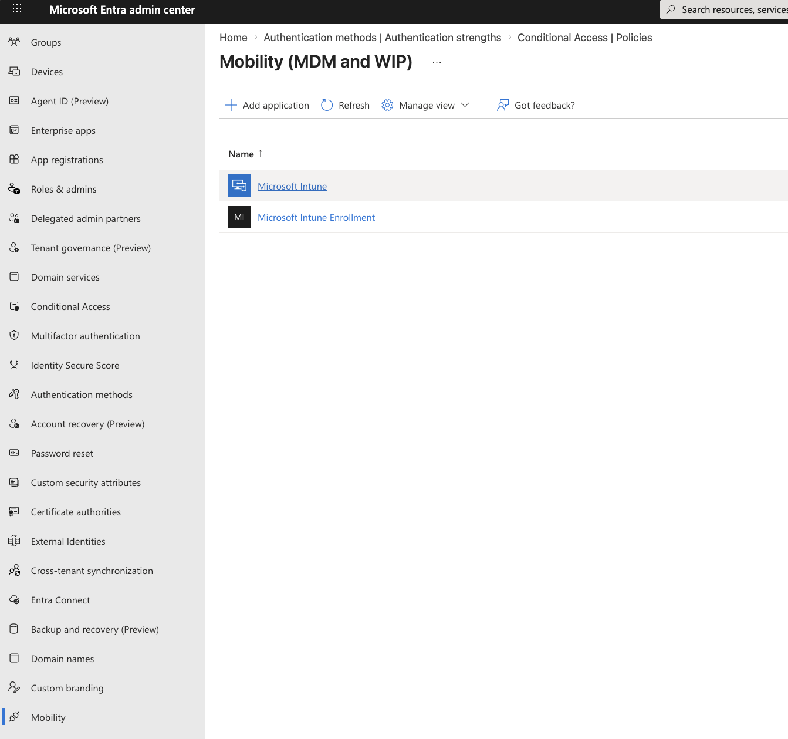
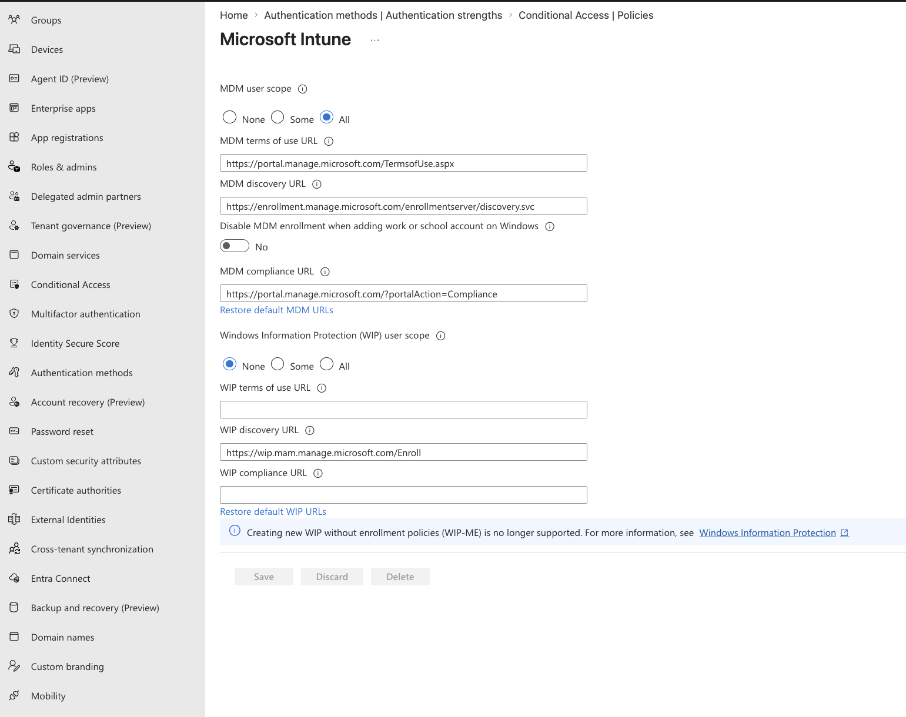
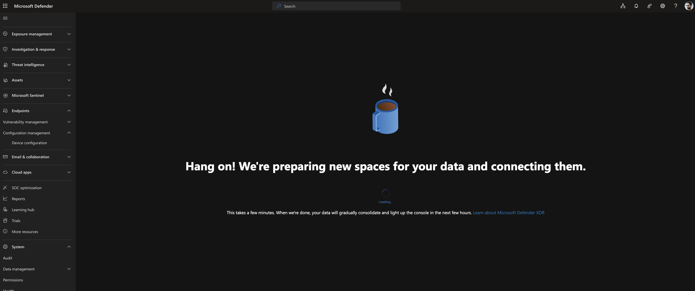
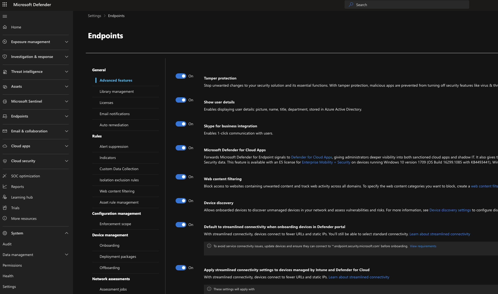
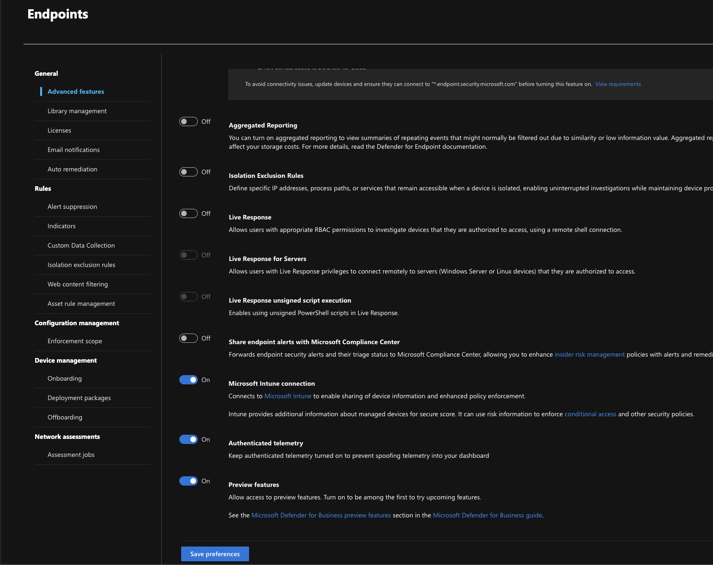
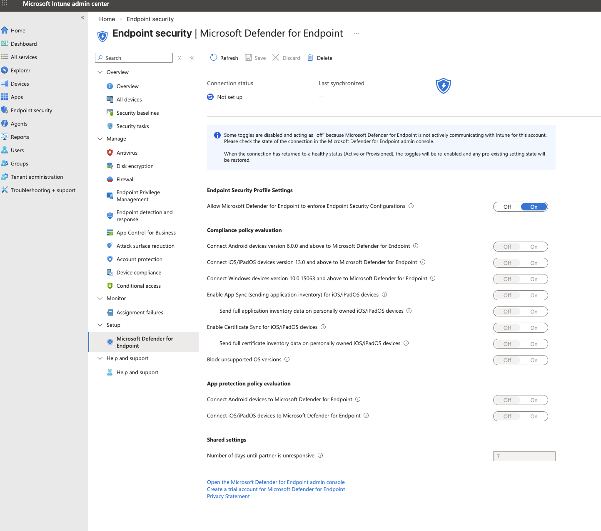
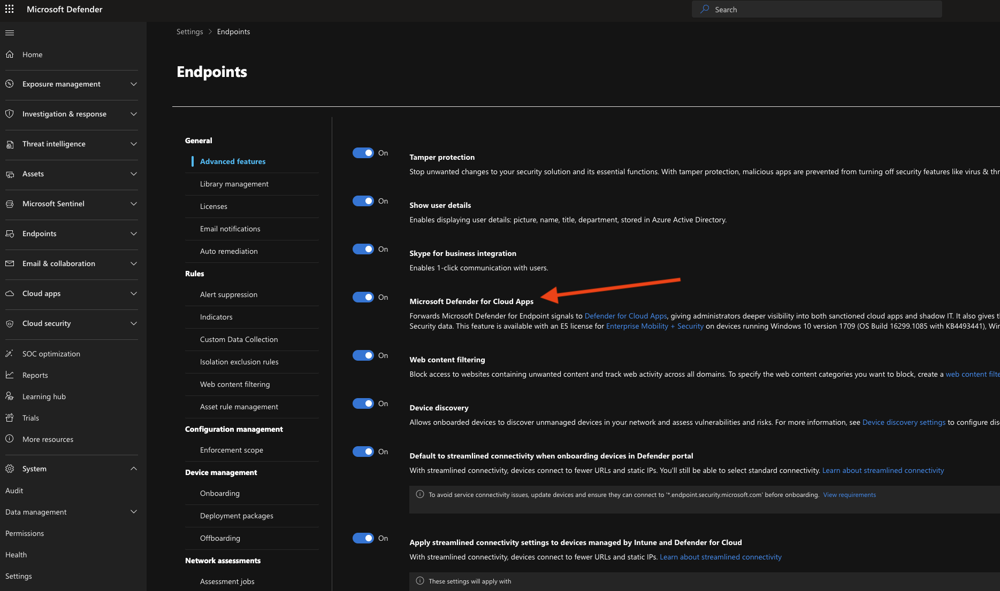
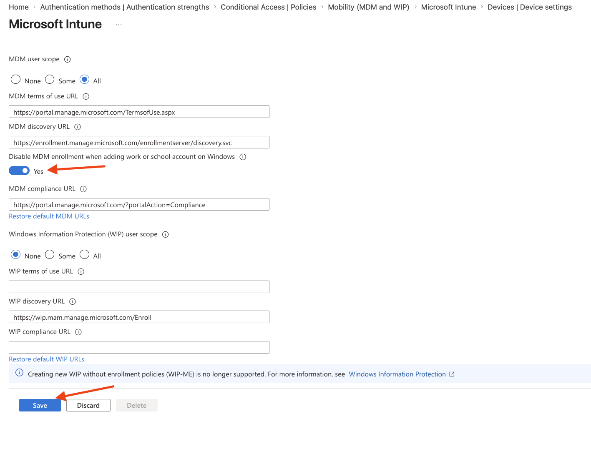
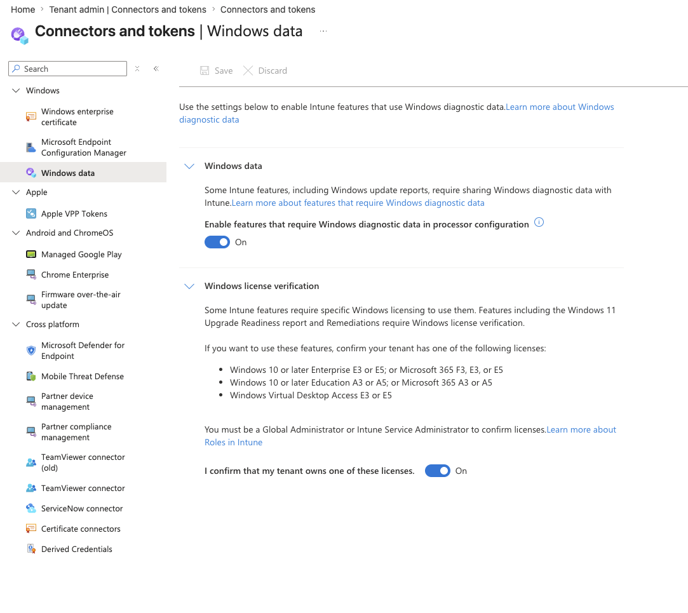

## Manual Prerequisites Before Deploying Policies via Inforcer

These settings **must be completed manually** in the tenant **before** deploying policies.  
Follow the steps **in order**. The checklist is grouped by portal for clarity.

---

## Prerequisite Checklist (Execution Order)

| Step | Prerequisite | Portal |
|-----:|--------------|--------|
| 1 | Create Intune Enrollment + Azure Credential Configuration Endpoint Service enterprise apps | Entra |
| 2 | Configure MDM user scope for automatic enrollment | Entra |
| 3 | Enable Exchange organization configuration | Exchange Online |
| 4 | Provision Microsoft Defender for Endpoint (open Defender portal) | Defender |
| 5 | Verify Tamper Protection is On (enabled by default) | Defender |
| 6 | Enable Microsoft Defender for Endpoint connector (Defender + Intune) | Defender / Intune |
| 7 | Enable MDE → Cloud Apps integration (enables Cloud Discovery) | Defender |
| 8 | Review Intune platform restrictions baseline | Intune |
| 9 | Set Windows Hello for Business to **Not configured** | Intune |
| 10 | Enable Windows diagnostic data for Intune | Intune |
| 11 | Exclude break-glass accounts from all Conditional Access policies | Entra |
| 12 | *(Optional)* Configure named locations (Blocked / Allowed countries) | Entra |

---

## Step 1. Create Required Enterprise Applications (Entra)

Create both service principals **before** configuring Conditional Access so they appear as targetable cloud apps.

### Why this matters

- **Microsoft Intune Enrollment**
  - Not always auto-created in new tenants
  - Without it, *Intune Enrollment* does not appear in Conditional Access
- **Azure Credential Configuration Endpoint Service**
  - Required for passkey registration in Microsoft Authenticator
  - Must be excluded from certain CA policies (device compliance / APP) to avoid blocking passkey registration
 


### How

```powershell
Connect-MgGraph -Scopes "Application.ReadWrite.All"

New-MgServicePrincipal -AppId "d4ebce55-015a-49b5-a083-c84d1797ae8c"
New-MgServicePrincipal -AppId "ea890292-c8c8-4433-b5ea-b09d0668e1a6"
```

### Verify

Entra admin center → **Enterprise applications**  
Confirm both apps appear.

---

## Step 2. Configure MDM User Scope (Entra)

MDM user scope controls who can enroll devices in Intune.

**Path:** Entra admin center → **Mobility** → **Microsoft Intune**  
Set **MDM user scope** to **All** or **Some**.



---

## Step 3. Enable Exchange Organization Configuration (Exchange Online)

Exchange tenants are often dehydrated by default.

```powershell
Install-Module ExchangeOnlineManagement -Scope CurrentUser -Force
Connect-ExchangeOnline
Enable-OrganizationCustomization
Get-OrganizationConfig | Select IsDehydrated
```

```powershell
$OrgConfigParams = @{
    AuditDisabled              = $false
    OAuth2ClientProfileEnabled = $true
    MailTipsAllTipsEnabled     = $true
    RejectDirectSend           = $true
}

Set-OrganizationConfig @OrgConfigParams
Disconnect-ExchangeOnline -Confirm:$false
```

---

## Step 4. Provision Microsoft Defender for Endpoint

Sign in to https://security.microsoft.com as a Global or Security Admin.  
Navigate to **Assets → Devices** to trigger provisioning if the portal hasn't been activated yet.  
Complete the initial setup wizard or dismiss it to proceed with manual configuration.




---

## Step 5. Verify Tamper Protection

Tamper Protection is **enabled by default** for all enterprise customers via [Built-in Protection](https://learn.microsoft.com/en-us/defender-endpoint/built-in-protection).

**Path:** Defender portal → **Settings** → **Endpoints** → **Advanced features**  
Confirm **Tamper Protection** is set to **On**.

> ⚠️ **If you don't see "Endpoints" on the Settings page:**  
> The Endpoints settings category only appears **after** Defender for Endpoint has been provisioned.  
> Go back to **Step 4** — navigate to **Assets → Devices** and wait for provisioning to complete.  
> Once provisioned, return to **Settings** and the **Endpoints** entry will appear.



---

## Step 6. Enable Defender for Endpoint Connector (Intune + Defender)

This is a **two-sided** connection:

1. **Defender portal** → Settings → **Endpoints** → Advanced features → Toggle **Microsoft Intune connection** to **On** → Save preferences  
2. **Intune admin center** → Endpoint security → Microsoft Defender for Endpoint → Confirm **Connection status** shows **Enabled**

> **Note:** It can take up to 15 minutes for the connection status to update after enabling the Defender-side toggle.  
> **Note:** The **Endpoints** entry under Settings requires Step 4 (provisioning) to be completed first.



---

## Step 7. Enable MDE → Cloud Apps Integration (Cloud Discovery)

This is a **separate toggle** from the Intune connector in Step 6. It enables Microsoft Defender for Endpoint to feed endpoint traffic data into Defender for Cloud Apps, which powers the **Cloud Discovery** Shadow IT dashboard.

**Path:** Defender portal → **Settings** → **Cloud Apps** → **Microsoft Defender for Endpoint** → toggle **"Enable Microsoft Defender for Endpoint integration with Microsoft Defender for Cloud Apps"** → **Save**

### Why this matters

Without this toggle, Cloud Discovery shows an empty welcome screen — no apps, no traffic, no Shadow IT visibility — even if MDE is provisioned and devices are enrolled. This integration is what routes the endpoint network traffic data into Cloud Discovery.

### Dependency chain

For data to appear in Cloud Discovery, all three links must be in place:

1. **Devices enrolled in Intune** (Step 2 + user devices completing enrollment)
2. **Intune ↔ MDE connector enabled** (Step 6)
3. **MDE → Cloud Apps toggle enabled** (this step)

> ⚠️ **Enabling the toggle alone is not enough.** Data will only appear once real devices are onboarded to MDE and generating traffic. In a fresh tenant with no enrolled devices, the dashboard will remain empty until the first device enrolls.

> **Note:** After enabling, allow up to **2 hours** for the first discovery data to appear. The dashboard filter will change from the empty state to **"Defender-managed endpoints"** once data begins flowing.



---

## Step 8. Review Intune Platform Restrictions

Intune → **Devices → Device onboarding → Enrollment → Device platform restriction**  
Ensure required platforms are allowed.  
Recommended: Block personal devices unless explicitly required.



---

## Step 9. Windows Hello for Business

Intune → Devices → Enrollment → Windows Hello for Business  
Set to **Not configured**.

---

## Step 10. Enable Windows Diagnostic Data

Intune → Tenant administration → Connectors and tokens → Windows data  
Enable features requiring Windows diagnostic data.



---

## Step 11. Break-Glass Account Exclusions

Exclude emergency access accounts from **all** Conditional Access policies.

---

## Step 12. Optional – Named Locations

Create:
- **IAC – Blocked Countries**
- **IAC – Allowed Countries**

Populate before enabling CA policies to avoid lockout.
