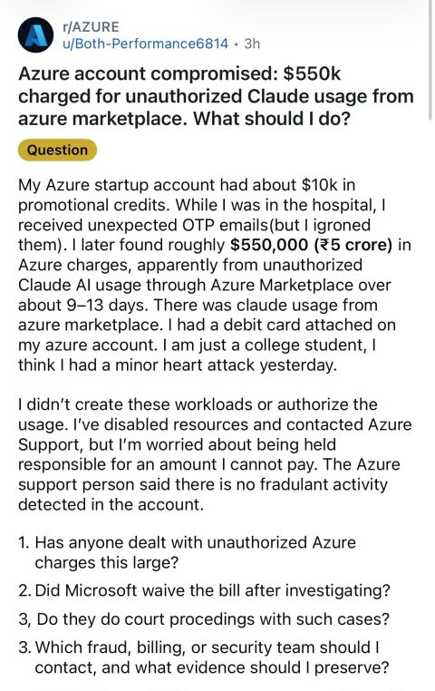
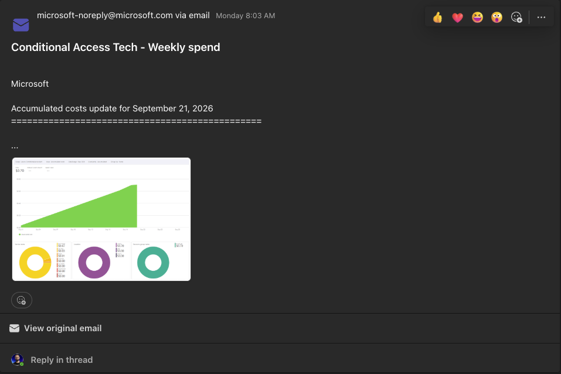
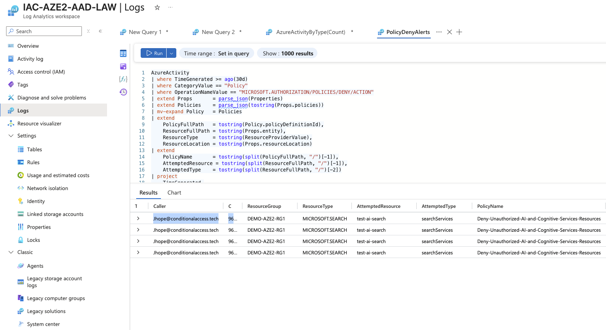
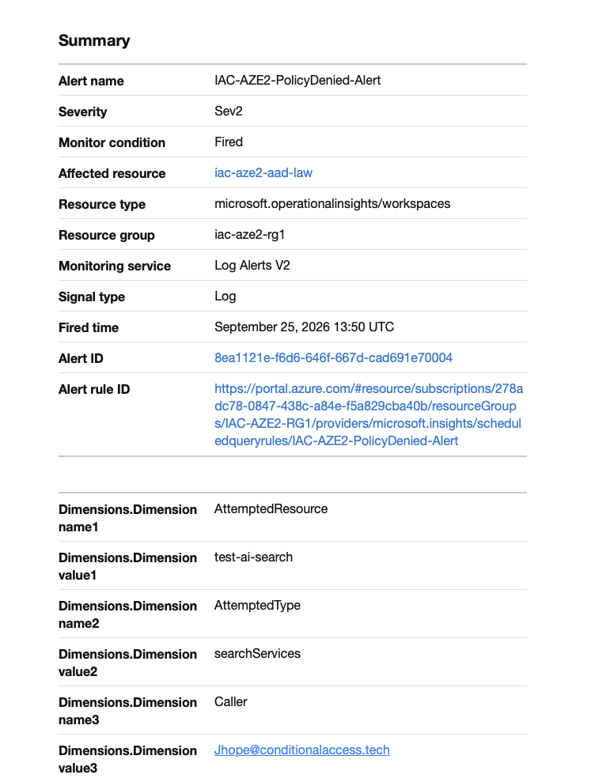

# The Azure Policy Baseline That Protects MSP Customers from Themselves

*Azure Governance · MSP Baseline*

Guardrails, HIPAA controls, AI spend protection, and the KQL alert most people never build.

A 35-policy initiative built from real MSP work, updated for the era of unauthorized AI deployments.

## Why Guardrails

Azure has almost infinite capabilities. When I started the shift in migrating all my clients from on-prem VMware to Azure, I realized one thing: I need to set up guardrails for what we are doing.

At the time the major issues were people setting up crypto infrastructure on your dime. Now it's things like AI automation being hosted on your dime. These things can bankrupt a company. It's not always attackers. Sometimes it's internal employees by accident.

This is why part of building a good Azure landing zone is building the guardrails. What VMs can my staff deploy? In what regions? How do I ensure logging and backup aren't forgotten? How do I protect against accidental modifications? Every part of these questions needs to have intention behind it.

I posted recently about FaceCheck being needed and my Azure Policy blocking me. This was a great example. I'm setting up a paid service that needs to be intentional, otherwise cost can run rampant in my infrastructure very quickly: [lnkd.in/p/e-7KevrE](https://lnkd.in/p/e-7KevrE)

Shortly after I came across this thread on Reddit. This is another reason why these settings have to be controlled. It's not that every aspect is controlled directly through a policy, but it aids in the system that has to go in place to prevent and defend against these. It's one step of many involved in controlling and alerting on this behavior.



> It's not that every aspect is controlled directly through a policy, but it aids in the system that has to go in place to prevent and defend against these. It's one step of many.

---

## Section 2: The Azure Policy Initiative: General Governance (Policies 1–15)

Policies 1–15 were part of the original objectives and build. These apply to every managed customer regardless of industry and cover the foundational questions: location controls, compute guardrails, backup, tagging, monitoring, and resource protection.

| # | Policy | Effect | Purpose |
| --- | --- | --- | --- |
| Location & Compute |  |  |  |
| 1 | Allowed locations | Deny | Blocks deployment to any region outside the approved list. Prevents data residency violations and surprise egress charges from unexpected regions. |
| 2 | Allowed virtual machine size SKUs | Deny | Constrains VM sizes to the approved SKU set. Prevents accidental deployment of GPU or memory-optimised SKUs that generate large hourly costs. |
| Backup & Recovery |  |  |  |
| 3 | Configure backup on VMs with a given tag (SRV) | DeployIfNotExists | Uses the `SRV` tag to enrol VMs into the SRV backup job. Covers 45 CFR § 164.308(a)(7)(i) Contingency Plan and § 164.312(c)(1) Integrity. |
| 4 | Configure backup on VMs with a given tag (region) | DeployIfNotExists | Uses a region tag to back up VMs in the specified region. Pairs with policy 3 to cover all workload types without manual vault assignment. |
| Tagging & Resource Protection |  |  |  |
| 5 | Inherit a tag from the resource group if missing | Modify | Resources inherit the `AVD` tag from the AVD Resource Group. Required for the Logic App automation to identify and manage AVD session hosts correctly. |
| 6 | Deploy CanNotDelete Resource Lock on Resource Groups | DeployIfNotExists | Deploys delete locks to resource groups and their resources. Prevents accidental deletion of production workloads. |
| 11 | Audit tags: Owner and TAM | Audit | Flags any resource missing `Owner` or `TAM` tags. Enforces accountability metadata without blocking deployments. |
| Diagnostics & Monitoring |  |  |  |
| 7 | Deploy Boot Diagnostics to storage for VMs | DeployIfNotExists | Points boot diagnostics at `{ClientId}-{region}-vmslaw`. Required for RDP/SSH troubleshooting and forensic review. |
| 8 | Configure system-assigned managed identity to enable Azure Monitor on VMs | DeployIfNotExists | Enables system-assigned managed identity as a prerequisite for the AMA-based monitoring stack. |
| 9 | Configure Windows Machines to DCR: PERF | DeployIfNotExists | Attaches VMs to the `{MSVMI}-{ClientId}-{region}-VM-PERF` DCR. Collects performance counters for capacity planning and anomaly detection. |
| 10 | Configure Windows Machines to DCR: LOGS | DeployIfNotExists | Attaches VMs to the `{ClientId}-{region}-VM-LOGS` DCR. Collects security event logs and forwards them to Log Analytics for Sentinel ingestion. |
| 12 | Enable Change Tracking on Windows Virtual Machines | DeployIfNotExists | Tracks file, registry, and software changes on Windows VMs. Critical for post-incident investigation. |
| 13 | Configure ChangeTracking Extension for Windows virtual machines | DeployIfNotExists | Configures the DCR rule required by Change Tracking. Without this, policy 12 installs the extension but data collection does not start. |
| 14 | Configure Windows VMs to run Azure Monitor Agent using system-assigned managed identity | DeployIfNotExists | Deploys AMA to all Windows VMs using the system MI enrolled by policy 8. The foundation for all DCR-based data collection. |
| 15 | Deploy Dependency Agent to Windows VMs with Azure Monitoring Agent settings | DeployIfNotExists | Adds the Dependency Agent alongside AMA for VM Insights service map and network dependency views. |

---

## Section 3: HIPAA Controls (Policies 16–35)

This is where the HIPAA controls come in. These were driven by working in the medical industry. For non-healthcare customers the security rationale still holds. The regulatory citation just does not apply.

| # | Policy | Effect | Purpose | HIPAA Citation |
| --- | --- | --- | --- | --- |
| AI & Marketplace Controls |  |  |  |  |
| 16 | Deny Unauthorized AI and Cognitive Services Resources Custom | Deny | Blocks `Microsoft.SaaS/resources`, `Microsoft.CognitiveServices/accounts`, `Microsoft.MachineLearningServices/workspaces` (+onlineEndpoints), `Microsoft.BotService/botServices`, `Microsoft.Search/searchServices`. Start on Audit, scope exemptions, then switch to Deny. | § 164.308(a)(1)(ii)(B) Risk Management  
§ 164.312(a)(1) Access Control  
CIS v8: 4.8, 2.7 |
| Subscription Ownership |  |  |  |  |
| 17 | Maximum 3 owners designated for subscription | Audit | Flags subscriptions with more than 3 owners. Excess owners increase the blast radius of a compromised privileged account. | § 164.312(a)(1) Access Control  
§ 164.308(a)(3) Workforce Security |
| 18 | More than one owner assigned to subscription | Audit | Flags subscriptions with only one owner. Single-owner subscriptions create an access continuity risk. | § 164.312(a)(1) Access Control  
§ 164.308(a)(7) Contingency Plan |
| 19 | Blocked accounts with owner permissions should be removed | Audit | Flags disabled accounts that retain Owner-level RBAC. Disabled accounts with live permissions are a persistent privilege escalation path. | § 164.312(a)(1) Access Control  
§ 164.308(a)(3) Workforce Security |
| 27 | Guest accounts with owner permissions should be removed | Audit | Flags guest (B2B) accounts holding Owner-level RBAC. Guest accounts bypass many internal identity controls and should never hold subscription ownership. | § 164.308(a)(3) Workforce Security  
§ 164.312(a)(1) Access Control |
| Activity Log & Alerting |  |  |  |  |
| 20 | Activity log alert should exist for specific Administrative operations | Audit | Flags subscriptions where no activity log alert covers key administrative operations. Pairs with CIS Azure 6.1.2 alert requirements. | § 164.312(b) Audit Controls  
§ 164.308(a)(1)(ii)(D) Activity Review |
| 22 | Azure Monitor log profile should collect write, delete, and action categories | Audit | Ensures the diagnostic profile captures all write, delete, and action categories. Gaps in these categories leave blind spots in incident timelines. | § 164.312(b) Audit Controls |
| Disaster Recovery |  |  |  |  |
| 21 | Audit VMs without disaster recovery configured | Audit | Flags VMs with no Azure Site Recovery replication enabled. Covers the HIPAA contingency plan requirement. | § 164.308(a)(7) Contingency Plan |
| Network Security |  |  |  |  |
| 23 | Deploy Diagnostic Settings for Network Security Groups | DeployIfNotExists | Pushes NSG flow logs and diagnostic settings for all NSGs. Without this, east-west traffic analysis during an incident is blind. | § 164.312(b) Audit Controls |
| 24 | Deploy Network Watcher when virtual networks are created | DeployIfNotExists | Automatically creates a Network Watcher resource per region when a VNet is deployed. Required prerequisite for NSG flow logs. | § 164.312(b) Audit Controls |
| 25 | Network Watcher should be enabled | Audit | Audit companion to policy 24. Flags any region with a VNet but no Network Watcher. | § 164.312(b) Audit Controls |
| 26 | Gateway subnets should not be configured with a network security group | Deny | Blocks NSG attachment to gateway subnets. NSGs on gateway subnets break VPN and ExpressRoute connectivity. | § 164.312(a)(1) Access Control |
| 28 | Internet-facing VMs should be protected with network security groups | Audit | Flags internet-exposed VMs without an NSG. Any VM with a public IP and no NSG is open to the internet on all ports. | § 164.312(a)(1) Access Control |
| 34 | Subnets should be associated with a Network Security Group | Audit | Flags unprotected subnets. May require exclusions for gateway subnets and Azure Firewall subnets. | § 164.312(a)(1) Access Control |
| 35 | VMs should be connected to an approved virtual network | Audit | Flags VMs connected to VNets outside the approved list. Prevents VMs from being attached to shadow VNets. | § 164.312(a)(1) Access Control |
| Key Vault & Storage |  |  |  |  |
| 29 | Key vaults should have deletion protection enabled | Audit | Flags Key Vaults without soft delete and purge protection. The policy provides ongoing drift detection. | § 164.312(c)(1) Integrity |
| 30 | Key Vault should use a virtual network service endpoint | Audit | Flags Key Vaults accessible over the public internet without a VNet service endpoint. | § 164.312(e)(1) Transmission Security |
| 31 | Resource logs in Key Vault should be enabled | Audit | Flags Key Vaults with diagnostic logging disabled. Without logs, secret access and key operations cannot be reviewed after an incident. | § 164.312(b) Audit Controls |
| 33 | Secure transfer to storage accounts should be enabled | Audit | Flags storage accounts that allow HTTP. Plain HTTP connections are rejected when secure transfer is enforced. | § 164.312(e)(1) Transmission Security |
| Logic Apps |  |  |  |  |
| 32 | Resource logs in Logic Apps should be enabled | Audit | Flags Logic Apps with diagnostic logging disabled. Automation workflows touching patient or financial data must produce an audit trail. | § 164.312(b) Audit Controls |

---

## Section 4: Policy 16 Is a New One

Policy 16 was added after realizing how critical it would be to secure AI. This was not part of the original build. It came from watching the threat landscape shift from crypto mining to AI inference workloads. The attack surface changed. The policy had to change with it.

After coming across the Reddit thread, I went into my own tenant to test this theory. I wanted to see if this policy would successfully block the kind of deployment that generated that $550k bill. The video below walks through the full test.

The resource providers in scope:

| Resource Provider | What It Creates | Why It's in Scope |
| --- | --- | --- |
| `Microsoft.SaaS/resources` | Marketplace SaaS subscriptions | The provider behind third-party AI listings: Claude, GPT wrappers, and similar. Bypasses subscription spending limits. |
| `Microsoft.CognitiveServices/accounts` | Azure OpenAI, AI Services accounts | Covers Azure-native AI model endpoints. Token-based billing with no per-subscription cap. |
| `Microsoft.MachineLearningServices/workspaces` | Azure ML workspaces | Provides GPU compute and online endpoints. Expensive at scale and commonly used in attacker-driven crypto mining infrastructure. |
| `Microsoft.MachineLearningServices/workspaces/onlineEndpoints` | AML online inference endpoints | The billing surface for model serving. Can run independently of workspace-level monitoring. |
| `Microsoft.BotService/botServices` | Bot Framework, Copilot Studio agents | Agent infrastructure. Out of scope for most customer subscriptions and a vector for outbound data exfiltration. |
| `Microsoft.Search/searchServices` | Azure AI Search | Commonly deployed as a RAG backend. Hourly billing per Search unit at the standard tier accumulates quickly. |

> ⚠️ **Deployment Note:** Set policy 16 to **Audit** for two weeks before switching to **Deny**. Customers with existing Azure OpenAI or Search deployments need resource group exemptions scoped before the Deny fires.

---

## Section 5: The Safety Net

Anyone who knows me or has read my Conditional Access logic and theory knows this: you are only as good as the safety net you build.

Policy is the start. But you also need budget alerts and detection that let you know if something was deployed that shouldn't have been and somehow got around things, if someone attempted to deploy something they shouldn't have (great training exercise), or if budgets are climbing too fast and you need to evaluate and reduce spend. Each of these could have stopped or severely diminished that $550k bill.

A billing alert setup that actually works has three layers:

### Budget alerts at multiple thresholds

In Cost Management, create a budget for each subscription with alerts at 50%, 80%, and 100% of expected monthly spend. Set recipients to include both the subscription owner and a shared MSP operations mailbox. The 50% alert is not a panic trigger. It's an early warning that something has changed. Investigate it.

### Anomaly alerts

Azure Cost Management includes anomaly detection that fires when spending deviates significantly from the predicted pattern. Enable it at the subscription scope for every managed customer. A subscription that normally spends $200/month and suddenly spikes to $2,000/day will trigger an anomaly alert before it hits the 50% budget threshold, because the rate of change is the signal, not the absolute number.

Enable it under Cost Management, Cost alerts, Anomaly alerts. Set the threshold sensitivity to Medium for most customers and High for any subscription with a debit card or no EA spending cap.

### Action groups that do something

An alert that sends an email is better than nothing. An alert that sends an email, fires an SMS, and triggers a Logic App or Azure Automation runbook that disables the subscription is a safety net. Build the action group once and reuse it across all customer budget alerts.



> ⚠️ **The gap Policy 16 cannot close:** Policy 16 blocks the deployment. It does not stop a resource that was deployed before the policy was assigned from continuing to accrue charges. Budget alerts with action groups are what catch that scenario: the resource that existed before you got there, or the one that slipped through during the Audit window.

---

## Section 6: Detecting the Block

Policy 16 blocks the deployment. That's the lock. But knowing someone tried the door is equally important, and this is where most baselines stop short.

After extensive testing against a live LAW with all diagnostic categories enabled, the finding is this: Azure Policy deny events do not appear in `AzureActivity` when you filter on `CategoryValue == "Administrative"`. Every guide, every example query, and every detection article filters on Administrative. They all miss the blocked attempts entirely.

Policy deny events log under `CategoryValue == "Policy"` with `OperationNameValue == "MICROSOFT.AUTHORIZATION/POLICIES/DENY/ACTION"`. That combination is where the signal lives.

> ⚠️ **Key Finding:** If you are querying `CategoryValue == "Administrative"` to detect policy denies, you will always return zero results. The correct filter is `CategoryValue == "Policy"`. This is not documented clearly anywhere in the Microsoft Learn guidance on Activity Log alerting.

### Production Alert Query

```
AzureActivity
| where TimeGenerated >= ago(30d)
| where CategoryValue == "Policy"
| where OperationNameValue == "MICROSOFT.AUTHORIZATION/POLICIES/DENY/ACTION"
| extend Props            = parse_json(Properties)
| extend Policies         = parse_json(tostring(Props.policies))
| mv-expand Policy        = Policies
| extend
    PolicyFullPath        = tostring(Policy.policyDefinitionId),
    ResourceFullPath      = tostring(Props.entity),
    ResourceType          = tostring(ResourceProviderValue),
    ResourceLocation      = tostring(Props.resourceLocation)
| extend
    PolicyName            = tostring(split(PolicyFullPath, "/")[-1]),
    AttemptedResource     = tostring(split(ResourceFullPath, "/")[-1]),
    AttemptedType         = tostring(split(ResourceFullPath, "/")[-2])
| project
    TimeGenerated,
    Caller,
    CallerIpAddress,
    ResourceGroup,
    ResourceType,
    AttemptedResource,
    AttemptedType,
    PolicyName,
    ResourceLocation,
    SubscriptionId,
    CorrelationId
| order by TimeGenerated desc
```





The policy is the lock. This query is the camera. Running Policy 16 without this alert is knowing the door is locked but never checking the footage.

---

## Section 7: What Policy Doesn't Cover

Azure Policy intercepts ARM deployment requests. It does not control what a user does inside a Marketplace web session that never touches ARM, and it does not block SaaS offers purchased directly through an ISV's portal using an Azure payment method attached at the billing account level.

The complete control stack for AI spend risk has three layers. Policy 16 covers only one of them.

**Billing-level controls:** For MCA accounts, set the Marketplace purchase policy to "Free" or "No" under Cost Management + Billing, Billing profiles, Policies. For EA accounts, enterprise administrators can set Marketplace to "Free/BYOL SKUs only." These controls block SaaS subscriptions that do not go through ARM. ([Microsoft Learn: Purchase control options](https://learn.microsoft.com/marketplace/purchase-control-options))

**Private Marketplace:** Private Marketplace restricts which offers are visible and purchasable for your tenant. Combined with billing controls and Policy 16, it closes the remaining gap. Enable it under Marketplace in the Azure portal and explicitly approve the offers your customers are permitted to use.

Policy 16 catches ARM-deployed resources. Billing controls catch Marketplace SaaS subscriptions. Private Marketplace catches portal browsing. The Reddit post's $550k charge would have been stopped by billing controls before ARM policy even applied, because a Marketplace SaaS subscription often does not create a `Microsoft.SaaS/resources` ARM object until after the billing relationship is already established.
