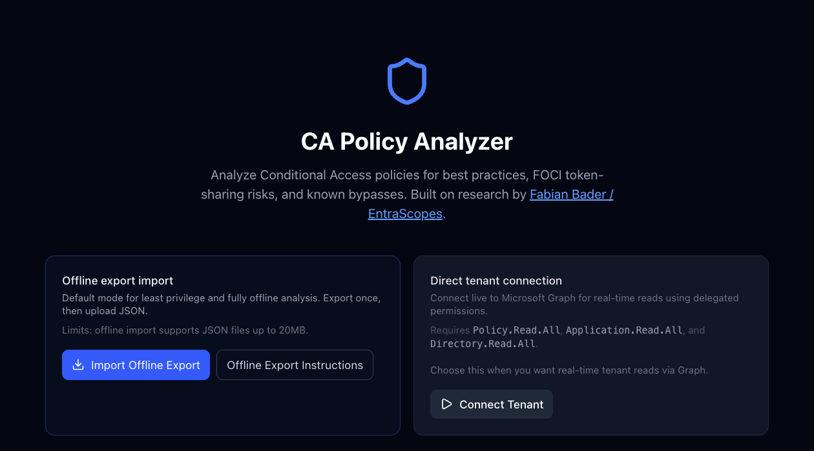

# CA Policy Analyzer: July 2026 Update

The CA Policy Analyzer has been in active use for long enough now that real-world tenants have started exposing the gaps. Policies that don't match the documented patterns. Configurations that are technically fine but trigger warnings anyway. Edge cases that only show up when someone hands you a JSON export from a production tenant with a hundred policies in it.

This round of updates addresses most of them. Two community contributors surfaced issues that would have been hard to catch in testing, and both landed PRs that ship in 1.16.1 and 1.16.0 respectively. The rest came from audit work against real tenant exports.

## 1.16.1. Offline Mode

Added — 10 July 2026

The analyzer previously required direct tenant connectivity. That ruled it out for a lot of real scenarios: audits, client engagements, environments with strict Conditional Access controls on third-party OAuth, or just cases where someone wants to review policies before handing the tool to a client.

Offline mode changes that. Export your policies with a single PowerShell command, load the file, and get the full analysis without a live tenant connection.

**How it works**

Export from your tenant using the Graph PowerShell Beta module:

`Get-MgBetaIdentityConditionalAccessPolicy | ConvertTo-Json -Depth 10 | Out-File ca-export.json`

Load the file via the new offline import path on the opening screen. The analyzer handles the messiness of real PowerShell exports: PascalCase keys, AdditionalProperties wrappers, null guest and auth-strength placeholders, and single-object collections that don't come through as arrays. A 20 MB file size cap and 40-level recursion guard are in place before any parsing runs.

*The redesigned opening screen — two explicit paths, offline or live.*

Thanks to **@chrisfriday** for the PR that shipped this. Offline import compatibility with real-world Graph PowerShell exports is harder than it sounds. The Beta module produces output that's inconsistent in several ways the documentation doesn't mention. Getting the parser right took work.

> ℹ️ **Navigation fix (also 1.16.2):** A 404 on the offline export instructions link was fixed in 1.16.2. The instructions page also now has a back link so you don't need the browser back button to return to the analyzer.

## 1.16.0. False Positive Reduction

Changed — 10 July 2026

This is the larger of the two releases in terms of scope. Seven surgical fixes across the analyzer, all targeting configurations that were technically correct but flagged as problems. False positives erode trust in any analysis tool. If you learn to ignore a warning category because it fires on things that are fine, you're going to miss the ones that aren't.

Fix

**Grant control operator — compliantDevice OR domainJoinedDevice**

This is a Microsoft-documented pattern for hybrid device trust. The analyzer was flagging it High alongside actual mixed-strength ORs like `mfa OR compliantDevice`. It now downgrades to Info. Same treatment for `approvedApplication OR compliantApplication`, which covers the MAM equivalent. Mixed-strength combinations still flag High.

Fix

**Break-glass checks on workload / agent-identity policies**

Policies targeting `includeUsers: ["None"]` are workload identity policies. They can't have break-glass exclusions because they don't apply to users. The analyzer was flagging them for missing break-glass coverage and counting them against tenant-wide coverage numbers. Both are now suppressed.

Fix

**checkAllUsersAllApps — break-glass exclusion handling**

Break-glass exclusions are expected hygiene. The check was treating them the same as unexpected group exclusions and inflating the exclusion count. Break-glass accounts are now subtracted from the tally before severity is calculated. App exclusions stay Medium; non-break-glass group exclusions drop to Low; break-glass-only exclusions are suppressed.

Fix

**Device registration bypass — intent and context aware**

The check was firing on policies that already require MFA, which is the documented mitigation. It was also firing when a dedicated register-device MFA policy already exists in the tenant. Both are now suppressed. Severity scales with whether device registration is explicitly targeted or only incidentally covered via All Apps.

Fix

**checkMissingMFA — device trust and agent-identity skips**

Policies whose only controls are strong device trust or app protection are valid standalone layers on a separate MFA baseline. Agent-identity policies can't do interactive MFA at all. Both are now skipped.

Fix

**User-agent bypass downgrade**

The check fires High when no companion block-unknown-platforms policy exists. When one already exists (exactly the recommended remediation), it now downgrades to Info rather than continuing to surface a warning for a gap that's already been addressed.

Fix

**Guest MFA finding — High to Info**

Requiring MFA for guests is best practice, not a security gap. The finding was creating noise in tenants that were doing the right thing. It's now an operational advisory about cross-tenant trust configuration rather than a High-severity warning. Thanks to **@dermo-blast** for the PR that surfaced this one.

Add

**Persona coverage — All-Users policies now credited correctly**

A tenant-wide policy now reduces coverage gaps for the Admin and Developer personas, as it should. Guest-targeting policies also credit Guest Admin coverage. The previous behavior was understating coverage for tenants with a strong baseline and inflating the apparent gap.

## 1.16.2. Template Matcher Accuracy

Fixed — 22 July 2026

Two template fingerprinting bugs were causing false "Present" matches: policies reported as matching a specific template when they only matched on broad criteria that any policy would satisfy.

Fix

**APP - SESSION - O365 - TimeoutSettings false match**

Any policy targeting All Users and any app was scoring 100% against the O365 timeout template because the distinctive session control wasn't part of the fingerprint. The fingerprint now requires `sessionApplicationEnforcedRestrictions: true` and explicit Office 365 targeting. Generic MFA policies no longer match.

Fix

**APP - BLOCK - SharePoint-OneDrive - NonTrustedLocations false match**

Generic block-by-IP or block-by-country policies targeting All Apps were matching because "All ⊇ SharePoint" was treated as sufficient. The template now requires explicit SharePoint Online app ID targeting (`00000003-0000-0ff1-ce00-000000000000`). Broad all-apps block policies no longer match.

## 1.16.3. Location Warning Accuracy

Fixed — 22 July 2026

The "not marked as trusted" location warning was firing for any IP-range location used by any enabled policy that wasn't flagged as trusted. That includes locations like a block list, where the trusted flag is irrelevant by design. You're not trying to mark your blocked IPs as trusted.

The warning now only fires when the tenant has at least one policy using "All trusted locations," which is the only scenario where the `isTrusted` flag changes user behavior: MFA bypass, reduced sign-in frequency, risk policy exemptions. The warning text now explains the concrete impact and explicitly acknowledges that block-list locations are a valid reason to dismiss it.

---

## → Community Contributors

Two PRs from outside contributors shipped in this cycle, both addressing real issues that came from running the tool against actual tenants.

@chrisfriday

PR #12 · v1.16.1

Offline import via PowerShell JSON export. Handled real-world Graph PowerShell output incompatibilities including PascalCase keys, AdditionalProperties wrappers, and null array fields. Made the analyzer usable in environments where live tenant connectivity isn't an option.

@dermo-blast

PR #18 · v1.16.0

Seven false-positive fixes across analyzer.ts and persona-coverage.ts, including the guest MFA severity downgrade and the break-glass handling improvements. Meaningful reduction in noise for tenants that are doing things right.

Also a specific thanks to **Ronnie J.**, who took the time to run the analyzer against his own CA policies and came back with real questions: what the recommendations meant in practice, whether they applied to his environment, what tradeoffs he was actually making. That kind of engagement matters more than it might seem. PRs improve the code. Those conversations improve the thinking behind it.

That's the part of building something in public that doesn't show up in a changelog. Someone takes what you made, tests it against their real environment, and treats it seriously enough to push back on it. If you're using the tool and have thoughts, I want to hear them.

The full changelog is on GitHub. If you're running into findings that don't match what you're seeing in the tenant, the issue tracker now has a structured template for reporting incorrect results, including what to include (policy JSON, expected vs actual status, browser version) and how PRs are reviewed.
