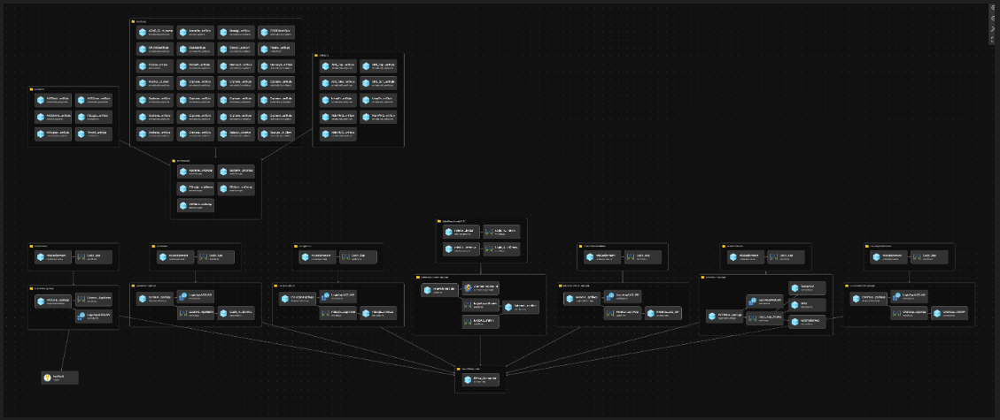
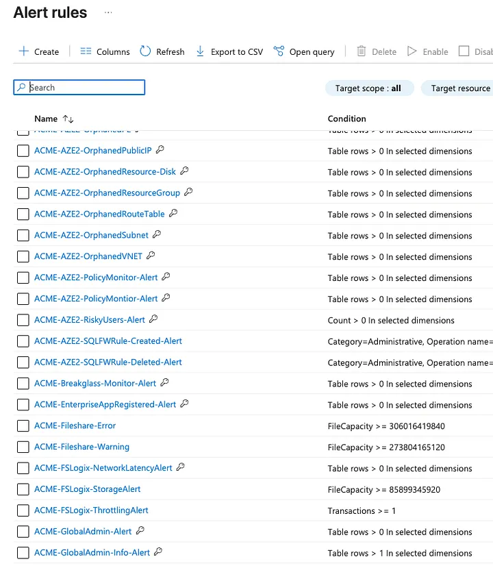
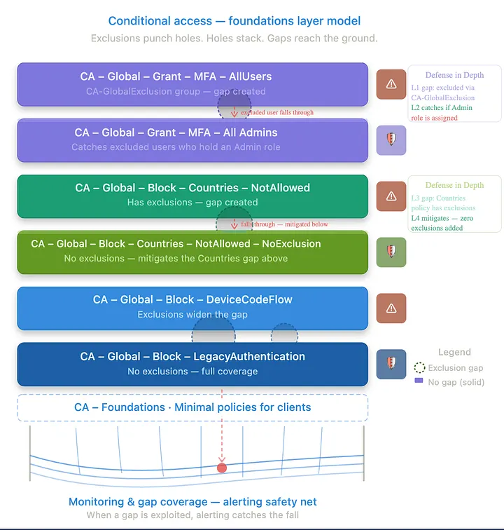
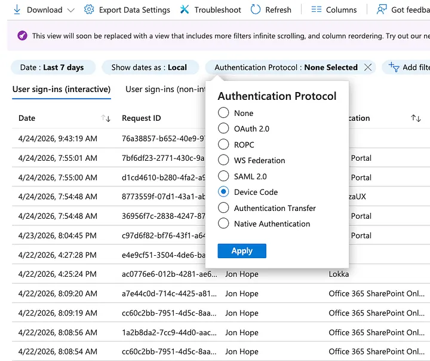
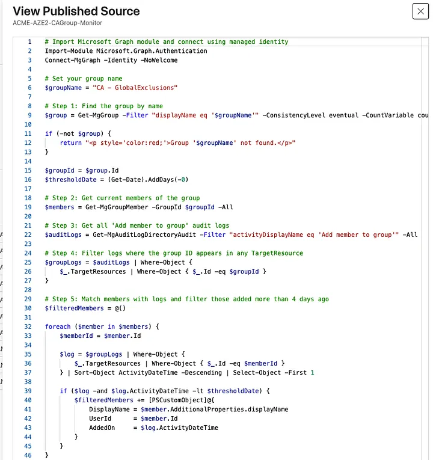
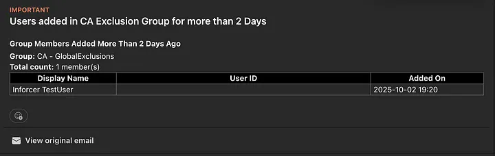
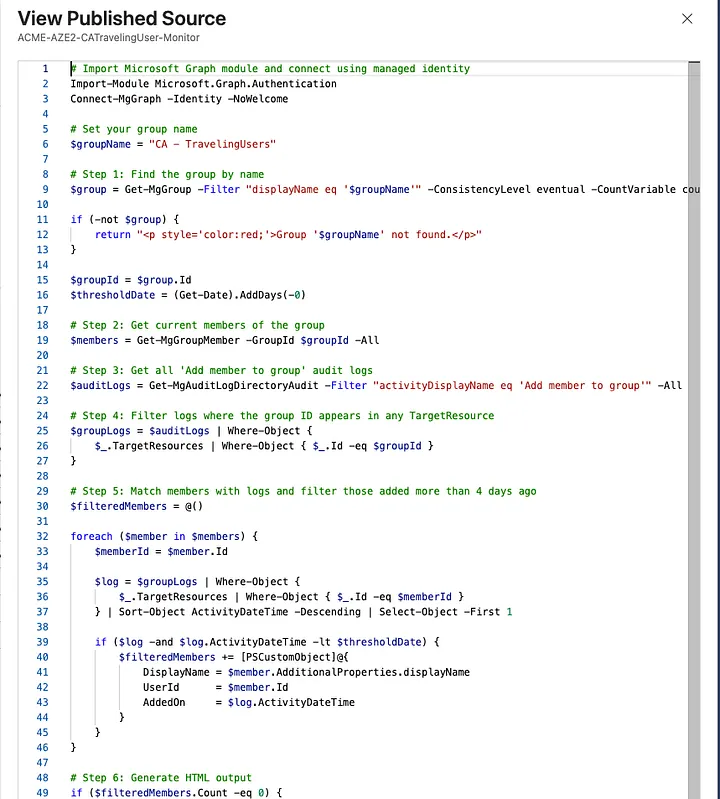

# The Safety Net

*Conditional Access Foundations · Final Post*

Why Azure is the foundation of every CA stack I've ever built. Build the net first. Then build the stack on top of it.

Azure Monitor · · · Log Analytics · · · May 2026 · · · 9 min read

Before I deploy a single Conditional Access policy, before I configure a named location, before I touch anything in Entra ID, I build the safety net.

That might seem backwards. Most people think about alerting as something you layer on after the fact, an afterthought, a nice-to-have. That mentality is exactly why most environments have exclusions that outlive their purpose by months, breakglass accounts nobody's watching, and CA gaps that quietly sit open until something goes wrong.

> "The safety net isn't reactive. It's the prerequisite."

[⚙️ Bicep templates, KQL queries, and runbooks for the full safety net **github.com/Jhope188/ConditionalAccessPolicies**](https://github.com/Jhope188/ConditionalAccessPolicies)

01

Where Azure Meets Microsoft 365

It is almost impossible to properly monitor and secure Microsoft 365 without Azure. Not everyone has E5. Not every client has P2 licensing across the board. But Azure has offered a legitimately low-cost path to advanced automation for years, and most people aren't using it.

A well-configured Log Analytics Workspace costs pennies at SMB scale. Azure Automation Accounts are nearly free at low runbook execution volumes. The gap between "I wish I knew about this sooner" and "I know about this in real time" is often a $15/month Log Analytics workspace and a few Bicep templates.

Log Analytics

~$2–$15/mo

Automation Account

Near $0

Key Vault

~$0.03/10k ops

Blob Storage

~$2–$5/mo

02

What the Safety Net Actually Is

In my case the safety net wasn't a single tool or a single alert. It was an Infrastructure as Code system that went in before any workload went live. The foundation was a Log Analytics Workspace paired with Blob Storage for log retention. From there:

**Azure Automation Accounts** act as the execution engine for scheduled and event-driven runbooks. **Data Collection Rules** route the right signals from the right sources into LAW. **KQL queries and scheduled monitors** turn raw log data into actionable alerts. **Azure Runbooks (PowerShell)** automate the logic that humans reliably forget to run manually. **Key Vault** stores the credentials and secrets everything else needs to operate.

*Bicep IaC — Safety Net Infrastructure The full safety net as IaC: Log Analytics, Automation Accounts, Data Collection Rules, Runbooks, Key Vault, and Blob Storage. Goes in before any CA policy.*

03

68 Alerts Before a Single CA Policy

When I say I deploy this before touching CA, I mean it literally. The Bicep alerting package puts over 68 alert rules in place before anything else. Infrastructure health, resource hygiene, and the identity-critical events that matter for CA.

*Azure Monitor — Alert Rules The deployed alerting package as it appears in the Azure portal: Scheduled Query Rules, Activity Log Alerts, and Metric Alerts across the full subscription. All deployed from Bicep before any workload goes live.*

Infrastructure Health

- CPU_80_Alert / CPU_90_Alert
- DiskThreshold_Alert
- Memory_1GB / Memory_2GB_Alert
- FileShareCapacity_Warn / Err
- FSLogix_Storage / Throttling
- NetworkLatency_Alert

Resource Hygiene

- OrphanedNIC / Disk / NSG
- OrphanedVNET / Subnet
- OrphanedPublicIP / RouteTable
- OrphanedAPIConnections
- OrphanedPrivateEndpoints
- OrphanedNATGateway

CA + Identity Critical

- BreakglassAlertRule
- GlobalAdminAlertRule
- CA_Policy_Deleted_Alert
- PolicyMonitor_Alert
- RiskyUsers_Alert
- AuthenticationMethodChange_Alert
- EnterpriseAppRegisteredAlert
- AccessManagement_Elevation_Critical
- AdminOperations_Alert
- EntraIDConnectABA_Alert

Lateral Movement Indicators

- NSGPolicyAlertCreate
- NSGPolicyAlertDelete
- NSGPolicyAlertUpdate
- SQLServerFWRuleCreated
- SQLServerFWRuleDeleted

Orphaned resources aren't directly CA-related, but they matter. They're noise that hides real signals. The identity-critical column is the part that ties directly to CA.

04

The CA-Specific Piece

Every layer in the CA stack has exclusions. Every exclusion is a gap. Some gaps are intentional: breakglass accounts are excluded from MFA by design. Some are operational: a user gets added to CA-GlobalExclusions because they're having an auth issue and someone will "fix it later." Some are forgotten, like that exclusion from six months ago that nobody removed.

*CA Foundations Layer Model Exclusions punch holes. Holes stack. Gaps reach the ground. The safety net catches what falls through — when a gap is exploited, alerting catches the fall.*

One example that ties directly to the previous post: Device Code Flow. Blocking it with a CA policy is the right move, but blocking it doesn't mean you'll know when someone tried to use it before the block went in, or when an exclusion opens the door back up. The signal exists in sign-in logs via AuthenticationProtocol == deviceCode.

*Entra Sign-In Logs — Device Code Filter Filtering sign-in logs by Authentication Protocol: Device Code. Most environments aren't querying for this. The CA policy blocks the flow; the log tells you if it happened anyway via an exclusion, a timing gap, or a policy that wasn't there yet.*

> ℹ️ **Fabian Bader — Sentinel KQL:** Fabian's [SignInWithDeviceCodeFlowFollowedByDeviceRegistration](https://github.com/f-bader/AzSentinelQueries/blob/master/Defender%20XDR/SignInWithDeviceCodeFlowFollowedByDeviceRegistration.md) query correlates device code sign-ins against subsequent device registrations to surface the exact post-compromise pattern Storm-2372 used: token obtained via device code phishing, device registered within minutes, PRT acquired. The CA policy blocks the flow. The KQL tells you if it happened anyway.

05

The GlobalExclusions Problem

The most dangerous thing in a CA environment isn't a missing policy. It's an exclusion that stopped being temporary.

I had an Azure Runbook on a schedule, daily at minimum and multiple times a day for sensitive groups, checking whether any user had been sitting in CA-GlobalExclusions longer than the threshold. When it found one, it didn't just log it. It sent an alert.

*Runbook — ACME-AZE2-CAGroup-Monitor PowerShell runbook connecting via Managed Identity, querying CA-GlobalExclusions by name, pulling current members, cross-referencing audit logs for when each was added, and flagging anyone past the threshold. No stored credentials.*

*Alert Email — CA-GlobalExclusions User in CA-GlobalExclusions for more than 2 days. Group: CA-GlobalExclusions. Total count: 1 member. A live gap in your MFA policy with nobody watching — until this fires.*

> ⚠️ **Threshold Rationale:** A 2-day threshold is deliberate. Long enough not to generate noise for legitimate short-term exclusions, short enough that you're not letting someone fall through for a week before anyone notices. The alert routes to a Teams webhook, a PSA ticket, or both.

06

The TravelingUsers Problem

The operational reality is that location-based CA policies will block users who travel, and the solution most people reach for is adding them to a traveling users group that bypasses the Named Locations block. That's fine. That's what it's for. But how do you know when someone is in that group? How do you make sure they come out of it when they get home?

Same pattern: a Runbook, a schedule, an alert.

*Runbook — ACME-AZE2-CATravelingUser-Monitor Same logic as the GlobalExclusions monitor: connect via Managed Identity, query the group by name, pull current members, cross-reference audit logs for when each was added, flag anyone past the threshold. Output goes to Teams or email.*

> 🛑 **Important:** The runbook shows a 0-day threshold. That was for testing. Set a real threshold before deploying. Zero days will alert on every member every run.

07

Why This Matters More Than the Policies Themselves

We will create gaps. Users call with auth issues at 7pm. Someone adds them to an exclusion group to unblock them. They get busy. The exclusion stays. Three months later that account gets compromised and you're trying to figure out why MFA didn't fire.

The CA policies are the architecture. The safety net is what catches the architecture failing at 7pm on a Friday.

The automation fills the gap between what you intend and what you actually remember to check at 9pm on a Tuesday. Nobody catches everything manually. That's not a criticism, it's just true.

08

The Licensing Reality

You don't need E5 to do this.

Log Analytics, Automation Accounts, Data Collection Rules, Key Vault: these are Azure resources. At SMB scale, most of the components stay within free tier limits. The ones that don't run well under $50/month total.

The gap between "I can't afford E5" and "I have zero visibility" is mostly a willingness-to-build problem, not a budget problem.

---

The Takeaway

We started at the top of the CA stack and worked down: MFA, admins, locations, Device Code Flow, Legacy Auth. The safety net was always the missing piece at the bottom.

Every policy you deploy creates potential gaps. Every exclusion is a calculated risk. The safety net doesn't eliminate them. It tells you when they're being used.

Build the net first. Then build the stack on top of it.

[⚙️ Code, Bicep templates, and KQL queries referenced in this post **github.com/Jhope188/ConditionalAccessPolicies**](https://github.com/Jhope188/ConditionalAccessPolicies)

Jon Hope

Microsoft MVP · Security: Identity & Access
