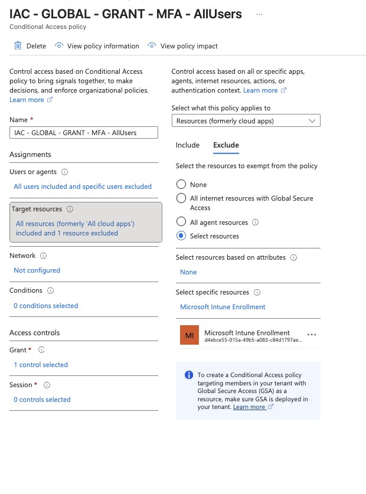
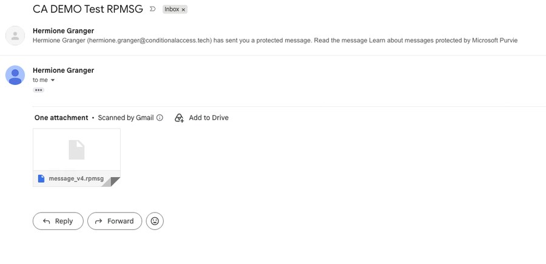
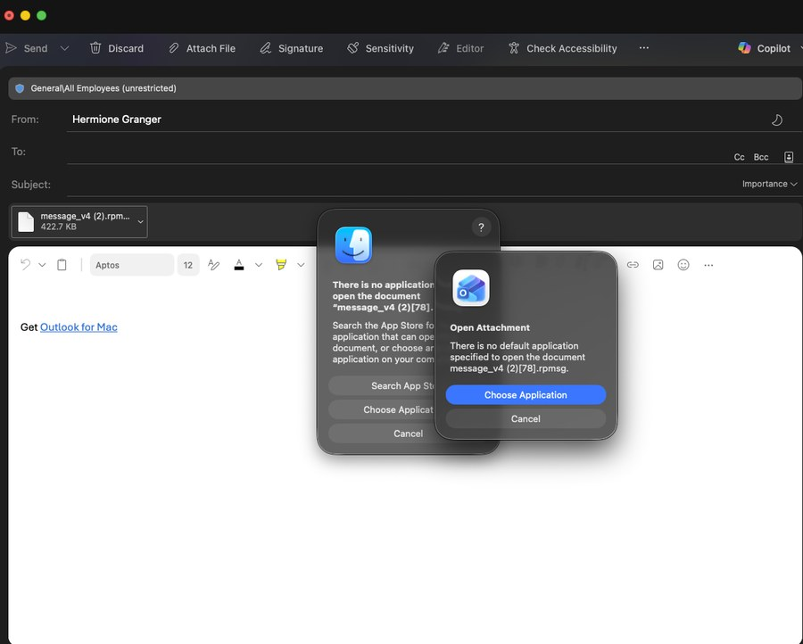
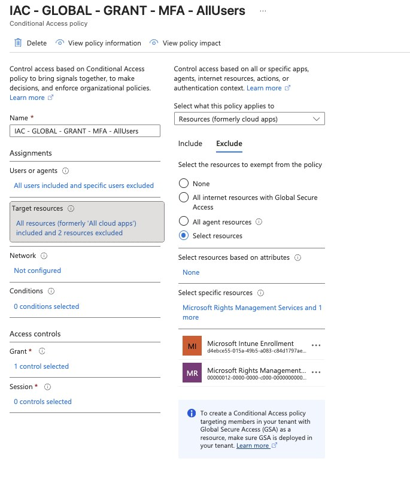
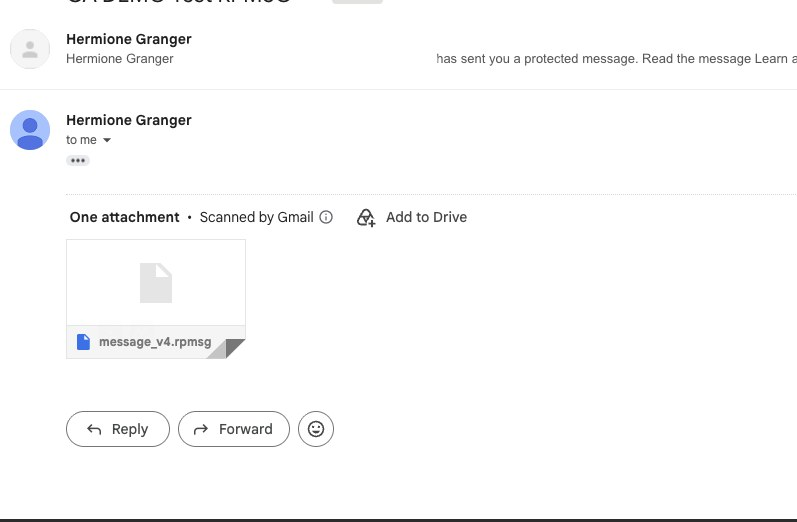
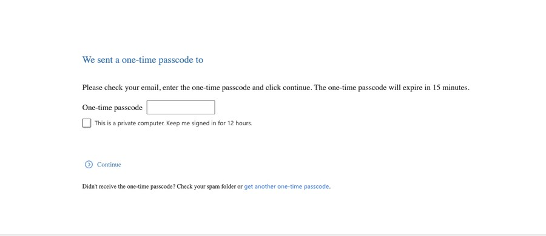
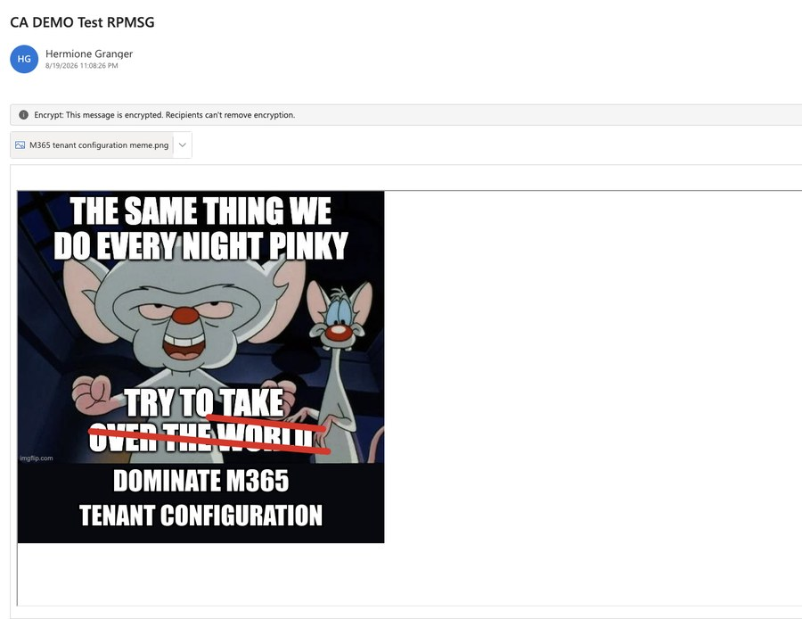

# Why Your Encrypted Emails Won't Open and How to Fix It

*Demo Guide · Conditional Access + Purview*

Sensitivity labels encrypt email. Conditional Access blocks the decryption service. The misconfiguration is invisible on your side. You find out when a recipient calls you.

The Root Cause

## What's Actually Happening

The rpmsg file is a container. It's not the problem. What breaks is what happens when Outlook tries to **unwrap it**.

When a recipient's Outlook desktop opens an rpmsg, it calls the Azure Rights Management endpoint in the sender's tenant to get a decryption key. That call is authenticated, which means it is subject to the sender's Conditional Access policies.

> 🛑 **What Breaks:** Your CA policy requires MFA on all cloud apps. The RMS token request hits that policy. The external recipient has no MFA registered in your tenant. The challenge fails, the key is never issued, the message stays sealed. Nothing logs on your side.

The service being hit is Microsoft Rights Management Services, App ID 00000012-0000-0000-c000-000000000000. It is a cloud app like any other in CA policy scope. "All cloud apps" means this one too.

Before the Fix

## The Broken Flow

1

#### User applies Confidential - Third Parties label in Outlook

Sensitivity label encryption is applied to the outbound email. Azure RMS wraps the message content.

↓

2

#### Email delivered to external recipient as rpmsg

Recipient receives the message with an rpmsg attachment or the OME wrapper. So far, expected behavior.

↓

3

#### Recipient's Outlook desktop tries to decrypt

Outlook contacts aadrm.com, the Azure RMS endpoint in the sender's tenant, to acquire a use license for decryption. This is a live authenticated call, not a cached operation.

↓

!

#### CA policy fires on the Rights Management service principal

"Require MFA for all users, all cloud apps" includes Microsoft Rights Management Services. The external recipient has no MFA registration in your tenant. CA blocks the token issuance. The decryption key is never returned.

↓

✕

#### Recipient sees an error: message will not open

Outlook desktop shows a generic access error. The recipient cannot read the message. No alert fires in your tenant. You won't know unless they tell you.

The Technical Explanation

## What Outlook Desktop Actually Does

### The Service Principal Involved

| Service | App ID | What It Does | CA Impact |
| --- | --- | --- | --- |
| Microsoft Rights Management Services | 00000012-0000-0000-c000-000000000000 | Issues use licenses for RMS-encrypted content at decryption time | Blocks decryption if MFA required and recipient can't satisfy it |

Excluding AIP from the MFA policy does not weaken security. The external recipient authenticated to their own identity provider to reach this point. The RMS token request is a downstream call inside an already-authenticated Outlook session. A second MFA challenge on a service call the user cannot see or control is not a security control. It is a broken user experience with no compensating value.

> ℹ️ **Why This Is Not a Security Gap:** CA enforces MFA at sign-in. The RMS token request happens after the user has already signed in. It is a background credential exchange, not a new session. Excluding AIP from MFA removes an unintended re-challenge on a call the user cannot see or complete.

Any client that goes through the OME portal hits this. The portal calls back to the sender's tenant to get a decryption key regardless of which browser or device the recipient uses. The rpmsg format is not the problem. The endpoint call is.

The Fix

## What Needs to Change in the CA Policy

Two options. Option A is the surgical fix: it leaves everything else unchanged.

Option A: Recommended for Most Deployments

### Exclude AIP service from your MFA policy

Add Microsoft Rights Management Services to the excluded cloud apps list in your "Require MFA All Users" policy. Internal users still get MFA enforced on every other app. The AIP token acquisition call is unblocked for all users including external.

```
# CA policy after fix
Policy Name  : CA002 - Require MFA - All Users
Users        : All users
Exclude Users: Azure-Breakglass, CA-Breakglass
Cloud Apps   : All cloud apps
Exclude Apps : Microsoft Rights Management Services
               # App ID: 00000012-0000-0000-c000-000000000000
Grant        : Require MFA
```

Option B: For Tighter External Posture

### Scope the MFA policy to internal users only

Under Users in the CA policy, select All users but ensure All guest and external users is NOT included. This removes external users from the MFA requirement on all apps in this policy, not just AIP. Only appropriate if you have a separate CA policy handling external user MFA.

```
Assignments → Users → Include : All users
Assignments → Users → Exclude : Guest and external users
                                   Azure-Breakglass
                                   CA-Breakglass
```

> ⚠️ **Caution:** Option B removes external users from this MFA policy entirely, not just for AIP. Only use this if you have a dedicated external user MFA policy in place. Option A is the more surgical fix.

Microsoft Learn

### External recipient can't open encrypted email

The official troubleshooting article documenting this exact behaviour. Covers CA policy blocking the AIP endpoint and labels scoped to internal recipients only, and documents the exclusion as the supported resolution.

[learn.microsoft.com › troubleshoot/outlook/security/external-recipient-cant-open-encrypted-email](https://learn.microsoft.com/en-us/troubleshoot/outlook/security/external-recipient-can%27t-open-encrypted-email)

### Microsoft Entra configuration for encrypted content

Covers cross-tenant access for encrypted content. Explicitly states that Microsoft Rights Management Services must be removed from CA policies or external users excluded when external recipients need to open encrypted content.

[learn.microsoft.com › purview/encryption-azure-ad-configuration](https://learn.microsoft.com/en-us/purview/encryption-azure-ad-configuration)

---

Live Demo

## Step-by-Step Walkthrough

The failure state is what makes the fix meaningful.

Phase 1: Show the Break

1

### CA policy: no Rights Management exclusion

The Require MFA All Users policy targets all cloud apps with no exclusions. Microsoft Rights Management Services is in scope. Any authenticated call to the RMS endpoint from an external recipient will be evaluated against this policy.

Entra admin center → Protection → Conditional Access → Policies → CA002 - Require MFA - All Users



2

### Encrypted email: external recipient

The email is sent with the Confidential - Third Parties sensitivity label applied. This label uses user-defined permissions. The sender explicitly grants the external recipient access at send time. That grant is what puts the recipient through the RMS token acquisition flow, and where the CA policy intercepts it.




3

### Decryption fails: CA blocks the RMS token

The recipient's client calls the sender's RMS endpoint to acquire a use license. CA evaluates that request, requires MFA, and the external recipient cannot satisfy the challenge. The token is denied. The sending tenant logs nothing. The failure is only visible to the recipient.

4

### Native Outlook: message breaks there too

The message also fails when opened natively in Outlook on the Inforcer tenant. No OME portal involved. Outlook desktop on the receiving side calls back to the sender's RMS endpoint directly, hits the same CA policy, and the decryption key is denied. The failure is not limited to the OME portal path.



Phase 2: Explain Why

5

### Microsoft Rights Management Services is a cloud app

Microsoft Rights Management Services appears in Enterprise Applications like any other cloud app. "All cloud apps" in the CA policy includes it, which is why the MFA requirement fires when an external recipient's client tries to acquire a decryption use license.

Entra admin center → Applications → Enterprise applications → Search: Microsoft Rights Management

6

### Explain what Outlook desktop actually does

When Outlook desktop opens an rpmsg, it calls aadrm.com to get a decryption use license. That call is authenticated. CA evaluates it. The external recipient has no MFA registered in your tenant, so the token is denied and the key is never issued. OWA decrypts server-side; the browser never touches aadrm.com.

Phase 3: Apply the Fix and Verify

7

### Add AIP to the excluded cloud apps list

Open the MFA for All Users policy. Under Cloud apps, switch to the Exclude tab. Add Microsoft Rights Management Services. Save the policy. The change takes effect within minutes.

CA policy → Cloud apps or actions → Exclude → Select apps → search "Microsoft Rights Management" → Select → Save



8

### With the exclusion in place: decryption succeeds

The same encrypted email, the same recipient, the same label. With Microsoft Rights Management Services excluded from the MFA policy, the RMS token request goes through. The encryption has not changed. The message is still protected and the rights are still enforced. MFA still applies to every other cloud app.





9

### Sign-in logs confirm the fix

The sign-in logs show a successful authentication entry for the Microsoft Rights Management Services app. Before the exclusion, the same app would have shown an interrupted or failed entry at the same step, the token request blocked by the MFA requirement.

Entra admin center → Monitoring → Sign-in logs → filter App = Microsoft Rights Management Services



---

Customer Talking Points

## The Non-Technical Version

### What to say to the customer

"Your MFA policy is correct, but it is also blocking the background service call that lets recipients decrypt your protected emails. Excluding that one service fixes the delivery problem without touching the protection on the emails themselves."

The protection from the sensitivity label is not weakened by this change. The email is still encrypted with Azure RMS. The recipient still has to authenticate to open it. The label still controls who can read, copy, forward, or print. What changes is that the service call Outlook desktop makes to get the decryption key is no longer interrupted by a secondary MFA challenge that the recipient has no way to complete.

> ⚠️ **Healthcare Context:** For customers with HIPAA obligations: this fix is not a HIPAA compliance gap. The encryption required under §164.312(e)(2)(ii) remains in place. Access control under §164.312(a)(1) is still enforced by the label encryption rights. The CA policy change affects the decryption delivery mechanism, not the protection itself.

IAC Baseline Update

## Add AIP Exclusion to Your Baseline CA Policy

This exclusion should be standard in any baseline that deploys both sensitivity label encryption and MFA for all users. Without it, every customer who sends a labeled email externally will hit this. Add it to your CA baseline documentation and script templates.

```
# PowerShell: add AIP exclusion to existing policy
# Requires: Microsoft.Graph module

$aipAppId = "00000012-0000-0000-c000-000000000000"

# Get the Rights Management service principal object ID
$aipSP = Get-MgServicePrincipal -Filter "AppId eq '$aipAppId'"

# Get your MFA policy (update -PolicyId to your actual policy GUID)
$policy = Get-MgIdentityConditionalAccessPolicy -ConditionalAccessPolicyId "<your-policy-guid>"

# Build the updated excluded apps list
$currentExcludes = $policy.Conditions.Applications.ExcludeApplications
$updatedExcludes  = $currentExcludes + $aipSP.AppId

# Update the policy
Update-MgIdentityConditionalAccessPolicy `
  -ConditionalAccessPolicyId $policy.Id `
  -Conditions @{
    Applications = @{
      IncludeApplications = $policy.Conditions.Applications.IncludeApplications
      ExcludeApplications = $updatedExcludes
    }
  }
```

> ℹ️ **Breakglass Reminder:** Verify both Azure-Breakglass and CA-Breakglass groups remain in excludeGroups on this policy after any update. The AIP app exclusion goes in excludeApplications, not in user excludes. They are separate arrays.

Quick Reference

## Key Facts

| Detail | Value |
| --- | --- |
| Service principal name | Microsoft Rights Management Services |
| App ID (stable, all tenants) | 00000012-0000-0000-c000-000000000000 |
| Endpoint hit by Outlook desktop | aadrm.com |
| Does the OME portal also fail? | Yes. The portal calls the sender's RMS endpoint too. Both Outlook desktop and the OME portal are subject to the sender's CA policy. |
| Does the fix weaken encryption | No. Label encryption remains fully enforced. |
| Does the fix weaken MFA posture | No. MFA required on all other cloud apps unchanged. |
| HIPAA compliance impact | None. §164.312(e)(2)(ii) encryption still in place. |
| Sign-in log filter to verify | App = Microsoft Rights Management Services |
