# Mastering Groups

*Deep Dive Series*

Groups are the connective tissue of identity and the shield that holds your security posture together. This is the deep dive: group types, nesting, enumeration risks, protections, portals, and the hygiene project behind it all.

Series 8 Parts · Series · Author Jon Hope · Author · Site conditionalaccess.tech · Site

01

Why Groups Are the Shield

On building identity security with intention, accountability, and a groups-first mindset.

Why do I feel so strongly about Groups. Some would say I almost rely on groups too heavily. In fact the only thing I don't use groups for is owners to Enterprise apps, but that's because it's not an option and there's a whole rabbit hole there to go down. I digress. Anyway. My love for groups can be summarized in two sayings. **Groups are the shield of Identity and the connective tissue to identity and governance.**

I've done a ton of posts in the past but my logic is this. Two or more identities should be managed via a group. That group should then have owners, humans accountable for the decisions on membership and permissions.

I found time and time again when doing IAM Projects, reviewing identities and grouping members based on roles, divisions, permissions. Always enabled me to simplify my approach to security. Whether it's an assigned group that holds highly privileged accounts or a dynamic group that automagically pulls in all my guest and disabled accounts. It allowed me to easily catalog and identify business units while helping to quickly sift through years of poor hygiene and security practices. All while applying ownership and accountability that was desperately needed.

> "Two or more identities should be managed via a group. That group should have owners. Humans accountable for the decisions on membership and permissions."

While working through these initiatives at an MSP I found one thing that always held true. Not only were groups the connective tissue between M365 technologies like CA, Purview, Teams, SharePoint and Exchange. They were the bridge between on-premises and Entra. Case in point, a lot of our clients were in phase 2, stuck Hybrid and looking for Cloud First. Groups were central to that Cloud First journey.

**📖 Microsoft Learn [Road to the cloud: Establish a cloud-first identity posture in Microsoft Entra](https://learn.microsoft.com/en-us/entra/architecture/road-to-the-cloud-posture)**
The Microsoft framework for moving from hybrid to cloud-first identity, where groups play a central role.

What do I mean by this? Well let's break it down to the technology and simplify the logic. Typical clients would have outdated groups and OU structures that needed to be redefined for a cloud-first world. On-prem file shares that were not maintained. GPO targeting groups with no real logic, or logic that evolved over time while practices and SOPs didn't. What I would do is come in and start by building the foundation of what we were trying to achieve. I would build new groups for Cloud First initiatives like Conditional Access, Authentication Methods and SSO access. This was just the start. Then I would start migrating legacy workloads to the cloud. Think NTFS shares moving to Entra or Azure File Shares. This looked different depending on the org. This was a time to re-evaluate who had access and why. Think through how I would push these out through Intune.

This is the rationale behind the groups-first approach.

🪪

Identity First

Cloud-first groups for Conditional Access, SSO, Authentication Methods, role scoping, licensing and more. The foundation everything else is built on.

💻

Intune

Replacing GPOs with new Device Security policies, Autopilot profiles, and endpoint categorization. Macs and Windows, BYOD vs Enterprise managed devices. All group-scoped.

🏛️

Governance

Admin groups that could review AI agents, Purview compliance and Unified groups as a whole. Assigning Group Owners that ran different teams and were accountable for members and group creation. The goal wasn't to limit productivity, it was to better control accountability.

None of this is easy. If it were easy everyone would do it. The core of Groups and security is intentional control and accountability. If no one is accountable the system collapses and chaos follows. Sprawl, outdated membership and inevitably compromise.

02

Types, Behavior, and Connective Tissue

The six group types, what each one does, and where each one belongs in a security-first architecture.

Microsoft defines each of these extremely well but I'm gonna give you the down and dirty Jon Hope explanation of each as I see it. The [Microsoft Learn comparison page](https://learn.microsoft.com/en-us/microsoft-365/admin/create-groups/compare-groups?view=o365-worldwide) is a great reference but let me break down what these actually mean in practice.

Security Group

The Swiss Army Knife

**Microsoft says:** Used for granting access to Microsoft 365 resources. Can contain users or devices. Supports dynamic membership. Not mail-enabled.

This is your main group type. This can be created as either assigned or dynamic. The ticket to this is determining the group structure ahead of time. I provide a breakdown in my GitHub that follows industry standards while putting a little Jhope finesse on top of things. To me this is the most important type. This is critical to RBAC, CA, privileged vs non-privileged. Typically these are the groups I'm using to enable PIM for Groups on, or allowing users to request via an access package, typically for authentication methods or CA exclusions. Getting these right sets the identity admin up for success in everything else.

`groupTypes: []`

`securityEnabled: true`

`mailEnabled: false`

Microsoft 365 Groups (Unified)

Where Collaboration Meets Governance

**Microsoft says:** Used for collaboration between users, inside and outside your company. Members get group email, shared workspace, SharePoint, Planner, Stream, and calendar. Powers Microsoft Teams membership. Supports dynamic membership.

Unified groups are the backbone to SharePoint, Teams and OneDrive. For me this is easier said than done. These groups become an easy mechanism for group sprawl to occur. The trick is to limit this while not impeding progress. Typically I believe this should be controlled by a subset of accountable admins and team leads, then maintained via policy and access review and governance controls. I'll dig further into this in Section 6 on Protecting Groups.

`groupTypes: ["Unified"]`

`securityEnabled: true`

`mailEnabled: true`

Distribution Groups

The Necessary Evil

**Microsoft says:** Used for sending email notifications to a set group of people. Static membership only. Members can be added to a Team, but the group itself is not. Only individual members join.

Well let's be honest, this is how we all get tickets. At the end of the day we need a single address that then annoys everyone in the organization, I mean alerts everyone in the organization! Fixed it! These are the necessary evil to ensuring the org runs smoothly and that everyone knows what's happening. Personally I would rather create a Teams channel with a Unified group and enable sending.

Mail-Enabled Security Groups

The Legacy Bridge

**Microsoft says:** Combines security group access control with email capability. Cannot be dynamically managed and cannot contain devices.

This feels and really is more legacy. A lot of the features can be replaced by either a Security group or an M365 group if you need the address. It does still provide a way to create a group that has the need for both security and email, but comes with significant limitations. In practice the MESG is best understood as a legacy hybrid object. If you need access control, use a Security Group. If you need email and collaboration, use an M365 Group. The only scenario where MESG still wins is when you genuinely need both in a single object with no interest in dynamic membership or device scope, which is a shrinking use case.

Dynamic Distribution Group

Pure Email Routing

**Microsoft says:** Defined and evaluated in Exchange Admin Center, not Entra. Membership is recalculated at send time against Exchange attributes. No static membership list exists. This is purely an email routing tool, not an access control object.

Gonna be honest, wasn't the email guy. Didn't use them a lot. Probably have created more in testing than in actual production.

Dynamic Security Group (User)

Automagic With Serious Caveats

**Microsoft says:** A Security Group with dynamic user membership. Members are added and removed automatically when user attributes change. Rules evaluate against Entra user attributes like department, jobTitle, country, userType. Requires Entra P1 per user member.

Now this is where things get interesting. I use these extensively in controlling objects. Two caveats: **don't use these for CA bypass and never add a dynamic expression for breakglass.** This is a sure-fired way to let attackers bypass the security controls you put in place for a reason.

I have a ton of examples in my Groups Deep Dive in GitHub. License queries for CA to actively target all P1 or P2 users (if Microsoft auditors come knocking you'll be very glad you had that in place. I'm looking at you, 300 user practice with 1 P2 license), organizing on-premises objects like DUO users by setting an extension attribute via AD. [Full dynamic membership rules reference on GitHub.](https://github.com/Jhope188/LearnGraphAPI/blob/main/Baseline/Entra/readme.md#12-dynamic-membership-rules-reference)

`groupTypes: ["DynamicMembership"]`

`securityEnabled: true`

`mailEnabled: false`

`membershipRule: user.department -eq "Sales"`

> 🛑 **Critical Security Note: Dynamic Groups and Attribute Write Permissions:** The security of a dynamic group is only as strong as the write permissions on the attributes used in the rule. If users can modify their own department attribute, they can add themselves to the group. If that group controls CA exclusions or access to sensitive resources, you have a bypass vector. Source: [Microsoft Learn, Dynamic membership rules](https://learn.microsoft.com/en-us/entra/identity/users/groups-dynamic-membership)

Dynamic Device Group

Cross-Workload Device Targeting

**Microsoft says:** A Security Group with dynamic device membership. Rules evaluate against device attributes like deviceOSType, deviceOSVersion, deviceOwnership, deviceTrustType, enrollmentProfileName. No P1 license required for device members, though P1 is still required at the tenant level to use dynamic groups at all.

Important: you cannot mix users and devices in the same dynamic group. The rule builder UI only works for user rules. Device rules require the text box. Microsoft's own guidance says to use Intune assignment filters for pure Intune targeting and reserve dynamic device groups for cross-workload scenarios like Conditional Access, Autopilot profile assignment, or licensing.

Same as above, tons of examples in the repo. The big thing is not confusing Intune Filters vs Dynamic device groups. **Use a dynamic device group when you need the same targeting to work across Intune AND Conditional Access, Autopilot, or licensing. Use a filter when the targeting is purely for Intune.**

`groupTypes: ["DynamicMembership"]`

`securityEnabled: true`

`mailEnabled: false`

`membershipRule: device.deviceOSType -eq "Windows"`

Dynamic M365 Group

Self-Managing Collaboration Workspaces

**Microsoft says:** A Microsoft 365 Group with dynamic user membership. Same collaboration features as a standard M365 Group but membership auto-populates from user attribute rules. M365 Groups can only contain users, never devices. Requires Entra P1 per user member.

Useful when you want a collaboration workspace that self-manages based on org attributes. For example, all users in a specific department automatically get the Teams workspace without manual onboarding.

Group Type Capability Matrix

| Capability | Security Group | M365 Group | Role-Assignable | Mail-Enabled SG | Distribution |
| --- | --- | --- | --- | --- | --- |
| **Conditional Access** | ✓ | ✓ | ✓ | ✓ | ✓ |
| **PIM Eligible** | ✓ | ✓ | ✓ ^1 | ✗ | ✗ |
| **License Assignment** | ✓ | securityEnabled only | ✓ | ✓ | ✗ |
| **Device Members** | ✓ | ✗ | ✗ | ✗ | ✗ |
| **Dynamic Membership** | ✓ (users or devices) | ✓ (users only) | ✗ Blocked | ✗ | ✗ |
| **HiddenMembership** | ✗ Not supported | Creation only | ✗ | ✗ | ✗ |
| **Nested Groups** | ✓ (other SGs) | ✗ | ✗ Must be flat | MESGs only | ✓ (other DGs) |
| **Soft-Delete Restore** | Preview | 30 days GA | 30 days | ✗ | ✗ |
| **Managed in Entra Portal** | ✓ | ✓ | ✓ | Exchange only | Exchange only |

^1 Any security group or M365 group can be enabled for PIM for Groups. Role-assignable is not a requirement. Role-assignable groups are preferred for privileged access scenarios because they add write protection, but the PIM capability itself is available to all security and M365 groups. Source: [Microsoft Learn, PIM for Groups](https://learn.microsoft.com/en-us/entra/id-governance/privileged-identity-management/concept-pim-for-groups)

**⚙️ GitHub: LearnGraphAPI [Baseline/Entra: Master Groups Scripts](https://github.com/Jhope188/LearnGraphAPI/tree/main/Baseline/Entra)**
Scripts for standardizing group creation, naming conventions, and configuration across portals. The practical companion to this section.

> ℹ️ **Group Naming Standardization:** Consistent naming is the first thing that breaks down in most tenants. The image below covers the naming convention used across the scripts in the repo above.

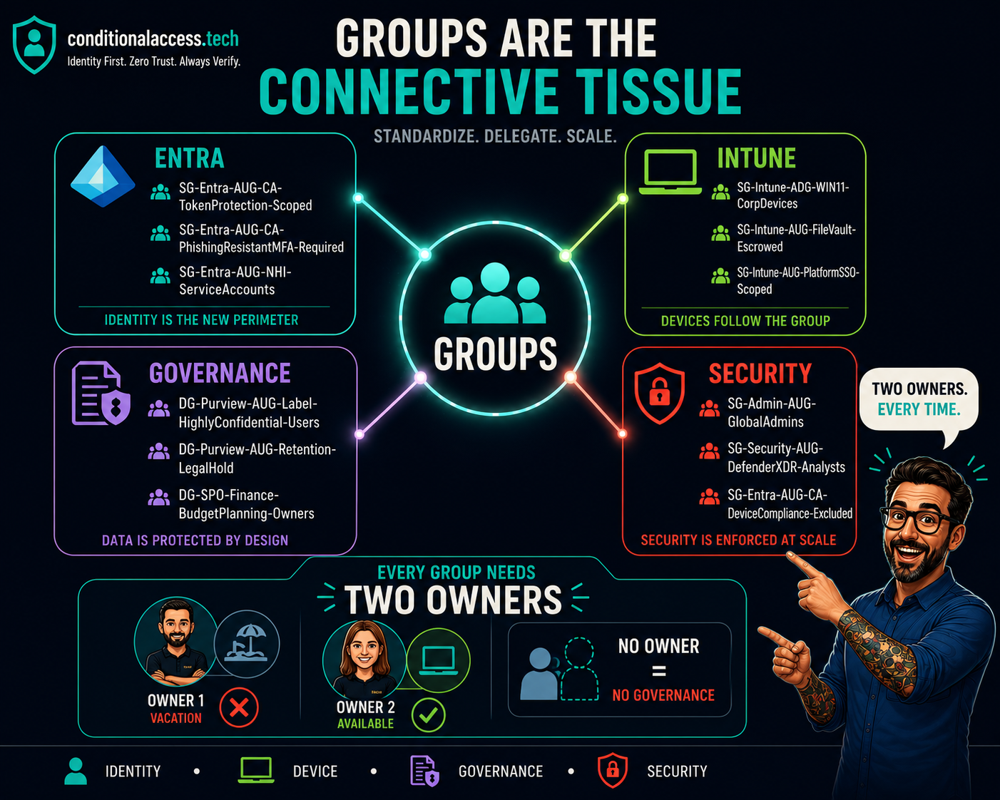

> 🛑 **Key Gotcha: M365 Group securityEnabled:** Created in M365 Admin Center: `securityEnabled: false`, which means you cannot use it for licensing. Created in Entra Admin Center: `securityEnabled: true`, so licensing works. Created via Graph or PowerShell: you set it explicitly. The portal-specific behavior is widely observed but not explicitly documented by Microsoft. Verify in your own tenant before assuming.

> 🛑 **Key Gotcha: isAssignableToRole is Immutable:** The `isAssignableToRole` flag must be set at group creation. You cannot make an existing group role-assignable, and you cannot remove the flag once set. 500 group tenant limit. Plan ahead and get this right the first time.

03

Group Nesting

What works, what silently fails, and where inheritance breaks down across M365 workloads.

Group Nesting and Groups portal differences is where I spent a lot of time while studying for the SC-300. My hope is that this acts as a resource you can use for anyone going through the same questions and concerns when it comes to nesting. Now with that said, definitively there are two amazing articles on Groups from Ewelina that in my opinion are the gospel on group nesting limitations and configuration.

**📖 Ewelina, welkasworld.com, Part 1 [Understanding Microsoft's Group Types: Definitions, Features & Group Nesting](https://www.welkasworld.com/post/understanding-microsoft-s-group-types-definitions-features-group-nesting-part-1)**
The foundational breakdown of group types and nesting behavior. Required reading alongside this section.

**📖 Ewelina, welkasworld.com, Part 2 [Understanding Microsoft's Group Types: Definitions, Features & Group Nesting (Part 2)](https://www.welkasworld.com/post/understanding-microsoft-s-group-types-definitions-features-group-nesting-part-2)**
Deeper nesting behavior, edge cases, and workload-specific inheritance.

What I Tested Personally

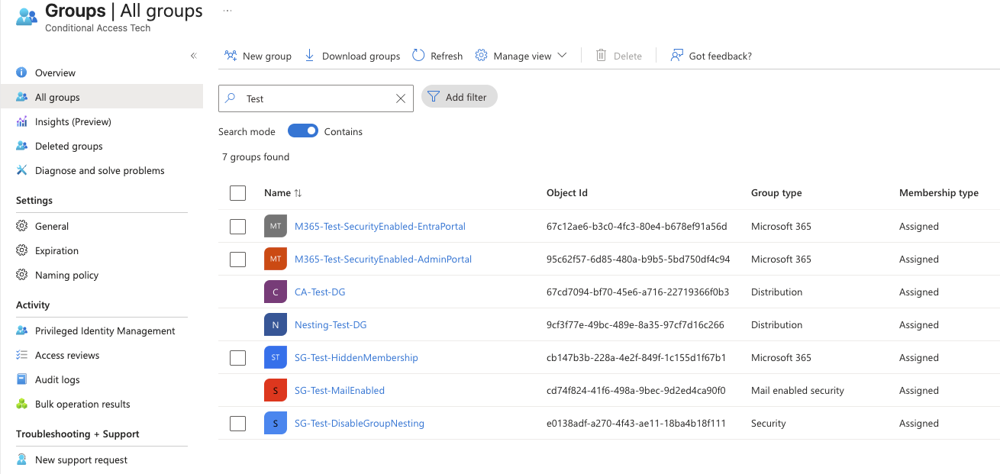

New in Graph: disableNesting Property

Big shout out to Daniel Bradley and [msdocstracker.com/graph](https://msdocstracker.com/graph) for pointing out the new Group Nesting property in Graph. This doesn't show by default but can be seen with the correct API permissions (`Group.ReadWrite.All`, then `Group-NestingSupport.ReadWrite.All`). You will then have to purposely expose the setting via the `disableNesting` property.

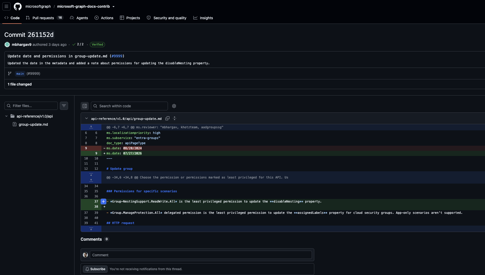

Did some quick testing below. Another great addition in securing groups down. As of right now this property is only available in the **beta endpoint** and has to be set via Graph. Worth noting the permission required is `Group-NestingSupport.ReadWrite.All`, not just `Group.ReadWrite.All`.

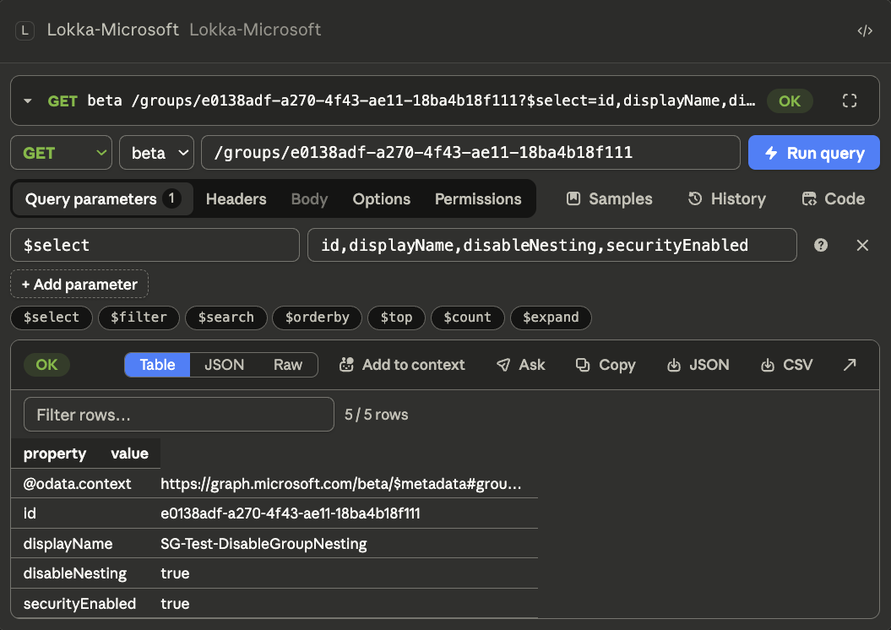

GET /v1.0/groups/{id}?$select=id,displayName,disableNesting

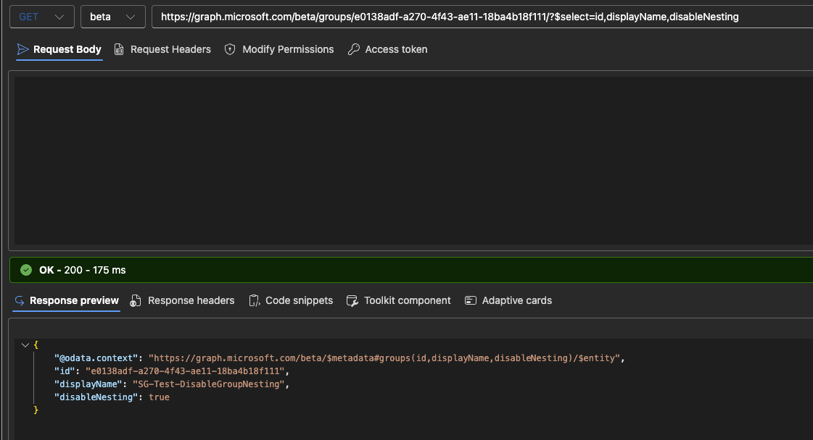

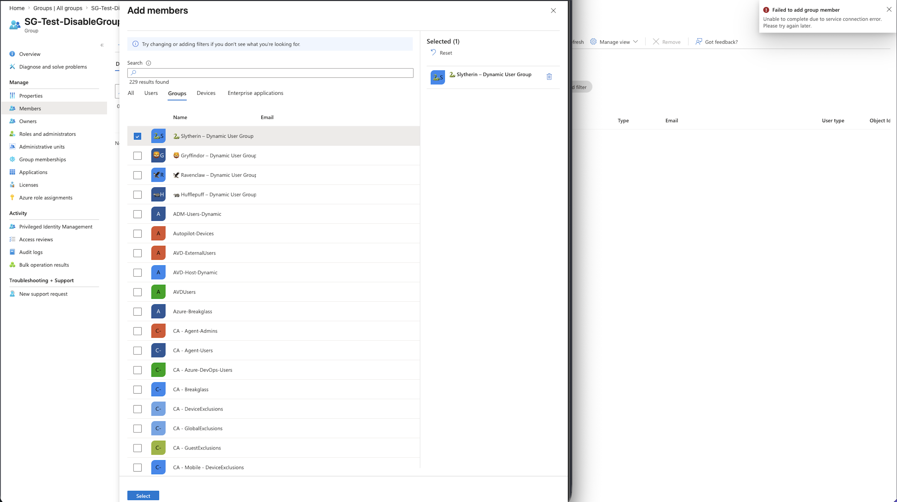

Security Group→ into →Security GroupAllowed

Security Group→ into →M365 GroupBlocked

M365 Group→ into →Other Entra GroupsBlocked

Distribution Group→ into →Distribution GroupAllowed

Mail-Enabled SG→ into →Mail-Enabled SGAllowed

Security Group→ into →Mail-Enabled SGBlocked

Distribution Group→ into →Mail-Enabled SGBlocked

Any nested group→License assignmentNot supported: direct members only

Nested SG members→Conditional Access scopeEvaluated (transitive)

Nested SG members→SharePoint permissionsInherited (transitive)

Nested SG members→Teams channel accessInconsistent: verify per scenario

Nested SG members→M365 Group shared mailboxNot inherited

Any group→ into →Role-Assignable GroupBlocked: must be flat

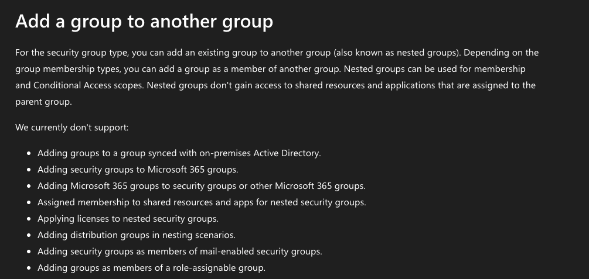

> ⚠️ **Membership Limits: Know Your Numbers:** **SharePoint Online:** A user can be a direct or transitive member of up to **2,047 security groups** before authentication and search results become unpredictable. This is documented in the Entra service limits page and cited directly in Microsoft Q&A against that source. **Conditional Access:** A separate but related limit: if users or groups belong to more than **2,048 groups**, CA policy evaluation may block access. Both limits apply to direct and nested membership combined. Source: [Microsoft Learn, CA Users and Groups](https://learn.microsoft.com/en-us/entra/identity/conditional-access/concept-conditional-access-users-groups)

**📋 Microsoft Learn [Microsoft Entra service limits and restrictions](https://learn.microsoft.com/en-us/entra/identity/users/directory-service-limits-restrictions)**
The authoritative reference for group nesting depth limits, membership limits, and tenant-level constraints.

**📋 Microsoft Learn [Manage Microsoft Entra groups and group membership](https://learn.microsoft.com/en-us/entra/fundamentals/how-to-manage-groups)**
Core group management operations, nesting guidance, and membership types.

## 04. Different Portals, Different Views

This section exists because of a study session. I was working through my [SC-300 prep](https://medium.com/@jhope188/sc-300-implementing-microsoft-identity-and-access-administration-78c69cd79751), following Ewelina's group type breakdown, and I started building test groups to validate what I was reading. Create an M365 group from the Admin Center. Create the same type from Entra. Compare.

They came back different. That was the thread that unravelled everything in this section.

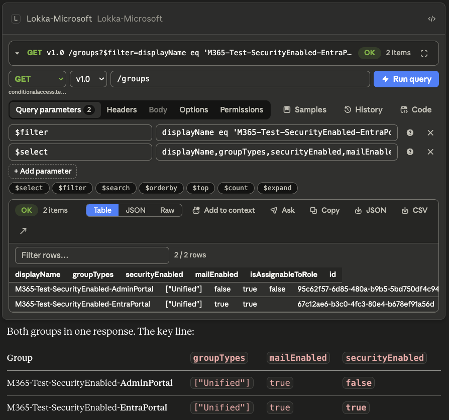

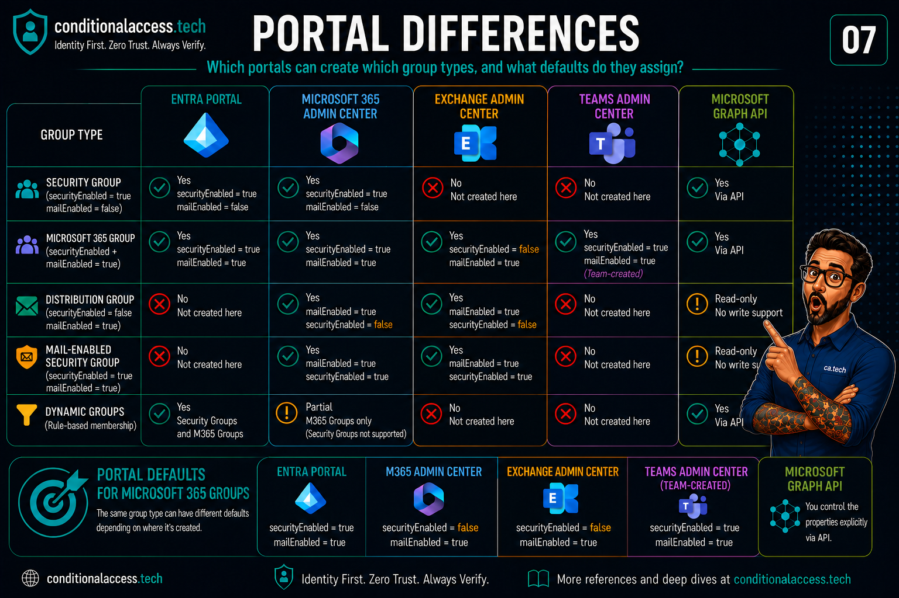

Both groups are groupTypes: ["Unified"]. Both have mailEnabled: true. But the Entra-created group came back with securityEnabled: true, while the Admin Center version returned securityEnabled: false. That one difference cascades into real-world consequences across licensing, CA policy scoping, and more.

The reason this matters: creation is when group properties get set. Some of those properties are immutable after the fact. By the time you notice a gap, the fix is delete and recreate, not edit.

The Licensing Rabbit Hole

Once I had two groups with different securityEnabled values, the obvious next test was licensing. Can I assign a license to either of them?

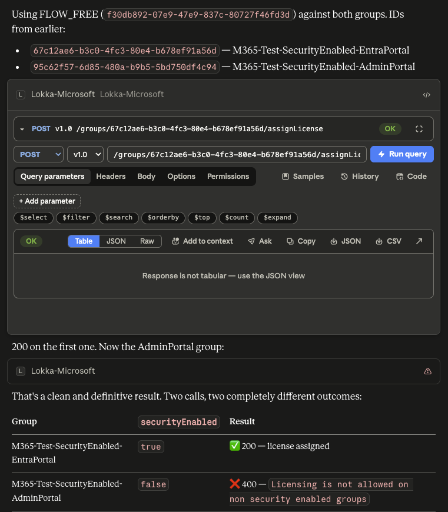

Graph enforced the rule cleanly. securityEnabled: true gets licensed. securityEnabled: false gets a hard 400. Not a portal quirk. A Graph-level constraint.

Then I tried the Entra portal. The Licenses tab redirects you out entirely, telling you to use the Admin Center.

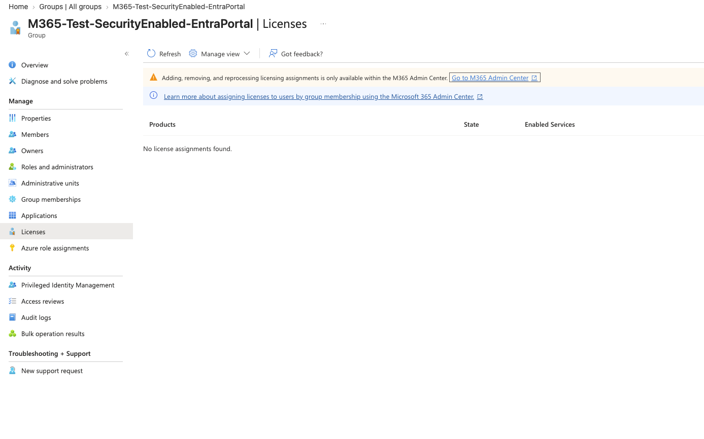

So Admin Center it is. Except when you search for an M365 group to assign a license, it does not show up. The picker only surfaces pure security groups.

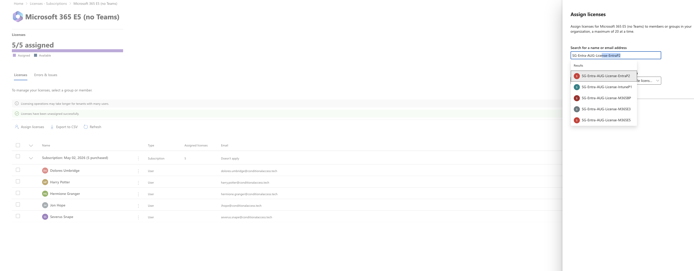

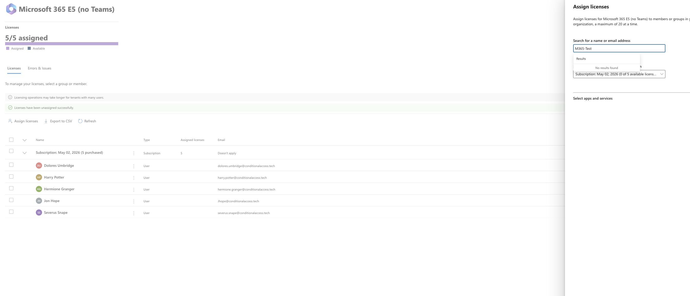

The Admin Center picker is scoped to pure security groups. M365 Unified groups, even with securityEnabled: true, do not appear. If you want to assign a license to an M365 group, Graph is the only path.

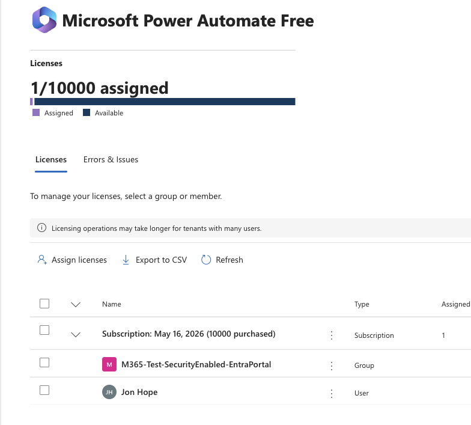

> ⚠️ **Live-tested finding:** Group-based licensing requires securityEnabled: true. Graph enforces this with a hard 400. The Admin Center license picker only surfaces pure security groups. M365 Unified groups with securityEnabled: true are eligible for licensing but invisible in the Admin Center picker. Graph is the only path for M365 group licensing.

Mail-Enabled Groups: Visible but Read-Only in Entra

Distribution groups and mail-enabled security groups surface another portal boundary. You can find them in Entra. You can view their properties. But the moment you try to manage membership or modify them, Entra points you elsewhere.

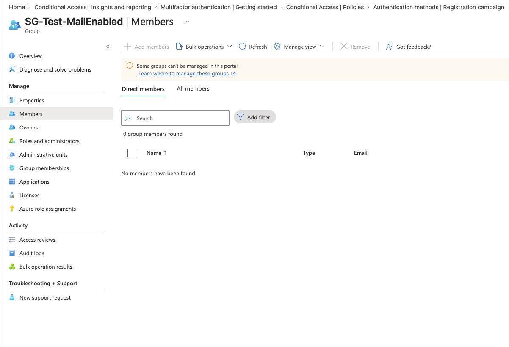

Mail-enabled security groups are Exchange-managed objects. Entra shows them because they have a presence in Entra ID, but write operations route back to Exchange Admin Center or the Microsoft 365 Admin Center. This is the read-only pattern.

Where Can You Actually Manage Each Type?

After testing across portals, here is what it actually looks like.

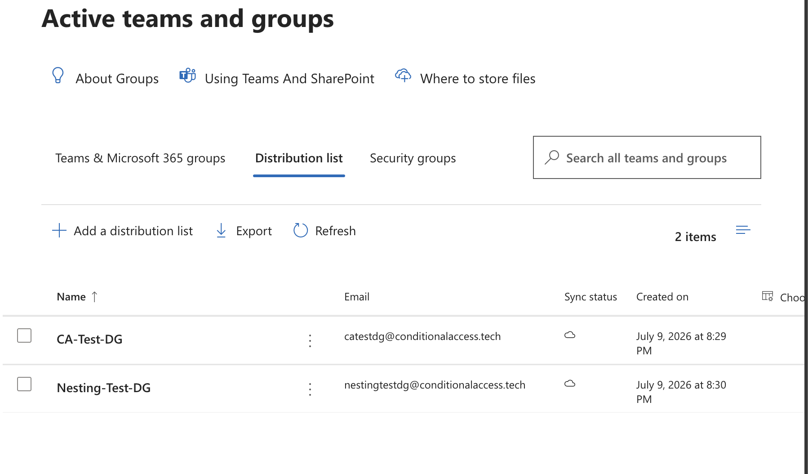

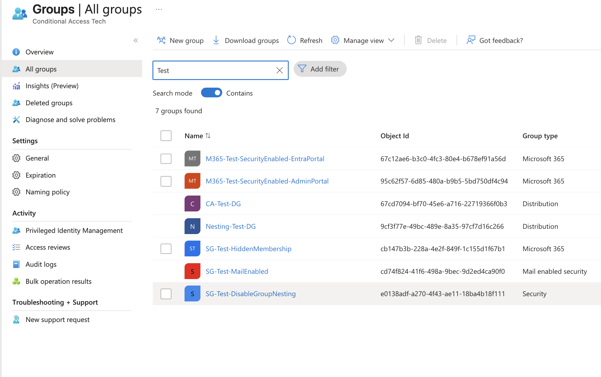

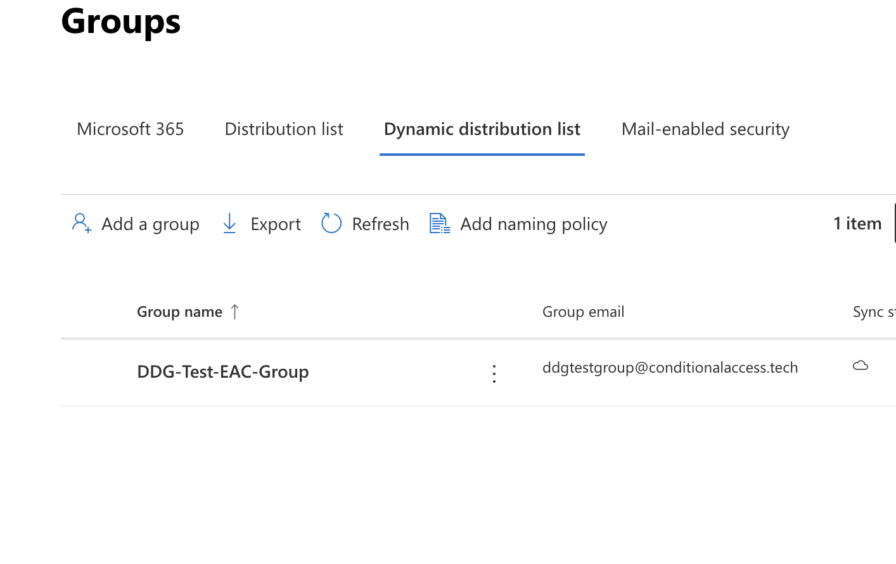

As best I can tell at time of writing, all group types outside of dynamic distribution groups are at least visible inside both Entra and the Admin Center. Dynamic distribution groups are Exchange Admin Center only. They have no Entra presence at all.

Portal Visibility and Management by Group Type

| Group Type | Entra | Admin Center | Exchange Admin Center | Teams Admin Center | Graph API | Notes |
| --- | --- | --- | --- | --- | --- | --- |
| **Security Group** | Full | Full | No | No | Full | Primary home is Entra; securityEnabled: true, mailEnabled: false |
| **M365 Unified Group** | Full | Full | Full | Full | Full | securityEnabled differs by creation portal; Teams sets securityEnabled: true; EAC and Admin Center set securityEnabled: false |
| **Mail-Enabled Security** | No | Full | Full | No | Read-only | Exchange-managed; not created in Entra or Teams; Graph has no write support |
| **Distribution Group** | No | Full | Full | No | Read-only | Exchange-managed; not created in Entra or Teams; Graph has no write support |
| **Dynamic Groups** | Full | Partial | No | No | Full | Admin Center supports M365 dynamic groups only; security dynamic groups require Entra or Graph |
| **Dynamic Distribution Group** | Not visible | Not visible | Full | No | Not supported | Exchange-only object; no Entra, Admin Center, Teams, or Graph presence |

Graph-Only Operations: What the Portal Hides

Portal behavior across this section kept exposing the same pattern: things that appear settable are not, things that appear visible cannot be changed, and some things are only reachable through Graph at all. Collecting these in one place is useful.

> ℹ️ **Operations that require Graph or PowerShell:** **Group-based licensing on M365 Unified groups:** the portal picker only surfaces pure security groups. **HiddenMembership on M365 groups:** creation-time only, not exposed in any portal. **HiddenMembership on Restricted Management AUs:** same rule. **isMemberManagementRestricted on AUs:** immutable after creation, no portal toggle. **disableNesting on security groups:** beta endpoint, creation-time only. **visibility: null vs Private:** the portal never exposes this distinction. **isAssignableToRole:** creation-time flag, no portal toggle after. **guestUserRoleId on authorizationPolicy:** portal exists but only Graph gives you the raw GUID to verify what tier is actually set.

The common thread is that these are creation-time properties the portals either hide during creation or do not surface for editing afterward. By the time you discover the gap, the group has to be deleted and recreated. That makes knowing these exist before you build more important than discovering them after.

Part 6 goes deeper into the protection layer: how to lock groups down, how administrative units and restricted management interact with membership and visibility, and how sensitivity labels fit into the picture.

05

Guests and Groups: The Enumeration Conundrum

What a guest account can see by default, a live demo, and how to lock it down.

The idea of this is simple. Giving attackers any information is an issue. We traditionally want to avoid this at all cost. In the age of AI this is even more pertinent than ever.

Lateral movement and escalation is just about the information you can obtain around in an environment. Something as harmless as a graph permission scope on an enterprise app that can be maliciously used is a common vector. Look at the entire breakdown on how we can use [Files.ReadWrite.All](https://www.youtube.com/watch?v=8kAO9TJBlYQ) or [agent identities](https://www.youtube.com/watch?v=A_8zVGifIlc) maliciously through inherited blueprint permissions. The whole point is how the human in us gets used against us in a malicious way. Technology is binary. Humans are far from that. If Midnight Blizzard showed us anything it's that graph scopes can be used maliciously and even Microsoft isn't safe from risk or human errors. These design gaps expose that as humans we put sensitive data into files, we mistakenly overshare information in email or other M365. The point of the demo is to show how Groups can be used maliciously. Every concept in technology is a double edged sword. It's on us to understand where the limitations are and how good things can be used maliciously to then understand how they can be protected.

Below I want to walk through how something I see all the time can be used in a malicious way. Guest Accounts. Keep in mind guests are just that, they are visitors into your environment. I did an entire write up on guests over at conditionalaccess.tech.

**📖 conditionalaccess.tech [Who Did You Let Into Your House? Guest Identity in Microsoft Entra](https://conditionalaccess.tech/articles/identity/who-did-you-let-in.html)**
Not all guests are the same. The trust model, the CA policy gaps, and the lifecycle problem most tenants ignore.

Keeping in mind we don't treat all guests the same, and the same concept is applicable with technology. Ungoverned groups, guests and settings can be the root cause of an entire tenant takeover or identity compromise.

> 🛑 **The Setup:** I've invited a guest, Jon Hope from Inforcer2M365, into my conditionalaccess.tech tenant. My guest settings are wide open, which is all too often the case because I don't want to limit collaboration. But the default setting is wide open and far too capable of being exploited. Let's show how a guest could be malicious, obtain group information, and laterally identify CA exclusion groups meant to protect the org.

Live Demo

Guest Enumeration Walkthrough

Login to Graph Explorer as the guest account against the conditionalaccess.tech tenant

`https://developer.microsoft.com/en-us/graph/graph-explorer?tenant=conditionalaccess.tech`

1

Confirm guest identity and tenant context

Run `GET /v1.0/me` to confirm who you're signed in as. The `userPrincipalName` returns the `#EXT#` format, which is the guest identity operating inside the resource tenant. The `mail` field shows the home tenant account. Note the tenant context in the top right: Conditional Access Tech, not Inforcer2M365.

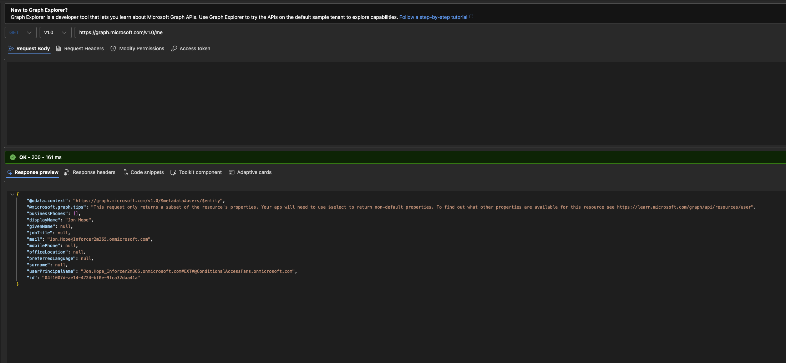

2

The Entra setting that makes this possible: External Collaboration defaults

This is the default state most tenants are running. Navigate to Entra admin center, External Identities, External collaboration settings. **Guest user access restrictions defaults to "Guest users have the same access as members"**, the most inclusive option. This single setting is what allows a guest to enumerate groups, read memberships, and map your CA exclusion architecture without any elevated permissions.

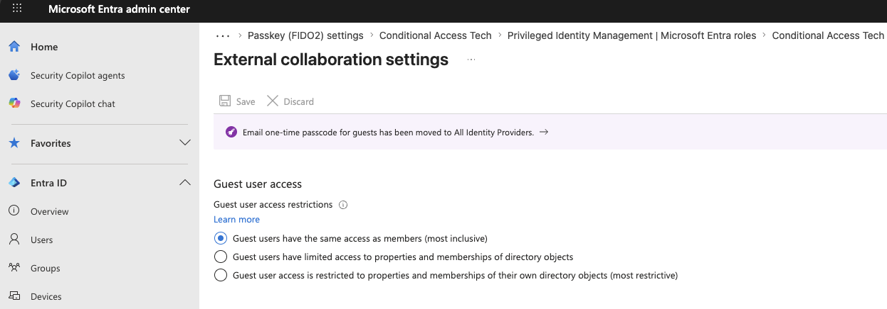

3

Enumerating all groups in the tenant as a guest

Signed into Graph Explorer as `Jon.Hope@Inforcer2m365.onmicrosoft.com` against the conditionalaccess.tech tenant, confirmed in the top right. Running `GET /v1.0/groups?$select=displayName,id,visibility` returns every group in the directory. The guest can see display names, IDs, and visibility values across the entire group estate, including CA exclusion groups, naming conventions, and any group that looks like a privileged container.

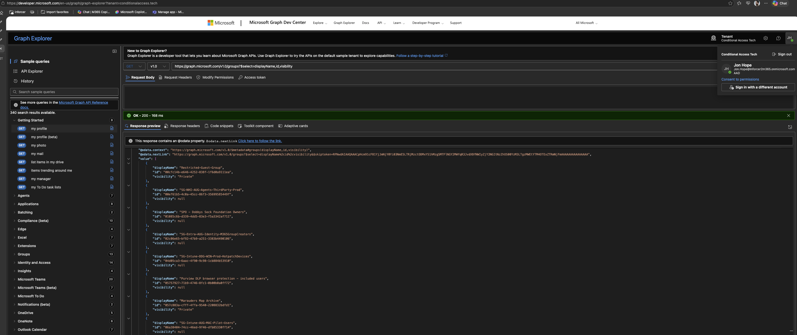

4

Enumerating breakglass group members: the critical moment

The guest has spotted `SG-Entra-AUG-CAP-BreakglassAccounts` in the group list. One more call returns the full member list: display names, UPNs, and object IDs. An attacker now knows exactly which accounts bypass every CA policy in the tenant. That's the attack surface. Two API calls.

GET /v1.0/groups/5628ad67-f9d1-4495-abe3-99dc8f9074f1/members

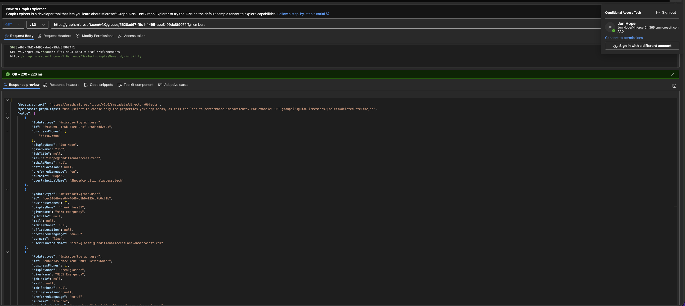

5

Securing the setting: restrict guest access to their own directory objects

Back in External Collaboration Settings, change **Guest user access restrictions** to **"Guest user access is restricted to properties and memberships of their own directory objects (most restrictive)"**. Sign out of Graph Explorer, clear the token, open a fresh incognito session, sign back in as the guest. Run the same two commands. Very different outcome.

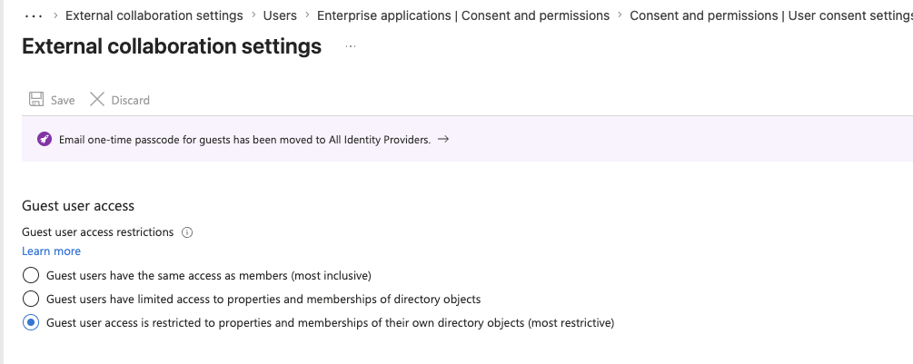

> A guest account. A default setting. Thirty seconds. That's all it takes to enumerate the members of your CA exclusion group.

Lockdown

Now Let's Protect This

Change the guest access restriction, sign out, clear the token, sign back in, run the same commands.

6

Fresh session: signing back in as the guest after the setting change

After flipping the restriction and clearing the token, sign back in via `aka.ms/ge?tenant=conditionalaccess.tech`. The passkey prompt confirms authentication is hitting the home tenant. A fresh token is issued against the updated policy. The existing cached token from the earlier session is gone.

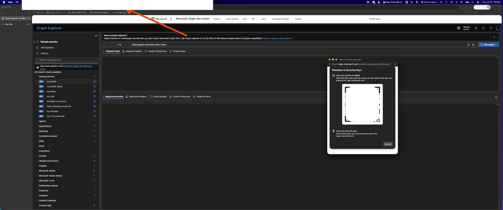

7

Same command. Access denied.

Run the same `GET /v1.0/groups?$select=displayName,id,visibility` call with the fresh token. The guest can no longer enumerate groups in the directory. The restricted `guestUserRoleId` setting limits the guest to their own directory objects only. The group estate is no longer visible. One setting change, same attacker, completely different outcome.

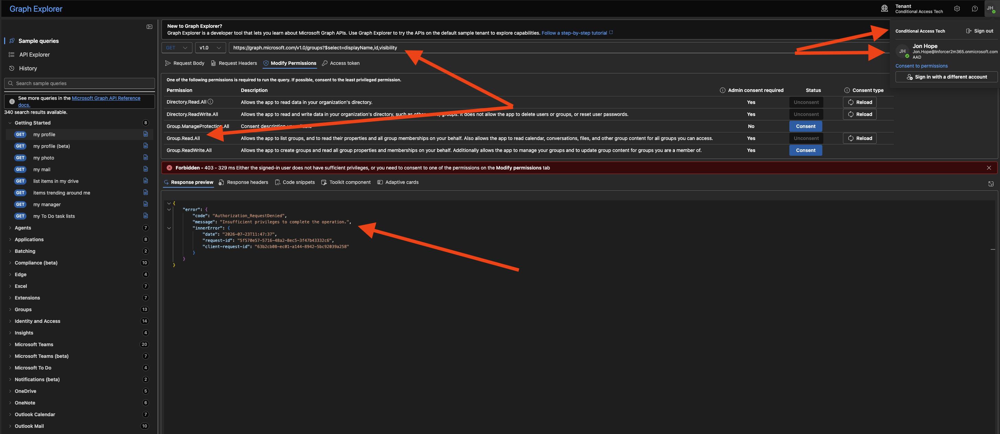

> ℹ️ **Verify the change via Graph:** Don't trust the portal alone. Confirm the setting took effect by running `GET /v1.0/policies/authorizationPolicy?$select=guestUserRoleId`. The three GUIDs to know: `a0b1b346` member-equivalent (do not use), `10dae51f` limited access (default), `2af84b1e` restricted (what you want).

> ⚠️ **Teams Caveat:** The restricted setting does not prevent guests from seeing other members in Teams channels they're already a member of. This is a documented limitation. The setting controls directory-level enumeration, not Teams channel membership visibility. If your guests are in Teams channels alongside sensitive users, that surface remains exposed regardless of this setting.

Same commands. Very different outcome.

This is what security comes down to. Understanding how groups can be maliciously used. In the next part of this series I'm going to dig even further into more protections for groups, including RMAU, sensitivity labels, and the industry patterns for locking down the groups that matter most.

**🎥 YouTube [Files.ReadWrite.All: How Graph Scopes Can Be Used Maliciously](https://www.youtube.com/watch?v=8kAO9TJBlYQ)**
A deeper look at how application permissions become attack vectors.

**🎥 YouTube [Agent Identities and Inherited Blueprint Permissions](https://www.youtube.com/watch?v=A_8zVGifIlc)**
How AI agent identities inherit permissions and the blast radius that creates.

## 06. Group Protections

At this point you know how groups work, how they nest, where they live, and how different portals surface them differently. The natural question is: how do you actually lock them down? Who can create them, who can modify them, and how do you prevent a group that matters from being tampered with?

That is what this section covers. The mechanisms are layered. None of them are complete solutions on their own. Together they give you intentional control.

Controlling Who Can Create Security Groups

The first question most admins ask is: "Can I just disable this setting so nobody can create groups?" The answer is: yes, partially, and it depends on which type of group you mean.

In Entra's User Settings panel, there is a single toggle for security group creation by regular users. When set to No, only admins can create security groups. This is the right starting point for any tenant that wants controlled, named, governed groups rather than group sprawl.

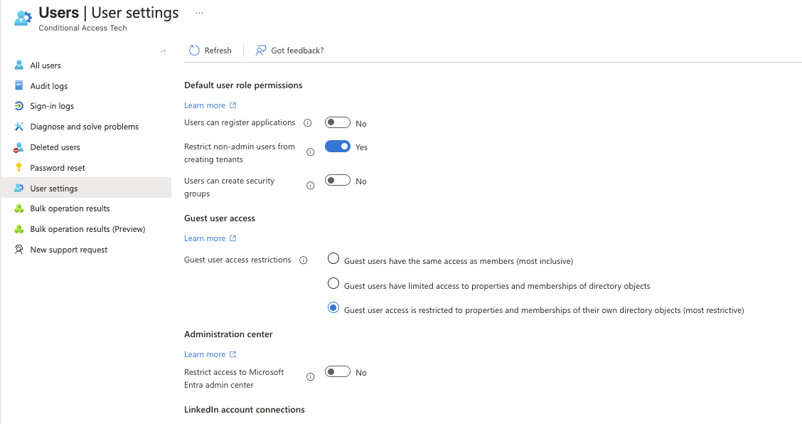

But that setting only covers security groups created through Azure portals, the API, and PowerShell. M365 Unified Groups have a separate control, and it lives elsewhere.

Controlling M365 Group Creation

M365 group creation is governed through the Groups General settings in Entra. This panel also exposes controls for Self Service Group Management, the Microsoft 365 Groups toggle itself, and directory-wide group settings. The controls here cover group creation from Azure portals, the API, and PowerShell.

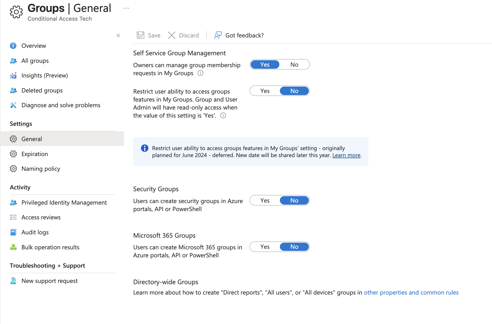

What the portal UI description says is "Azure portals, API, or PowerShell", and that phrasing is easy to misread as leaving Teams, SharePoint, and Outlook untouched. It does not. Because Entra ID is the directory of record for all M365 groups, the restriction enforces a tenant-wide check on any user-initiated group creation regardless of which workload initiates it. Block group creation in Entra and you block it in Teams, SharePoint, and Outlook too. What the UI description is actually telling you is the admin surfaces where the setting itself can be configured, not the scope of what it restricts.

What this means for the demo below is deliberate. The Azure portal is the surface that makes the restriction most visible to an infrastructure engineer. Severus Snape has Contributor rights on the subscription. He can deploy resources. He cannot create Entra objects. The Azure portal is where that wall is most likely to surprise someone who does not think of Azure RBAC and Entra permissions as separate planes.

Putting the Theory to the Test

Severus Snape is a Contributor on the Azure subscription. He can deploy infrastructure. He cannot create groups. When settings are correctly configured, he hits the wall even in the Azure portal.

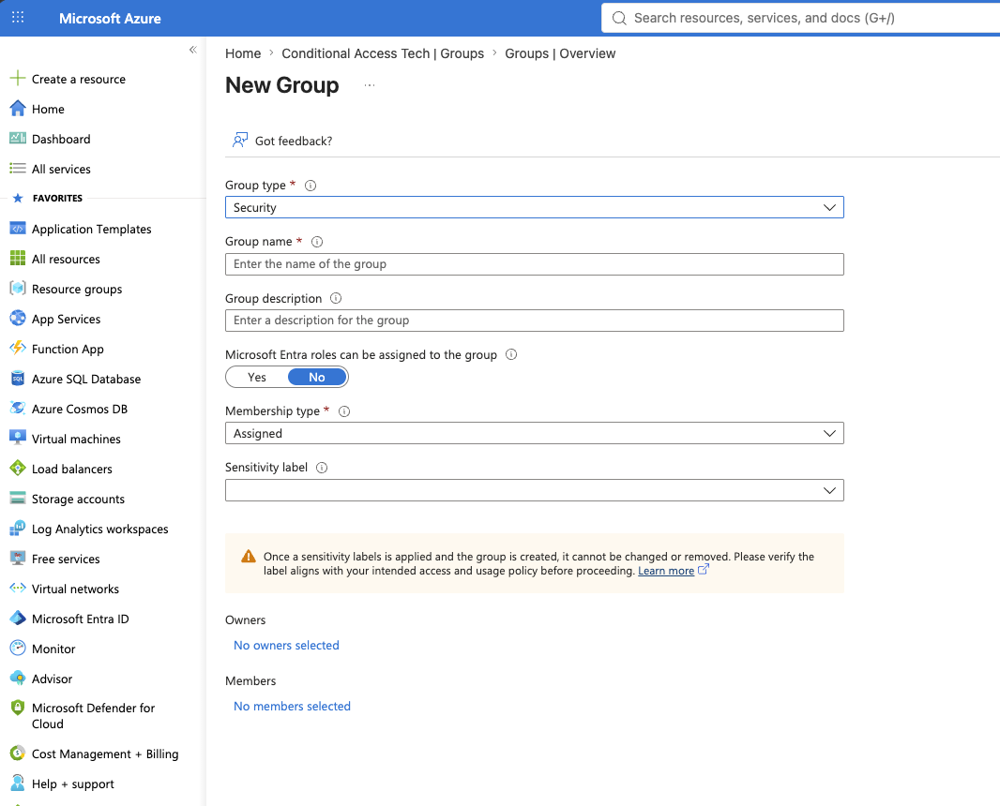

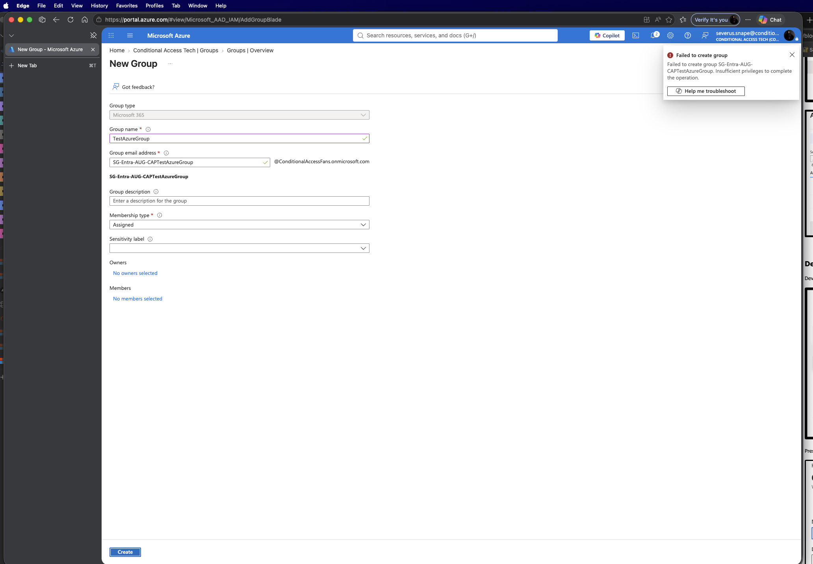

Two interesting things visible in the test. First, the Group type dropdown shows Microsoft 365 as the only available option. This is because the security group creation toggle was set to No in User Settings, which blocks that pathway but does not suppress the M365 option in the Azure portal UI. Second, the creation attempt fails regardless, because the Groups General setting also blocks M365 group creation.

This matters. Azure RBAC and Entra group controls are separate authorization planes. A Contributor can deploy resources. They cannot create Entra objects unless granted that permission explicitly.

The M365 Group Creation Check in Inforcer

The M365 group creation control is a CIS benchmark check. Inforcer surfaces this directly. When the setting is correctly configured you see a pass. Microsoft's reference for managing who can create M365 groups is documented here: [Manage who can create Microsoft 365 Groups](https://learn.microsoft.com/en-us/previous-versions/microsoft-365/solutions/manage-creation-of-groups?view=o365-worldwide).

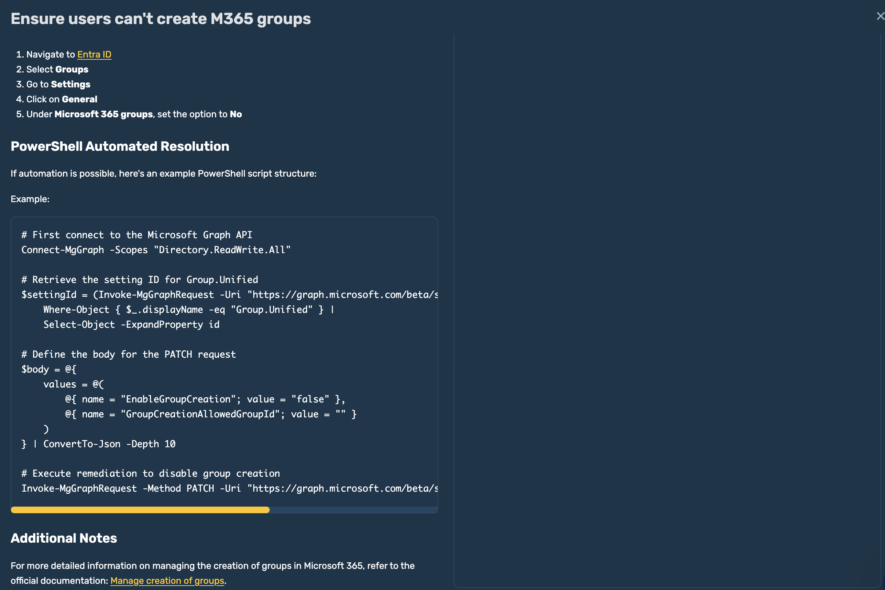

The underlying setting lives in the Group.Unified directory settings object via Graph. The two key values are EnableGroupCreation and GroupCreationAllowedGroupId. The second one matters more than it looks: it scopes creation rights to a specific group, which means you can allow a governed set of users to create M365 groups without opening creation to everyone.

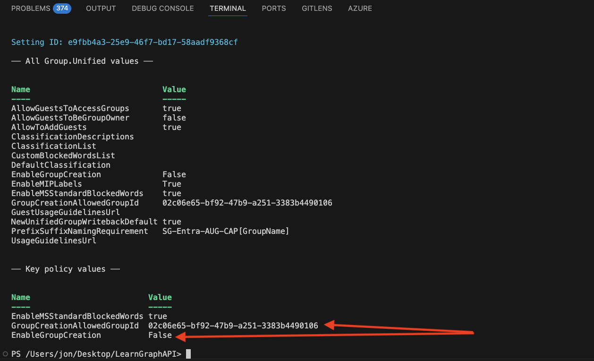

Sensitivity Labels: Identity and Data Governance Converge

Sensitivity labels are one of the clearest signals that identity administration and data governance are becoming the same job. I wrote about this after Ignite and built this image to capture the core idea:

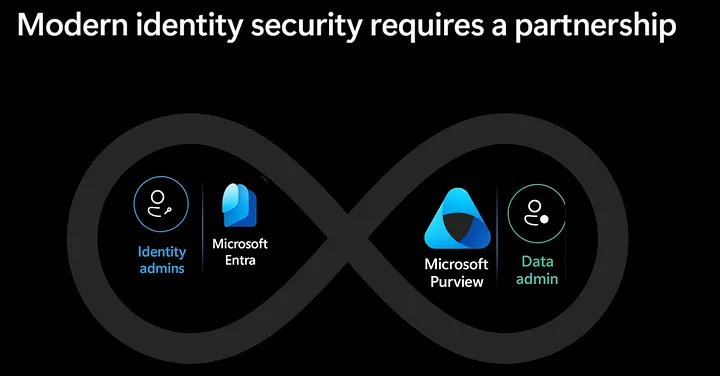

M365 Groups have supported sensitivity labels for some time. When a label is applied to a group, it enforces settings on the group as a container: privacy configuration, external user access, external sharing from connected SharePoint sites, and Conditional Access controls for labeled SharePoint sites. The label overrides whatever privacy setting was on the group. Apply a Confidential label that enforces Private, and the group becomes Private regardless of what it was before.

The practical use case I tested before building this series: restricting guests from being added to a group that handles internal-only documentation. A sensitivity label that blocks external user access enforces that at the group level, not at the admin's discretion on any given day.

Reference: [Microsoft's InsideTrack article on sensitivity labels and Entra](https://www.microsoft.com/insidetrack/blog/transforming-our-approach-to-sensitivity-labels-at-microsoft-with-microsoft-entra/). Also a walkthrough video I recorded: [YouTube walkthrough](https://youtu.be/8W6qQH3feDo?si=KthAxq8Vo-VTixYH).

For Entra security groups, sensitivity label support is currently in preview. The same labels you publish in Purview apply to cloud security groups with no separate label configuration required. Limitations: dynamic membership groups, synced groups, and Exchange-managed groups are excluded. Flag this as preview behavior before writing it into any production documentation.

> ⚠️ **Preview, Sensitivity Labels on Security Groups:** **Still in preview. Behavior may change before GA.** Key things to know before using this in production: **Labels are immutable once applied.** Unlike M365 groups where owners and admins can change or remove labels, on security groups you cannot change or remove a label after it is set. If you need to change it, you delete the group and recreate it. Choose carefully. **Prerequisites:** At least one active Entra ID P1 or P2 license (or M365 E3/E5). EnableMIPLabels=True set in the Group.Security directory settings template (separate from Group.Unified used for M365 groups, enabling it for M365 groups does not cover security groups). Labels published in Microsoft Purview with Groups & Sites scope. Labels synchronized to Entra ID via Execute-AzureADLabelSync from Security & Compliance PowerShell. Allow up to 24 hours after sync. **Supported on:** Cloud-only security groups with assigned membership. Not supported on dynamic membership groups, on-premises synced groups, Exchange-managed groups, or mail-enabled security groups. **Nesting caveat:** You cannot apply a label to a group that contains nested groups. Remove child groups first, apply the label, then label child groups individually with an equally or more restrictive label before adding them back. Reference: [Assign sensitivity labels to Microsoft Entra security groups (preview)](https://learn.microsoft.com/en-us/entra/identity/users/groups-sensitivity-labels)

Hidden Membership on M365 Unified Groups

One mechanism to limit internal visibility is HiddenMembership on M365 Unified Groups. This is a soft protection. Think of the guest enumeration scenario covered in Section 05. The idea is similar but points inward: limiting what users inside the organization can see about group membership.

When visibility: HiddenMembership is set on an M365 group, non-members cannot see who is in the group. Members can still see each other. Owners and admins retain full visibility regardless. This is not a security boundary. Admins, PowerShell cmdlets, and Graph with sufficient permissions bypass it. It is a guardrail against casual enumeration, not a defense against determined insiders or malicious actors with admin access.

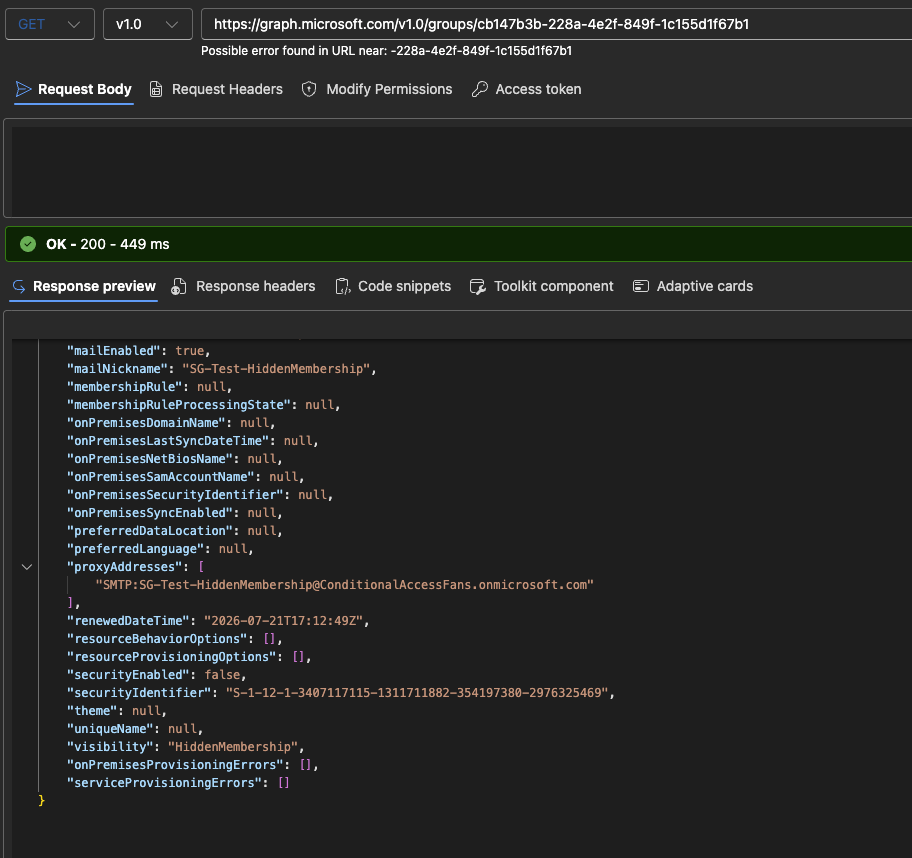

> ℹ️ **Key constraint: HiddenMembership:** HiddenMembership can only be set at group creation time, via Graph or PowerShell (New-UnifiedGroup -HiddenGroupMembershipEnabled:$true). It is immutable after creation. It is only supported on M365 Unified groups. Security groups (securityEnabled: true) and HiddenMembership are mutually exclusive. The portal does not expose this option during creation.

Combined with HiddenFromAddressListsEnabled, these are your primary tools for limiting how much of a group's identity is visible to users who aren't members. Neither replaces proper access control. They reduce surface area.

AU vs RMAU: The Break-Glass Question

From soft membership visibility controls to the hardest protection available: Administrative Units, and specifically Restricted Management Administrative Units.

I covered this in depth in a separate article: [AU vs RMAU on conditionalaccess.tech](https://conditionalaccess.tech/articles/entra/au-vs-rmau.html). The section here focuses specifically on how AUs and RMAUs interact with group protection.

One of my favorite articles on this topic is by cybersecurity researcher Jay Kerai: [The main reason you shouldn't exclude break-glass groups from access](https://www.linkedin.com/pulse/main-reason-you-shouldnt-exclude-break-glass-group-access-kerai-4dtve/). Jay's argument is that groups are too easily modified by too many roles, and the safer path is to not use groups for break-glass CA exclusions at all.

I think both positions have merit. The graphic below captures where Jay and I land:

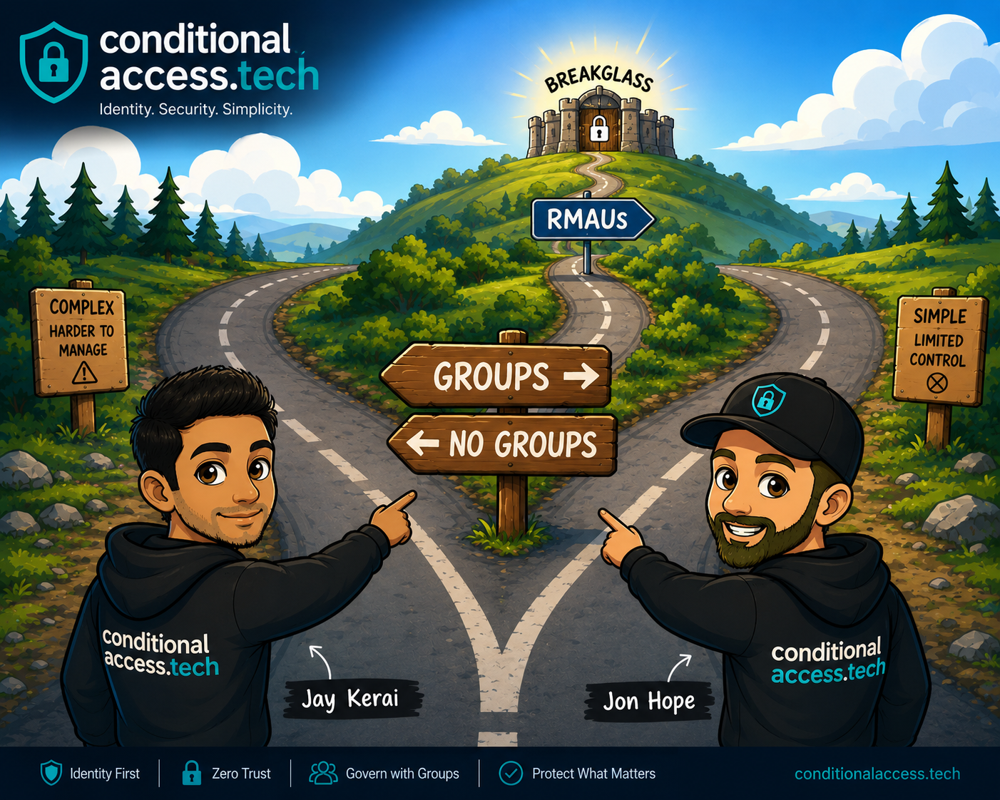

Jay's core concern: many roles can modify or create groups in ways you might not expect. The blast radius of a misconfigured or compromised group containing a break-glass exclusion is significant. He is right. The answer is not to abandon groups. The answer is to lock the groups down with the right mechanism: RMAUs.

An RMAU places the group under restricted management. Only scoped administrators explicitly assigned to that RMAU can modify the objects inside it. Global Admin cannot touch them unless granted that scoped role. This is the correct protection model for break-glass exclusion groups, CA exclusion groups, and any group that if modified would create a security incident.

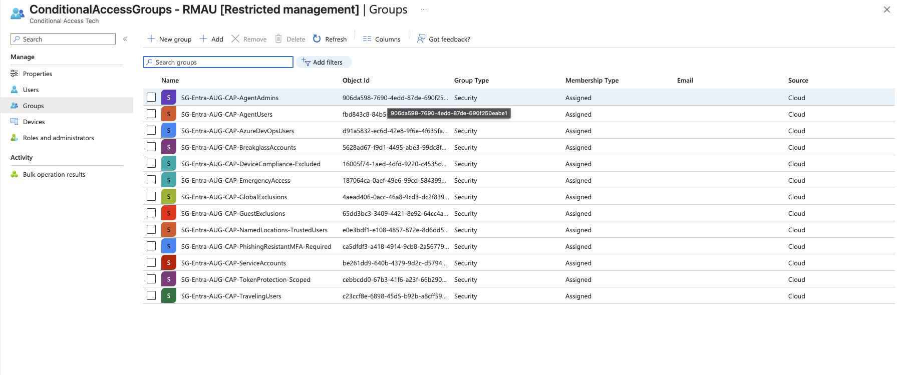

> 🛑 **Never use dynamic groups for break-glass:** Do not put break-glass accounts in a dynamic group. An attacker who can manipulate the attribute used by the membership rule can add themselves automatically. The group becomes a liability, not a protection. Assigned membership only for anything in an RMAU.

Hidden Membership on RMAUs

This is the feature most people have never heard of. An RMAU can also have visibility: HiddenMembership. This means non-members cannot see who is in the AU. Only users with specific privileged roles, or users who are members of the AU, can see membership. Jay Kerai mentioned this in a presentation. Katie Knowles documented how it can be abused for persistence: [Abusing Entra ID Administrative Units](https://securitylabs.datadoghq.com/articles/abusing-entra-id-administrative-units/).

Worth knowing it exists for two reasons. First, so you can use it intentionally to limit visibility of your most sensitive administrative scopes. Second, so during post-incident reconnaissance you do not overlook AUs or RMAUs that an attacker may have created. Hidden membership means they do not show up in standard directory browsing.

At time of writing, HiddenMembership on an RMAU can only be set at creation via Graph Explorer, using the beta endpoint:

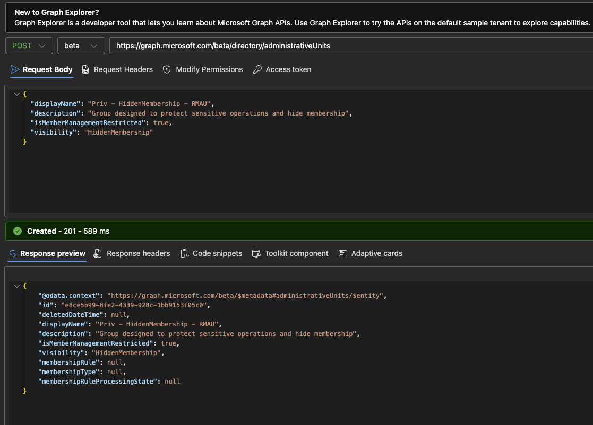

To demonstrate the effect: Snape, who is a member of the RMAU, can see its members when viewing it in the portal.

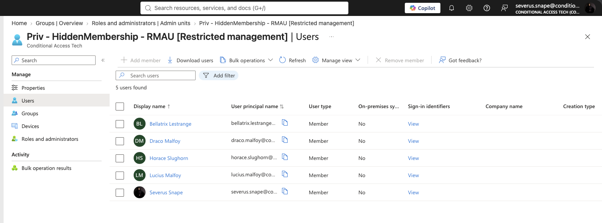

Dolores Umbridge, who is not a member and holds no scoped role over the RMAU, sees nothing:

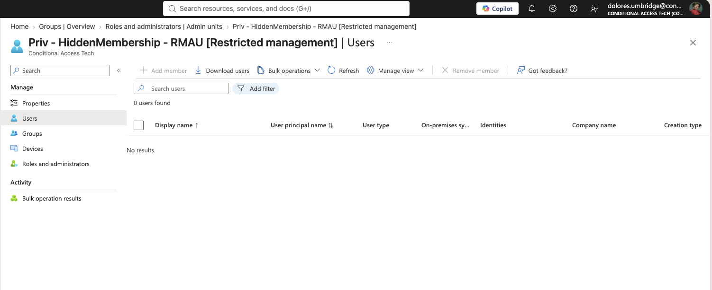

Is this overkill for most MSPs? Probably. The AU and RMAU post on conditionalaccess.tech covers the reality that most MSPs are not using AUs at all today. That should change. The hidden membership layer on top of an RMAU is the far end of the intentionality spectrum, but it is a real tool and it is worth understanding what it does.

If you are using hidden membership RMAUs or AUs in production, reach out. I would love to hear the specific use case that drove the decision.

Part 8 covers the key gotchas, the things that catch people regardless of how much they know.

## 07. The Group Hygiene Project

Everything covered so far in this series assumes you know what you have and why it exists. In most tenants that assumption fails the moment you look closely. Groups accumulate. Names drift. Purposes get blurry. And without a consistent structure from the start, every admin after you is reading tea leaves trying to figure out what a group does and whether they can touch it.

Governance does not begin at the expiration policy or the access review. It begins at the name.

Microsoft's Built-in Naming Controls

Entra has two native mechanisms under Groups, Naming Policy. The first is prefix and suffix enforcement for M365 groups. You define a string that gets prepended or appended to any group name a user creates. The second is a blocked words list, where specific terms are rejected outright. Neither of these is a complete naming system. But they are a signal to the org that naming is intentional, and they catch the worst drift at creation time.

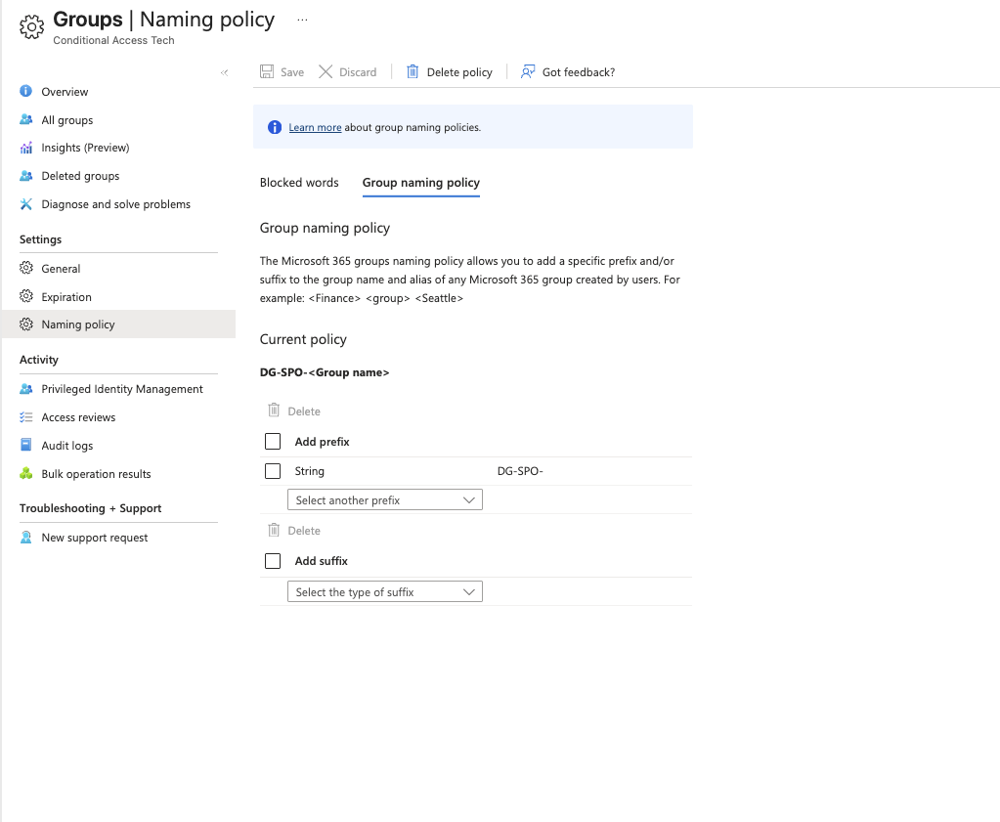

The limitation is scope. The Entra naming policy only applies to M365 groups created by users. It does not cover security groups. It does not apply when admins create groups. And it does not tell anyone what the name means or how it maps to a purpose. That requires a standard.

A Standard That Actually Scales

Back in Section 2 I referenced my naming convention and the scripts behind it. The idea is not complicated. Every group should be readable at a glance. The name tells you the type, the scope, the purpose, and the membership model. Without that, you end up with groups named "Marketing Team" sitting next to "Mktg-Team-Old" and nobody willing to delete either because nobody knows if they are the same thing.

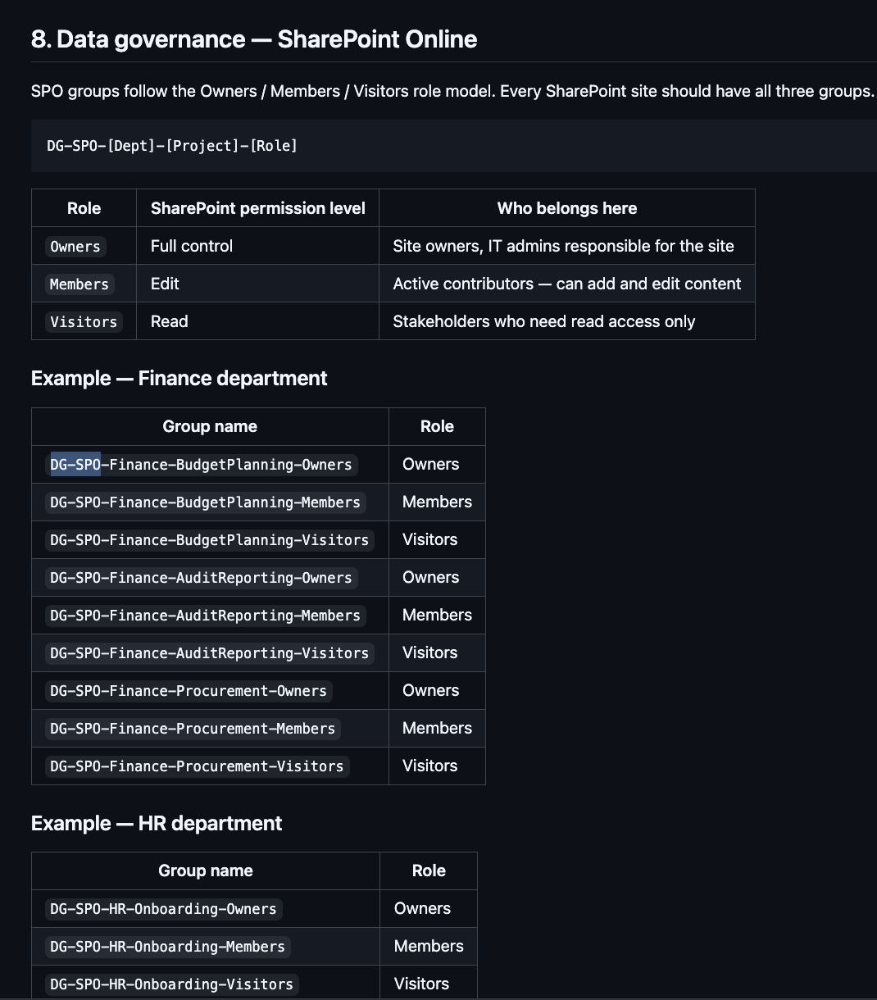

I learned this the hard way. At my previous company I built a naming convention that worked well at first and ran out of runway as the use of groups grew. New use cases arrived that the original names did not anticipate. GDAP relationships, SPO governance groups, Purview DLP scopes, all required naming that the original system could not cleanly accommodate. Retrofitting it was painful. That experience drove me to build something that was designed to scale rather than something that had to be extended after the fact.

The full standard lives in my GitHub repo: [Jhope188/LearnGraphAPI, Baseline/Entra](https://github.com/Jhope188/LearnGraphAPI/tree/main/Baseline/Entra). The infographic below captures the core logic.

The Naming Convention Document

The naming document does more than define prefixes. It explains why each group exists, what the type codes mean, how the scope segment maps to the actual workload, and what the membership model implies. AUG means assigned user group, where an admin assigns members manually. DUG means dynamic user group, where a dynamic rule evaluates attributes to determine membership. That distinction matters for CA policy scoping, licensing, and governance reviews.

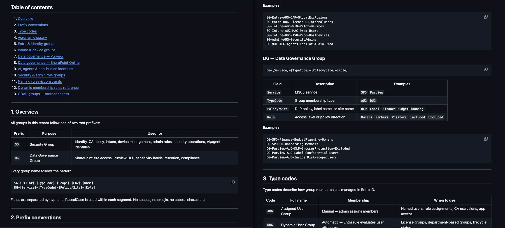

One deliberate decision baked into the standard: any script that creates groups automatically adds the user running it as a group owner. If you are going to provision a set of groups, you should carry accountability for them. Ideally, a second owner with domain knowledge is added afterward. The Intune admin should own SG-Intune groups. The department manager should own the DG-SPO groups for their team.

Scripts That Follow the Standard

Each group category has its own provisioning script. Security groups, Intune device groups, GDAP admin groups, SPO governance groups, Purview governance groups, AI agent groups, and the RMAU with hidden membership covered in Section 6. The scripts handle creation, naming, owner assignment, and in some cases the properties that have to be set at creation time.

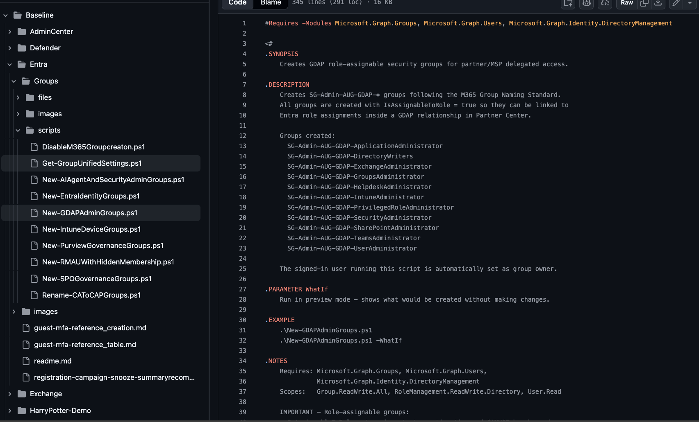

The repo also includes the DisableM365GroupCreation script with the option to pass in a single group as the creation-allowed group, which maps directly to the Group.Unified GroupCreationAllowedGroupId setting covered in Section 6.

> ℹ️ **The underlying principle:** Naming conventions do not restrict users. They give groups an identity that survives personnel changes, admin turnover, and the slow accumulation of context loss that happens in every organization over time. A group named SG-Entra-AUG-CAP-GlobalExclusions tells the next admin exactly what it is, who manages it, and why touching it requires thought. A group named "Exclusions" tells them nothing.

My hope is that this gives someone a starting point. Not a prescription. The standard I use reflects my environment and the use cases I have built against. Your org will have different pillars, different workloads, different constraints. The value is not copying the convention. The value is having one, documenting it, and building scripts that enforce it so the standard outlasts the person who created it.

08

Key Gotchas and Things That Catch People

The decisions that look fine until they aren't. Verified against Microsoft Learn.

These are the things that come up in IAM projects, in tenant reviews, and in post-incident analysis. Some are documented clearly. Some are widely observed but tucked away in a Q&A thread. All of them have burned someone.

**📖 Kandi Brian [Every Group Type in Microsoft 365 and Entra ID, Compared](https://kandibrian.com/articles/m365-groups-comparison.html)**
A thorough independent reference that informed several of the gotchas in this section. Well sourced and worth bookmarking.

> 🛑 **1. Role-Assignable Groups Cannot Be Nested Inside:** **What MS says:** A group cannot be added as an active member of a role-assignable group. Group nesting is blocked entirely. The group must be flat. This is explicitly documented in the Microsoft Learn role-assignable groups article. One group can be an *eligible* member of another group via PIM, but active membership nesting into a role-assignable group is not supported.  
  
 **Why it matters:** Any attempt to nest a regular security group inside a role-assignable CA exclusion group will silently fail or be rejected. If your design relies on group nesting to populate a role-assignable exclusion group, rethink the design. Keep role-assignable groups flat and membership directly managed.  
  
 **Source:** [Microsoft Learn: Use Microsoft Entra groups to manage role assignments](https://learn.microsoft.com/en-us/entra/identity/role-based-access-control/groups-concept)

> 🛑 **2. PIM for Groups: Don't Nest Groups Inside PIM-Enrolled Groups:** **What MS says:** Microsoft's security guidance explicitly recommends against nesting groups inside PIM-enrolled role-assignable groups. A non-role-assignable group nested inside provides a lateral path for lower-privileged admins (Groups Administrator, Exchange Administrator, Knowledge Administrator) to influence privileged group membership indirectly. The Microsoft Learn PIM for Groups doc is explicit: role-assignable groups can't have other groups nested inside them as active members.  
  
 **The nuance:** One group *can* be an eligible member of another group even if one is role-assignable. But active nesting is blocked. And from a security posture standpoint, even eligible nesting into PIM groups should be deliberate and reviewed.  
  
 **Source:** [Microsoft Learn: PIM for Groups](https://learn.microsoft.com/en-us/entra/id-governance/privileged-identity-management/concept-pim-for-groups) and [Microsoft Learn: Best practices for securing Entra ID Governance](https://learn.microsoft.com/en-us/entra/id-governance/best-practices-secure-id-governance)

> 🛑 **3. Group-Based Licensing Does Not Traverse Nested Groups:** **What MS says:** Group-based licensing only applies to direct members of the licensed group. Transitive membership through nesting is explicitly not supported. Even if a user is a member of a nested security group, they will not receive the license assignment unless they are a direct member of the group the license is assigned to.  
  
 **Why it bites people:** You build a clean nested group structure for managing your P1 and P2 licensed populations, assign the license to the parent group, and wonder why half your users aren't getting it. This is one of the few places in M365 where transitive group membership is explicitly excluded. Licensing requires direct membership, full stop.  
  
 **Source:** [Microsoft Learn: Group-based licensing additional scenarios](https://learn.microsoft.com/en-us/entra/identity/users/licensing-group-advanced)

> 🛑 **4. Administrative Units Cannot Be Nested:** **What MS says:** Administrative units cannot be nested inside other administrative units. This is documented as an explicit constraint in the Microsoft Learn AU article.  
  
 **What this means in practice:** If you're designing an AU structure for delegation, you cannot create a parent/child hierarchy of AUs. Each AU is a flat container. Your delegation model needs to be designed around this constraint from the start, not retrofitted after the fact.  
  
 **Source:** [Microsoft Learn: Administrative units in Microsoft Entra ID](https://learn.microsoft.com/en-us/entra/identity/role-based-access-control/administrative-units)

> 🛑 **5. RMAUs Only Support Specific Group Types:** **What MS says:** If the administrative unit is a restricted management administrative unit, the group type must be a Microsoft Entra security group. Only non-unified groups that are security enabled, not mail enabled, and not on-premises sync enabled are supported.  
  
 **Why it matters:** You cannot add M365 groups, mail-enabled security groups, distribution groups, or on-premises synced groups to an RMAU. If your group portfolio contains these types and you're planning to use RMAU for write protection, you'll hit a wall. Cloud-only security groups only.  
  
 **Source:** [Microsoft Learn: Restricted management administrative units](https://learn.microsoft.com/en-us/entra/identity/role-based-access-control/admin-units-restricted-management)

> ⚠️ **6. M365 Group securityEnabled Varies By Portal:** **Observed behavior (not formally documented per portal):** Created in M365 Admin Center: `securityEnabled: false`, cannot use for licensing. Created in Entra Admin Center: `securityEnabled: true`, licensing works. Created via Graph or PowerShell: you set it explicitly.  
  
 **Fix if needed:** `Update-MgGroup -GroupId $id -SecurityEnabled:$True`  
  
 Microsoft Learn's Graph API examples default M365 Groups to `securityEnabled: false`. The portal-specific difference is widely observed but not explicitly documented in a single Learn article. Verify in your own tenant before assuming.

> ⚠️ **7. isAssignableToRole and HiddenMembership Are Both Immutable After Creation:** The `isAssignableToRole` flag must be set at group creation. You cannot make an existing group role-assignable and cannot remove the flag once set. 500 group tenant limit. `HiddenMembership` is only supported on M365 (Unified) groups, and only at creation time. It cannot be set after the group is created and cannot be applied to security groups at all. Both are creation-time decisions with no retrofit path. If you need either property, you are recreating the group.  
  
 **Source:** [Microsoft Learn: Role-assignable groups](https://learn.microsoft.com/en-us/entra/identity/role-based-access-control/groups-concept)

> ⚠️ **8. Dynamic Groups Are Only as Secure as the Attributes They Use:** If users can modify their own `department` attribute, they can add themselves to any dynamic group that uses that attribute in its rule. If that group controls CA exclusions or access to sensitive resources, you have a bypass vector. Microsoft calls this out explicitly in the dynamic membership rules documentation.  
  
 Specifically for CA: never drive a CA exclusion group from dynamic membership. The rule is the attack surface. A compromised or impersonated admin who can modify the rule can grant themselves CA bypass.  
  
 **Source:** [Microsoft Learn: Dynamic membership rules for groups](https://learn.microsoft.com/en-us/entra/identity/users/groups-dynamic-membership)

> ⚠️ **9. Deleting an M365 Group Deletes Everything Connected to It:** Deleting a Microsoft 365 Group initiates deletion of all connected resources: the shared mailbox, SharePoint site, OneNote notebook, Planner board, and any associated Teams workspace. Everything enters a soft-delete state for 30 days, then permanent deletion. This is meaningfully different from deleting a security group, which only removes an access control object. Distribution groups and mail-enabled security groups cannot be soft-deleted and restored at all. If you delete one, it's gone.  
  
 **Source:** [Microsoft Learn: Restore a deleted Microsoft 365 group](https://learn.microsoft.com/en-us/microsoft-365/admin/create-groups/restore-deleted-group)

> ⚠️ **10. SharePoint Groups Are Invisible to Entra: But It Depends on the Site Type:** This one is more nuanced than most gotcha lists make it sound. The behavior differs significantly depending on which type of SharePoint site you're dealing with.  
  
 **Team sites (connected to M365 Groups):** Each SharePoint team site is by default part of a Microsoft 365 group. Group owners become site owners, group members become site members. Because the M365 group is an Entra object, membership is Entra-visible. The SharePoint Owners/Members/Visitors groups still exist as a legacy layer underneath, but the primary membership surface is the M365 group. The blind spot here is reduced, not eliminated.  
  
 **Communication sites:** Communication sites aren't connected to Microsoft 365 groups and use the standard SharePoint permissions groups: Owners, Members, Visitors. These are purely SharePoint-native objects. No Entra presence, no Graph API visibility, no Entra audit logs. When you add an Entra security group to a communication site permission group, the site owner sees the group name but cannot see who is a member of it. The membership is invisible from the SharePoint layer.  
  
 **Why it bites people:** Admins assume that because they can see a security group listed in SharePoint site permissions, they know who has access. They don't. Site owners running an access review manually from the SharePoint permissions page will see group names, not members. A departed employee who is still a member of an Entra security group that was added to a communication site two years ago still has access. Nobody sees it without going to Entra and looking up that group specifically.  
  
 **How to create a SharePoint-only group invisible to Entra:** You don't create it explicitly. It's created automatically when you provision a communication site, or when you use SharePoint's Advanced Permissions settings to create a custom SharePoint group. These are site-scoped objects that live entirely in the SharePoint layer. They have no Entra object ID, no Graph API endpoint, and do not appear in the Entra admin center.  
  
 **Source:** [Microsoft Learn: Sharing and permissions in the SharePoint modern experience](https://learn.microsoft.com/en-us/sharepoint/modern-experience-sharing-permissions)

> ⚠️ **11. Teams Creation Means M365 Group Sprawl Without Controls:** Every Team created by end users automatically creates an M365 Group with all connected resources. Without restricting group creation via `EnableGroupCreation: false` in Entra group settings, every licensed user is a group creator by default. In a large org with Planner enabled and no group creation policy, you will end up with hundreds of orphaned groups that no one owns and nothing cleans up.  
  
 **Source:** [Microsoft Learn: Manage who can create Microsoft 365 Groups](https://learn.microsoft.com/en-us/microsoft-365/solutions/manage-creation-of-groups)

> ⚠️ **12. Adding a Group to an AU Scopes the Group Object, Not Its Members:** When you add a group to an administrative unit, the AU brings the group itself into the management scope, not the members of the group. A scoped administrator at the AU level can manage the group object (rename it, delete it, modify it) but cannot necessarily manage the users who are members of that group unless those users are also members of the AU.  
  
This is a frequently misunderstood distinction when designing AU-based delegation models for MSP or large enterprise environments.  
  
 **Source:** [Microsoft Learn: Add users, groups, or devices to an administrative unit](https://learn.microsoft.com/en-us/entra/identity/role-based-access-control/admin-units-members-add)

> ⚠️ **13. Nested SG in a Distribution Group Does Not Deliver Email to Its Members:** Exchange resolves group membership using mail-enabled expansion logic at send time. If a non-mail-enabled security group is nested inside a distribution group, Exchange will not expand the security group's membership and its members will not receive the email. The send may succeed without error, making this a silent failure. Every group in the nesting chain must be mail-enabled for email delivery to reach the full intended recipient list.  
  
 **Source:** [Microsoft Learn: Manage mail-enabled security groups in Exchange Online](https://learn.microsoft.com/en-us/exchange/recipients-in-exchange-online/manage-mail-enabled-security-groups)

> ⚠️ **14. Transitive Group Membership Is Not Uniform Across M365 Services:** Transitive (nested) security group membership is evaluated in SharePoint Online and in Conditional Access scope. It is not evaluated for group-based licensing (direct members only), for M365 Group shared mailbox access, or for Authentication Methods policies. Teams channel access via nested groups is inconsistent and should be verified per scenario. Do not assume that because nesting works in one workload it works in all of them.  
  
 **Source:** [Microsoft Learn: Entra service limits and restrictions](https://learn.microsoft.com/en-us/entra/identity/users/directory-service-limits-restrictions)

> ⚠️ **15. Disabling a User Account Does Not Remove Group Memberships:** When a user account is disabled in Entra ID, it does not automatically remove that user from any groups. The user loses the ability to authenticate but all group memberships remain intact in the directory. If the account is ever re-enabled, all memberships are immediately restored. In organizations with long account-retention periods, disabled accounts can sit in security groups, role-assignable groups, and M365 groups for months after the employee departed. Offboarding procedures must explicitly handle group membership removal, not just account disablement.

> ⚠️ **16. On-Premises Synced Groups Are Read-Only in Entra:** Groups synchronized from on-premises Active Directory via Entra Connect are read-only in Entra ID. Any membership changes made in the Entra portal will be overwritten at the next synchronization cycle. Offboarding actions, membership changes, and group modifications for synced groups must be performed in on-premises AD. This is the most common source of "I removed them but they still have access" complaints in hybrid environments.

> ⚠️ **17. SharePoint Permission Groups Are Invisible to Entra: But It Depends on the Site Type:** This one catches people because the behavior differs based on site type, and most admins don't realize the distinction exists.  
  
 **Team sites** are connected to an M365 group by default. Group owners become site owners, group members become site members. The underlying M365 group is an Entra object and is fully visible in the Entra admin center. Membership managed through the M365 group is auditable.  
  
 **Communication sites** are not connected to Microsoft 365 groups and use the standard SharePoint permissions groups: Owners, Members, Visitors. These are purely SharePoint-native, site-scoped objects. No M365 group behind them, no Entra admin center surface, no Graph API visibility, no Entra audit logs.  
  
 **Why it bites people:** When an Entra security group is added to a SharePoint permission group on a communication site, the site owner sees the group name but cannot see who is inside it. A security group with 200 members gives 200 people read access to a communication site and the site owner has no visibility into who those 200 people are. That's a governance blind spot that doesn't produce alerts and doesn't show up in Entra reporting. It only surfaces when you go looking for it.  
  
 You don't create these SharePoint groups deliberately; they're created automatically when a communication site is provisioned, or when you create custom groups via SharePoint's advanced permissions settings. They live entirely in the SharePoint layer.  
  
 **Source:** [Microsoft Learn: Sharing and permissions in the SharePoint modern experience](https://learn.microsoft.com/en-us/sharepoint/modern-experience-sharing-permissions)

> 🛑 **18. Global Secure Access Does Not Support Nested Groups: Direct Membership Only:** Global Secure Access (GSA) traffic profile assignment has a hard constraint that is easy to miss: **nested group memberships are not traversed**. A user must be a direct member of the group assigned to the traffic profile. Transitive membership through a nested group is ignored entirely; the user simply does not receive the profile.  
  
 There are a few other assignment constraints worth knowing alongside this:

> 🛑 **19. memberOf Dynamic Group Rule Is Being Deprecated: November 3, 2026:** The `memberOf` rule operator allowed you to build a dynamic group whose membership was derived from a user's membership in *other* groups, essentially creating a group-of-groups via a dynamic rule. The pattern looked like this: In the example below, "Hogwarts Witches and Wizards" is a dynamic group that automatically includes any user who is a direct member of Slytherin, Gryffindor, Ravenclaw, or Hufflepuff: the four house groups. It's an elegant pattern for rollup groups. **⚠️ The preview is ending. After November 3, 2026, it stops working.** Any dynamic membership group, dynamic administrative unit, or entitlement management auto-assignment policy using `memberOf` will freeze in its last known state and stop updating. New users added to the source groups will not be picked up. Existing members will not be removed when they leave. The group silently stales out: no error, no alert, just drift. **What goes wrong when it freezes:** Teams and SharePoint access based on the rollup group becomes stale. CA targeting that includes or excludes the group will be wrong. Group-based licensing assignments will drift. Access package auto-assignments will stop reflecting reality. All of this fails silently: the group still exists, it just doesn't update.  
  
 **What to do before November 3:** Audit your tenant for any dynamic group rules containing `memberof`. Replace them with attribute-based rules, direct membership, or nested membership managed through a different mechanism. Microsoft's migration guide is linked below.  
  
 **Source:** [Microsoft Learn: memberOf dynamic membership rule (deprecation notice)](https://learn.microsoft.com/en-us/entra/identity/users/groups-dynamic-rule-member-of)
