# NHI? Never Heard of Him

*Non-Human Identity Security*

The Service Principal Sitting in Your Tenant

Every tenant has them. Most orgs can't see them. Some hold more privilege than any human admin, with none of the controls you've actually built.

Your human admins sit inside PIM (hopefully). They need MFA. They get reviewed in access reviews. Their sign-ins generate risk signals in ID Protection. Now think about the applications running in your tenant: the automation scripts, the SaaS integrations, the AI agents provisioned last quarter. How many have application permissions you haven't looked at in six months? How many carry a client secret that was created, emailed to a developer, and forgotten? How many hold `Files.ReadWrite.All` across your entire SharePoint estate?

That's the gap. The non-human identities sitting quietly in Enterprise Applications, operating with no session, no second factor, and in many cases no owner who still works at your company.

Merill Fernando and Erika Zelic called them shadow admins. I think that's exactly right.

---

## Two Very Different Keys to the Same Door

The blast radius of a compromised service principal depends entirely on which permission model was used to grant it access. Get this wrong and you'll underestimate what an attacker can reach.

### Delegated permissions (scopes)

A delegated permission lets an app act on behalf of a signed-in user. The access token carries an `scp` claim listing the granted scopes: things like `User.Read` or `Mail.Read`. The app can never exceed what the user can do. If the signed-in user doesn't have access to a particular mailbox or SharePoint site, neither does the app, regardless of what the scope says.

Delegated permissions always require a user to be present in the authentication flow. That user's risk signal, device state, and Conditional Access session all apply. As [Microsoft Learn states](https://learn.microsoft.com/en-us/graph/permissions-overview): the privileges an app has to act on behalf of a user are determined by the Graph permissions granted *and* the user's own permissions. Both must allow the action. There's a person in the chain, and that person's access level sets the ceiling.

### Application permissions (app roles)

Application permissions work differently. The app acts as itself, with no user involved. The token carries a `roles` claim instead of `scp`. There is no intersection with a user's privileges, because there is no user. If the app holds `Mail.Read` as an application permission, it can read every mailbox in the tenant. Not the user's mailbox. Every mailbox.

This is why application permissions require admin consent. Who can approve depends on which permission type and which API is involved. Per [Microsoft Learn: Grant tenant-wide admin consent](https://learn.microsoft.com/en-us/entra/identity/enterprise-apps/grant-admin-consent):

- **Privileged Role Administrator / Global Administrator**: can consent to any permission for any API, including Microsoft Graph application permissions (app roles).
- **Cloud Application Administrator / AI Administrator / Application Administrator**: can consent to any permission for any API, *except* Microsoft Graph application permissions (app roles). This includes Microsoft Graph delegated permissions. The carve-out is app roles only.
- **Custom directory role**: can be configured with `managePermissionGrantsForAll` to consent under a defined app consent policy.

The practical implication: if an app requests Microsoft Graph delegated permissions such as `User.Read.All` or `Mail.Read` as delegated, a Cloud Application Administrator can approve those without GA involvement. The GA or Privileged Role Administrator bar applies only to Microsoft Graph *application* permissions: the app role grants that carry no user context.

> ℹ️ **Key distinction — sourced from Microsoft Learn:** Key distinction — sourced from Microsoft Learn Delegated: access is bounded by the intersection of the Graph permissions granted and the signed-in user's own rights. Both must allow the action. Application: access is bounded only by what was consented at the tenant level. No user rights intersect. The scope of access is set at consent time, not at runtime by a user's privileges.

## When a Vendor Says They Need Global Admin, Push Back

"We need Global Administrator to register the app." Sometimes that's true. Sometimes it's not. The difference comes down to which APIs the app is calling, not how sensitive the vendor thinks their product is.

The consent model splits by API. Per [Microsoft Learn](https://learn.microsoft.com/en-us/entra/identity/enterprise-apps/grant-admin-consent):

- **Application Administrator / Cloud Application Administrator**: can consent to application permissions for any API, except Microsoft Graph app roles.
- **Global Administrator / Privileged Role Administrator**: can consent to everything, including Microsoft Graph application permissions.
- **Custom directory role**: can be configured with `managePermissionGrantsForAll` to consent under a defined app consent policy.

An app calling only Microsoft Cloud App Security or the Office 365 Management API can be fully consented by an Application Administrator. The moment the list includes a single Microsoft Graph application permission, GA or Privileged Role Administrator must approve it. That rule applies to every Graph app role without exception: `AttackSimulation.Read.All` carries the same consent bar as `RoleManagement.ReadWrite.Directory`. The API boundary sets the requirement, not the individual permission's risk rating.

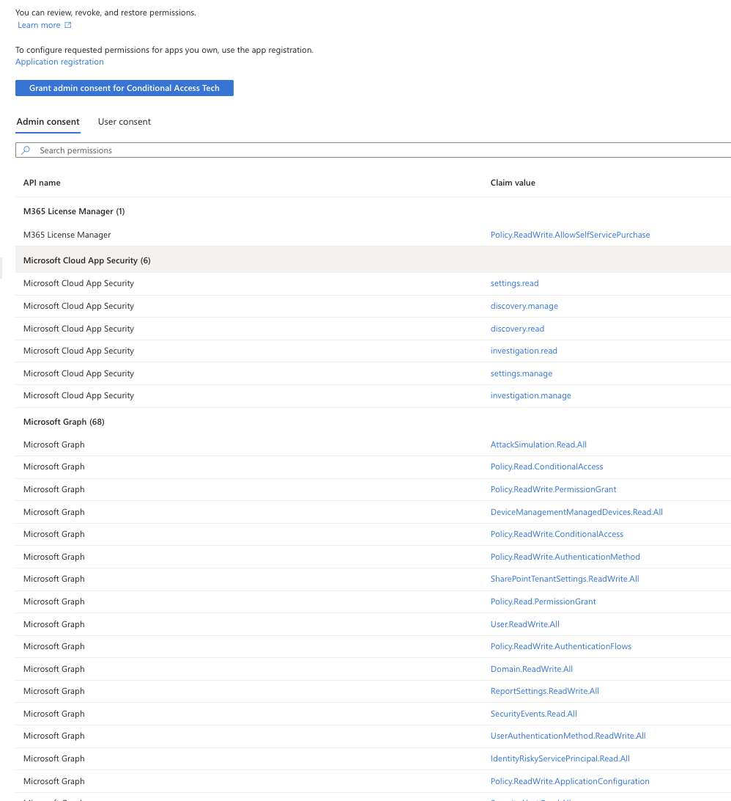

When a vendor says they need GA and their app calls Microsoft Graph application permissions, that's accurate. It's a platform requirement. What you should push back on is the scope: are they requesting the minimum Graph permissions their product needs, or did someone test with GA and never narrow it down? GA consent being required is not the problem. `Directory.ReadWrite.All` when three narrower permissions would do the job is.

### The other pattern: GA as a service account

Separate from the consent question, some vendors instruct customers to create a dedicated user account, assign it the Global Administrator role, and configure it as a service account that the product runs as. This is not the same as requesting GA consent for a service principal. This is assigning a GA directory role to an account that operates as a non-human identity.

The problem with this pattern is that the access ceiling is not set by a Graph permission grant. It's set by the Global Administrator role itself. A GA-assigned service account can do anything a GA human can do, including actions that have no corresponding Graph API permission.

A service account is a user object. Standard user CA policies apply to it, and ID Protection does generate risk signals on its sign-ins. But in practice, these controls tend to get weakened or excluded to keep the automation running. MFA gets excluded because interactive MFA prompts break unattended scripts. CA policies get exceptions carved out. The account ends up with GA access and progressively fewer controls applied to it. Not because the model doesn't support controls, but because enforcing them conflicts with the automation use case.

The more useful distinction is this: unlike a service principal, a user account with GA doesn't surface in an Enterprise Applications audit. Someone reviewing app permissions and service principals won't see it. It lives in the user directory, holds the GA role, and signs in non-interactively. The only way to find it is to look at Entra role assignments specifically, not the application surface.

If a vendor asks you to create a GA service account, the question to ask is: which specific capabilities does this account need that a service principal with scoped Graph permissions cannot provide? In most cases, the answer is none. The vendor simply hasn't done the work of mapping their product's API calls to the minimum required permissions. Vendors who have done that work can tell you exactly which Graph permissions their service principal needs, and why. That's the standard to hold them to.

### What good looks like

Every permission on the list should map to a named product feature. Not a category, not a general capability. A specific feature. If the vendor can't tell you which permission enables which function, the list hasn't been reviewed. Ask before you approve.

> ⚠️ **Consent ≠ review:** Consent ≠ review Admin consent is a one-time action. No automatic expiry, no re-attestation, no alert when the app starts calling APIs it wasn't expected to. That governance has to come from you.

---

## The Permissions That Should Stop and Make You Think Twice

Not all Graph API permissions carry the same weight. Some allow read-only access to a handful of resources. Others give an attacker everything they need to own the tenant without touching a user account. The following are the ones that warrant immediate scrutiny when you see them on a service principal.

Sources: [Microsoft Graph permissions reference](https://learn.microsoft.com/en-us/graph/permissions-reference) (Microsoft Learn) · [graphpermissions.merill.net](https://graphpermissions.merill.net) (Merill Fernando) · [Exploiting App-Only Graph Permissions in Entra ID](https://www.semperis.com/blog/exploiting-app-only-graph-permissions-in-entra-id/) (Semperis, November 2025). Microsoft's own documentation explicitly flags permissions that allow granting authorisation, specifically `AppRoleAssignment.ReadWrite.All` and `RoleManagement.ReadWrite.Directory`, with the warning: *"allow an application to grant additional privileges to itself, other applications, or any user. Use caution when granting any of these permissions."* The Tier 0 classification used below reflects the framing from Andy Robbins's Graph app role audit research and the Semperis escalation chain documentation.

| Permission | Risk | What an attacker does with it |
| --- | --- | --- |
| [DelegatedPermissionGrant.ReadWrite.All](https://graphpermissions.merill.net/permission/DelegatedPermissionGrant.ReadWrite.All) | Critical | Manage all delegated permission grants for any API including Microsoft Graph. An attacker can grant any principal consent to any delegated permission, bypassing the consent model entirely. No user interaction required after the service principal is compromised. |
| [RoleAssignmentSchedule.ReadWrite.Directory](https://graphpermissions.merill.net/permission/RoleAssignmentSchedule.ReadWrite.Directory) | Critical | Read, update and delete policies for privileged RBAC role assignments in the directory. Allows creation of permanent privileged role assignments, removal of approval requirements, and bypass of PIM controls on all directory roles. |
| [RoleManagement.ReadWrite.Directory](https://graphpermissions.merill.net/permission/RoleManagement.ReadWrite.Directory) | Critical | Assigns Entra directory roles, including Global Administrator, to any principal. Full tenant compromise in one API call. |
| [AppRoleAssignment.ReadWrite.All](https://graphpermissions.merill.net/permission/AppRoleAssignment.ReadWrite.All) | Critical | Grants itself or any other service principal additional app roles, including `RoleManagement.ReadWrite.Directory`. Privilege escalation chain to Global Admin without any human interaction. |
| [Application.ReadWrite.All](https://graphpermissions.merill.net/permission/Application.ReadWrite.All) | Critical | Creates new app registrations, adds credentials (secrets/certs) to existing apps, modifies redirect URIs. Used to backdoor any app in the tenant. |
| [Directory.ReadWrite.All](https://graphpermissions.merill.net/permission/Directory.ReadWrite.All) | Critical | Reads and writes directory objects. Adds the attacker-controlled account to any non-role-assignable group, including groups with Azure RBAC or app assignments. |
| [Policy.ReadWrite.PermissionGrant](https://graphpermissions.merill.net/permission/Policy.ReadWrite.PermissionGrant) | Critical | Creates a permission grant policy scoped to a controlled service principal, which can then be used to grant `RoleManagement.ReadWrite.Directory`. Indirect escalation path. |
| [Files.ReadWrite.All](https://graphpermissions.merill.net/permission/Files.ReadWrite.All) | Critical | Read and write access to every file across OneDrive and SharePoint in the tenant. Discussed in detail below. |
| [Sites.FullControl.All](https://graphpermissions.merill.net/permission/Sites.FullControl.All) | Critical | Full control of every SharePoint site collection in the tenant. Includes the ability to modify permissions, delete content, and break inheritance. |
| [Mail.ReadWrite](https://graphpermissions.merill.net/permission/Mail.ReadWrite) / [Mail.Read](https://graphpermissions.merill.net/permission/Mail.Read) | Critical | Tenant-wide mailbox access with no user bound. Enables exfiltration at scale, or, as Midnight Blizzard demonstrated, mining emails for secrets and tokens to pivot elsewhere. |
| [DeviceManagementConfiguration.ReadWrite.All](https://graphpermissions.merill.net/permission/DeviceManagementConfiguration.ReadWrite.All) | Critical | Deploys Intune management scripts to any managed device. If an admin logs into an Intune-managed device, this becomes a path to Global Administrator via the endpoint. |
| [DeviceManagementRBAC.ReadWrite.All](https://graphpermissions.merill.net/permission/DeviceManagementRBAC.ReadWrite.All) | Critical | Assigns privileged Intune RBAC roles, enabling arbitrary code execution across the managed device fleet. |
| [User.ReadWrite.All](https://graphpermissions.merill.net/permission/User.ReadWrite.All) | High | Modifies user profiles including password resets for non-admin accounts. Used for credential takeover of standard users. |
| [GroupMember.ReadWrite.All](https://graphpermissions.merill.net/permission/GroupMember.ReadWrite.All) | High | Adds any principal to any group. Combined with groups that have privileged app access, this enables escalation without touching roles directly. |
| [Domain.ReadWrite.All](https://graphpermissions.merill.net/permission/Domain.ReadWrite.All) | Critical | Add or modify federated domains. Used to configure a federation trust to an attacker-controlled identity provider, enabling authentication as any user in the tenant without knowing their password. |
| [UserAuthenticationMethod.ReadWrite.All](https://graphpermissions.merill.net/permission/UserAuthenticationMethod.ReadWrite.All) | Critical | Read and write all users' authentication methods. Allows an attacker to add a new MFA method to any account, including privileged accounts, enabling full account takeover without knowing the password. |
| [ADSynchronization.ReadWrite.All](https://graphpermissions.merill.net/permission/ADSynchronization.ReadWrite.All) | Critical | Calls the undocumented Synchronization API. Allows modification of hybrid user accounts and password resets, including synced accounts that may have Entra roles. |

The pattern across the critical tier: each of these permissions is either a direct path to tenant ownership, or a stepping stone that gets you there in one more API call. An attacker with `AppRoleAssignment.ReadWrite.All` doesn't need anything else. They grant themselves `RoleManagement.ReadWrite.Directory`, then promote a controlled account to Global Administrator. [Semperis documented this exact chain](https://www.semperis.com/blog/exploiting-app-only-graph-permissions-in-entra-id/) in November 2025. No user interaction required after the initial service principal compromise.

Semperis — Open Source

**EntraGoat: Deliberate Vulnerability Lab for Entra ID**

EntraGoat is a CTF-style, deliberately vulnerable Entra ID environment built by Semperis for hands-on practice with real-world attack paths. Scenarios run in your own test tenant with setup and cleanup PowerShell scripts. Directly relevant to this section: Scenario 1 covers service principal ownership abuse and Scenario 2 covers exploiting app-only Graph permissions. Both attack chains are described in the table above. If you want to understand what these permissions actually enable in practice rather than in theory, this is where to start.

[EntraGoat overview →](https://www.semperis.com/blog/what-is-entragoat-entra-id-simulation-environment/) [GitHub →](https://github.com/Semperis/EntraGoat)

---

## Files.ReadWrite.All: Those Permissions Are Fine, I Think?

This section draws on the [Entra Chat episode with Merill Fernando and Erika Zelic](https://www.youtube.com/watch?v=8kAO9TJBlYQ&list=PL06Jj3_onEzEBGRfA7Zddg1IrjgpU1eGp&index=8). Well worth the full watch if you're thinking about NHI risk in your tenant.

`Files.ReadWrite.All` deserves its own section because it's the permission most likely to slip through a review. It sounds like file access. It is file access: across every OneDrive account and every SharePoint site in the tenant, with write capability.

Most discussions of this permission focus on the application permission model: a service principal acting with no user present. That risk is real. But Erika Zelic makes a point from her offensive security background that's worth sitting with: **delegated permissions carry the same risk in a post-exploitation scenario.** If an attacker compromises a user who has consented to an app with `Files.Read.All` or `Files.ReadWrite.All` as a delegated permission, they can use that app to read every file that user can access. In most organisations, access sprawl means that's a lot. And credential hunters know exactly what to look for: configuration files, scripts, password spreadsheets, secrets emailed to developers and saved to OneDrive. They are in there. Erika's framing: *"they're highly likely to find some credentials in files."*

As an application permission, the blast radius is larger still. A service principal holding `Files.ReadWrite.All` with no user present can: read every document across your SharePoint estate, download and re-upload modified versions, create anonymous sharing links to any document, embed malicious URLs or macros inside existing files and save them back, move or delete content, and enumerate site structures to map sensitive data before exfiltration.

The write angle is the one that catches most teams off guard. As Erika puts it: *"if you have files.readwrite.all, you lose the integrity of any of the files that can be accessed with that API permission."* A compromised service principal with this permission doesn't need to exfiltrate files to cause damage. It can change them in place. Payroll templates, legal contracts, board papers, all reachable with a single Graph API call. The change shows up in version history, but only if someone is looking at that specific file. There's no centralised alert for a service principal modifying 400 documents overnight.

The third risk is the sharing link vector. An app with write permissions can call the Graph API to create an anonymous "anyone with the link" share for any document in the tenant, then log that link externally. No files leave via API. No DLP rule fires on the Graph call. The document stays where it is and becomes accessible to anyone on the internet. This requires anonymous sharing to be enabled at the SharePoint admin level. If a tenant has disabled it, this specific vector doesn't apply. Many tenants haven't.

> 🛑 **What to ask before approving:** What to ask before approving Why does this app need write access and not just read? Does it need access to all sites or just specific ones? Has Sites.Selected been configured to restrict which sites this app can reach? If the answer to the last question is no, Files.ReadWrite.All is tenant-wide.

---

## How Midnight Blizzard Got In Through an App Secret

Sources: [Microsoft MSRC disclosure](https://www.microsoft.com/en-us/msrc/blog/2024/01/microsoft-actions-following-attack-by-nation-state-actor-midnight-blizzard) · [Microsoft Security Blog: responder guidance](https://www.microsoft.com/en-us/security/blog/2024/01/25/midnight-blizzard-guidance-for-responders-on-nation-state-attack/)

In late November 2023, APT29 ran a low-volume password spray against a legacy, non-production Microsoft test tenant. No MFA. Weak password on the admin account. They got in.

What they found was a legacy OAuth app with a client secret still active. That app had been granted elevated permissions, including `EWS.AccessAsUser.All`, and had an existing service principal in Microsoft's corporate tenant. The attacker used the secret to authenticate as the app, then pivoted from the test tenant into the production corporate tenant using that cross-tenant trust relationship.

From there: new OAuth applications registered, `AppRoleAssignment.ReadWrite.All` used to escalate, user accounts created in the corporate tenant, and eventually full access to executive mailboxes. The pivot from mailboxes to source code happened because internal emails contained tokens, certificates, and credentials shared by engineers. Those were replayed to authenticate to internal systems.

> ℹ️ **The chain that mattered:** The chain that mattered Forgotten test tenant → weak credentials → no MFA → legacy app with active secret → cross-tenant service principal trust → escalation via AppRoleAssignment.ReadWrite.All → full mailbox access → secrets harvested from email → source code.

Every link in that chain is a control failure that exists in most enterprise tenants today. The test environment nobody cleaned up. The app secret emailed to a developer. The cross-tenant trust nobody documented. None of these are exotic attack techniques. They're the default state of Microsoft 365 environments that haven't been specifically hardened.

---

## Investigating What's Actually in Your Tenant

Knowing the risk categories is step one. Finding out what you have is the part most teams skip. Here's a practical investigation sequence.

1

**Enumerate application permissions via Graph**

The Entra admin center gives you a filtered view but doesn't surface cross-app permission grants cleanly. Use Graph Explorer or PowerShell. There are three calls that matter here, run in sequence.

**Step A: List all service principals**

Start by pulling every service principal in the tenant with the fields you need for the next calls:

```
GET https://graph.microsoft.com/v1.0/servicePrincipals
  ?$select=displayName,appId,servicePrincipalType,id
```

This returns paginated results. The `@odata.nextLink` in the response means there are more pages. Follow it until the list is complete. Each result gives you the `id` you need for the next calls.

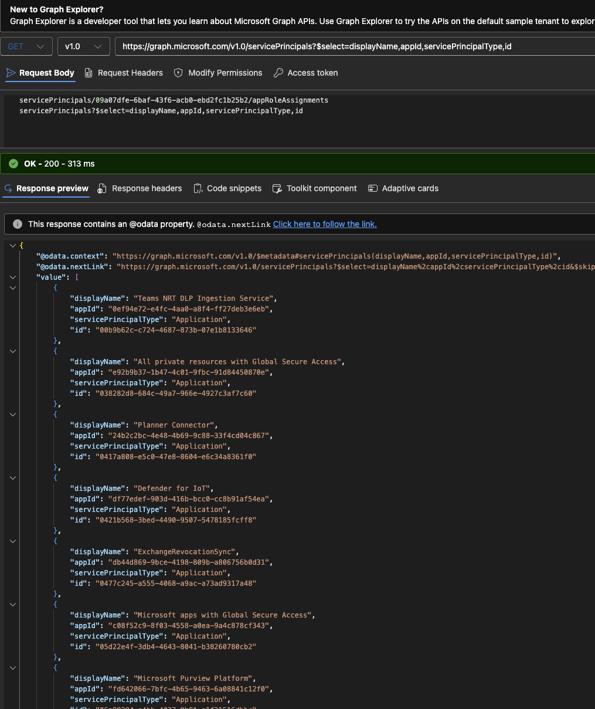

**Step B: Get the Microsoft Graph SP id and its app roles**

Application permissions are stored as app roles on the Microsoft Graph service principal. Two queries here: first get its id, then pull its app roles.

**Step B Query 1** — get the Microsoft Graph SP id:

```
GET https://graph.microsoft.com/v1.0/servicePrincipals
  ?$filter=displayName eq 'Microsoft Graph'&$select=id,displayName
```

Returns a single result. Copy the `id` value — you need it for Query 2 and step C.

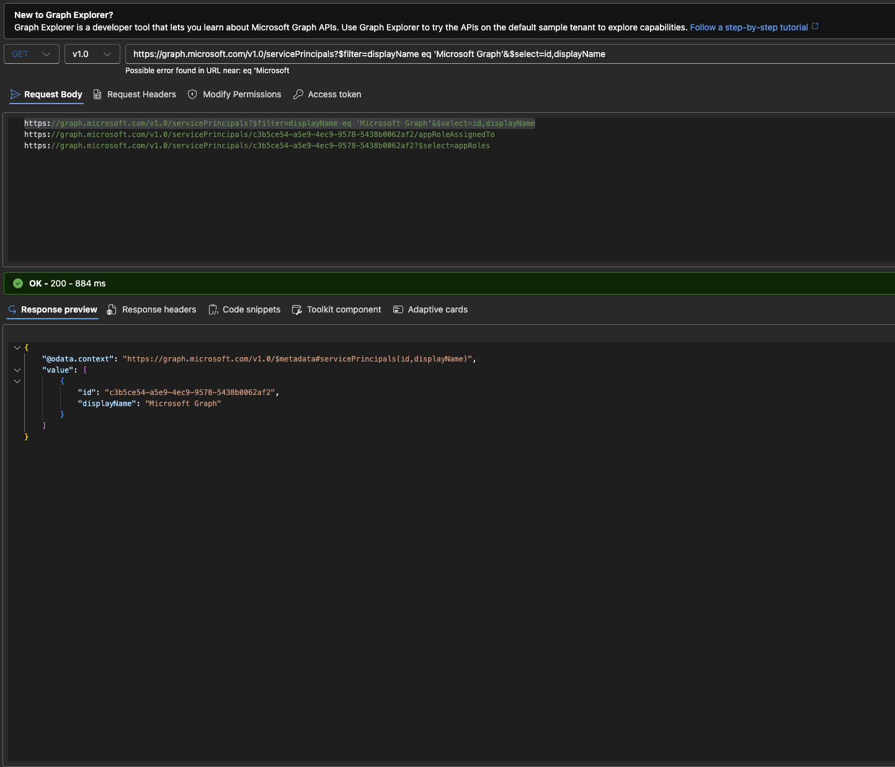

**Step B Query 2** — pull the app roles decode table using that id:

```
GET https://graph.microsoft.com/v1.0/servicePrincipals/{graph-sp-id}?$select=appRoles
```

The `appRoles` array is your GUID-to-permission-name lookup table. Each entry maps a GUID (`id` field) to a readable permission name (`value` field). Keep this open while you run step C.

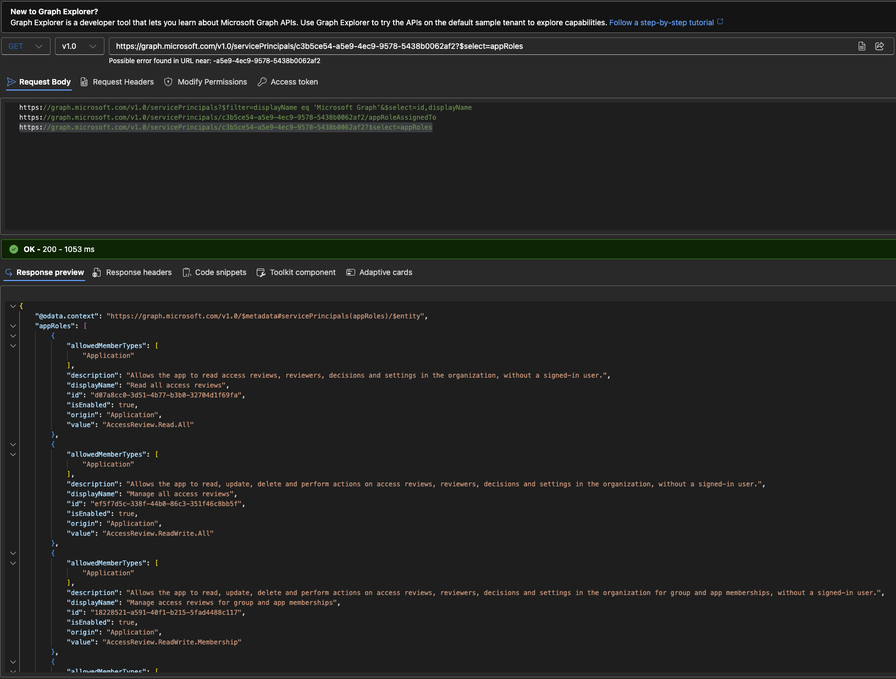

**Step C: Find who has been granted what**

Query the Microsoft Graph SP's inbound assignments to see every service principal that holds Graph application permissions:

```
GET https://graph.microsoft.com/v1.0/servicePrincipals/{{graphSpId}}/appRoleAssignedTo
```

Each result includes the `principalDisplayName` (the app granted the permission), an `appRoleId` GUID to decode via step B, and `principalType: ServicePrincipal` confirming app-to-app grants, not user assignments. Cross-reference any `appRoleId` against the step B lookup table to get the permission name. Microsoft Learn covers this in [Review permissions granted to enterprise applications](https://learn.microsoft.com/en-us/entra/identity/enterprise-apps/manage-application-permissions).

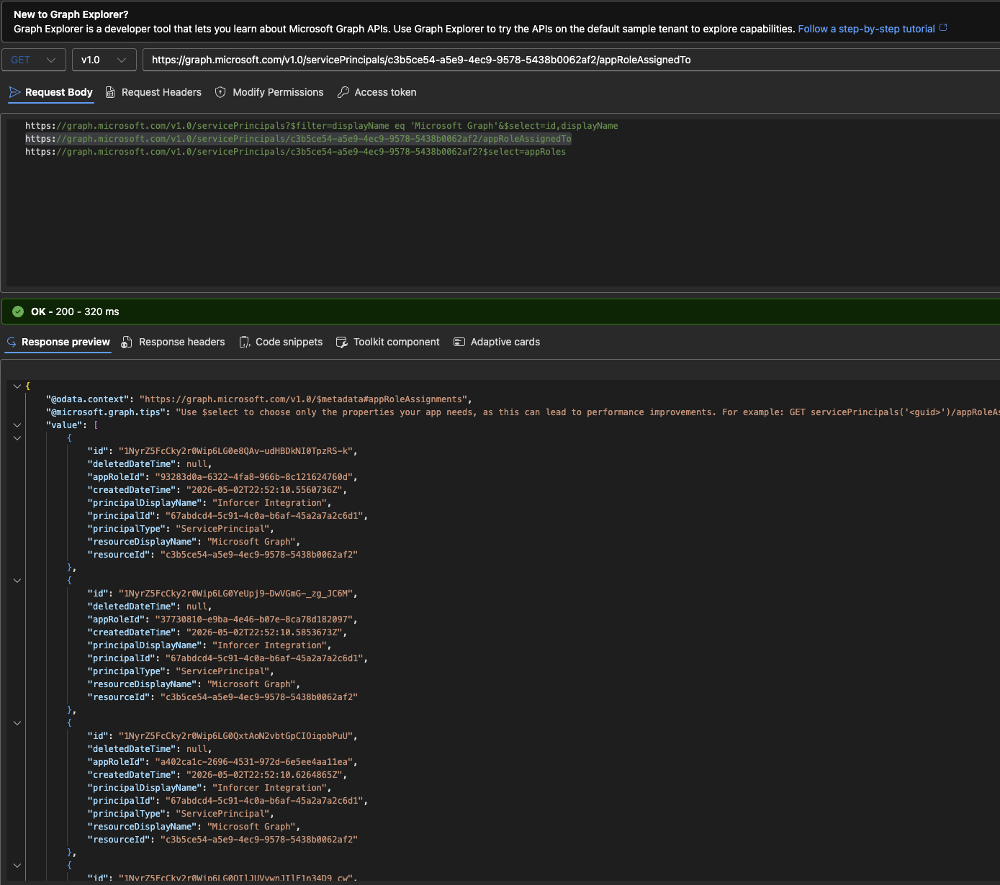

2

**Look for the high-risk permission set specifically**

Cross-reference against the table above. The permissions that should trigger immediate review: `RoleManagement.ReadWrite.Directory`, `AppRoleAssignment.ReadWrite.All`, `Application.ReadWrite.All`, `Files.ReadWrite.All`, `Sites.FullControl.All`, `Mail.ReadWrite`, and `DeviceManagementConfiguration.ReadWrite.All`. Splunk published detection analytics specifically for the top three identity escalation permissions, worth operationalising in Sentinel.

3

**Check owners and review dates**

For every app registration with sensitive permissions, who is the owner? Is that person still at the organisation? If you can't answer those questions from an automated source, you're operating blind. Entra access reviews can be scoped to service principals. Use them.

4

**Audit credentials**

List every client secret and certificate across your app registrations. Flag anything expiring in the next 90 days and anything that has already expired but whose service principal is still enabled. An expired secret on a disabled service principal is noise. An active service principal with a secret that hasn't been rotated in two years is a problem: you don't know who has a copy of that secret.

5

**Query the Graph Activity Log**

If you have the data retained, look for service principals accessing resources at unusual volumes or times. A service principal that normally reads a handful of files per day suddenly performing hundreds of read operations at 3am is worth investigating. The Graph Activity Log captures per-request detail for Graph API calls, not just sign-in events.

6

**Identify multi-tenant apps with tenant-wide consent**

A multi-tenant app registered in another publisher's tenant can have a service principal in yours. You consented to it, but you don't control its registration. If that publisher's tenant is compromised, your service principal becomes a pivot point. Audit the consent type on all enterprise apps and specifically flag any third-party multi-tenant apps with high-privilege application permissions.

7

**Hunt for service principal-less authentication**

A service principal-less authentication occurs when a multi-tenant enterprise app authenticates in your tenant without having a service principal object registered there. Entra ID blocks this for non-Microsoft third-party apps as of March 2026. Query sign-in logs for the null service principal ID:

`$Uri = "https://graph.microsoft.com/beta/auditLogs/signIns?`$filter=servicePrincipalId eq '00000000-0000-0000-0000-000000000000'"`

> ⚠️ **Why this matters beyond compliance:** Why this matters beyond compliance Service principal-less authentication is a structural blind spot. An app authenticating without a service principal in your tenant means you have no object in your directory to review, no permissions to audit, and nothing to show up in an Entra access review.

8

**Run the community audit tools**

The manual steps above tell you what to look for. AzADServicePrincipalInsights and MSIdentityTools produce the output automatically. See the Tools section below for setup and what each one surfaces.

---

## Microsoft Already Knows: The Entra Recommendations You Should Be Reading

Before you build a custom audit pipeline, check what Entra has already surfaced for you. The Recommendations blade under Entra ID Overview runs automated analysis against your tenant and flags credential problems by name, by app, and with a direct link to fix them. Most environments have findings sitting there unactioned for months.

There are three credential-specific recommendations relevant to service principal hygiene, each with a distinct API name you can query programmatically:

staleAppCreds

**Remove unused credentials from apps**

Surfaces credentials, both secrets and certificates, that haven't been used in the past 30 days across app registrations and service principals. A credential created, handed to a developer, and never used in production looks identical to a credential that was exfiltrated and never used. Expired credentials are excluded from the impacted list, but a flagged credential that hasn't expired yet is an active risk: it exists, someone has a copy, and nothing is monitoring whether it gets used.

servicePrincipalKeyExpiry

**Renew expiring service principal credentials**

Flags service principal credentials expiring within 30 days. An expired credential on a production service principal causes downtime, not a graceful degradation. The recommendation gives you the specific service principal, the specific credential, and enough detail to act without manually hunting through hundreds of app registrations.

staleApps

**Remove unused applications**

Identifies apps that haven't issued tokens in 90 days, from either the client or resource side. An unused app with high-privilege application permissions is attack surface with no operational value.

The recommendations surface at **Entra ID > Overview > Recommendations**. Reading them requires Reports Reader, Security Reader, or Global Reader at minimum. The Graph API exposes the same data via `DirectoryRecommendations.Read.All` and `DirectoryRecommendations.ReadWrite.All`.

> ⚠️ **Important caveat on staleAppCreds:** Important caveat on staleAppCreds The recommendation flags credentials unused in the past 30 days. A legitimate service principal that authenticates quarterly will appear here. Verify whether the usage pattern is intentional before acting.

If the origin in the impacted resources list shows "Service Principal," remediation goes through Enterprise Apps and Graph API rather than the App Registrations blade. Follow the service principal path for SAML-related credentials especially: removing the wrong credential from the wrong object will break SSO silently.

---

## Tools for the Audit: What to Run Today

The investigation steps above tell you what to look for. These two community tools produce the output automatically. Run them before you try to build anything custom.

Jon Hope — conditionalaccess.tech

**LearnGraphAPI — EntApps Scripts**

[GitHub →](https://github.com/Jhope188/LearnGraphAPI/tree/main/Baseline/Entra/EntApps)

Three PowerShell scripts for enterprise application hygiene:

- [`Invoke-AppConsentGrantReport.ps1`](https://github.com/Jhope188/LearnGraphAPI/blob/main/Baseline/Entra/EntApps/Invoke-AppConsentGrantReport.ps1): pulls all OAuth permission grants across the tenant, maps them to the Microsoft IR playbook investigation workflow.
- [`Invoke-AzADSPInsights.ps1`](https://github.com/Jhope188/LearnGraphAPI/blob/main/Baseline/Entra/EntApps/Invoke-AzADSPInsights.ps1): launcher wrapper for AzADServicePrincipalInsights.
- [`MicrosoftADPSPermissions.ps1`](https://github.com/Jhope188/LearnGraphAPI/blob/main/Baseline/Entra/EntApps/MicrosoftADPSPermissions.ps1): exports Microsoft Graph application permissions across all service principals, ranked by privilege level.

Julian Hayward

**AzADServicePrincipalInsights**

[GitHub →](https://github.com/JulianHayward/AzADServicePrincipalInsights)

Generates a self-contained HTML report covering every service principal in the tenant. Owners, app role assignments, OAuth permission grants, application secrets, certificates, federated identity credentials, and HiPo users. Critical and medium permissions are flagged and counted automatically. Also surfaces service principals with no owners, expired credentials, and cross-tenant app relationships.

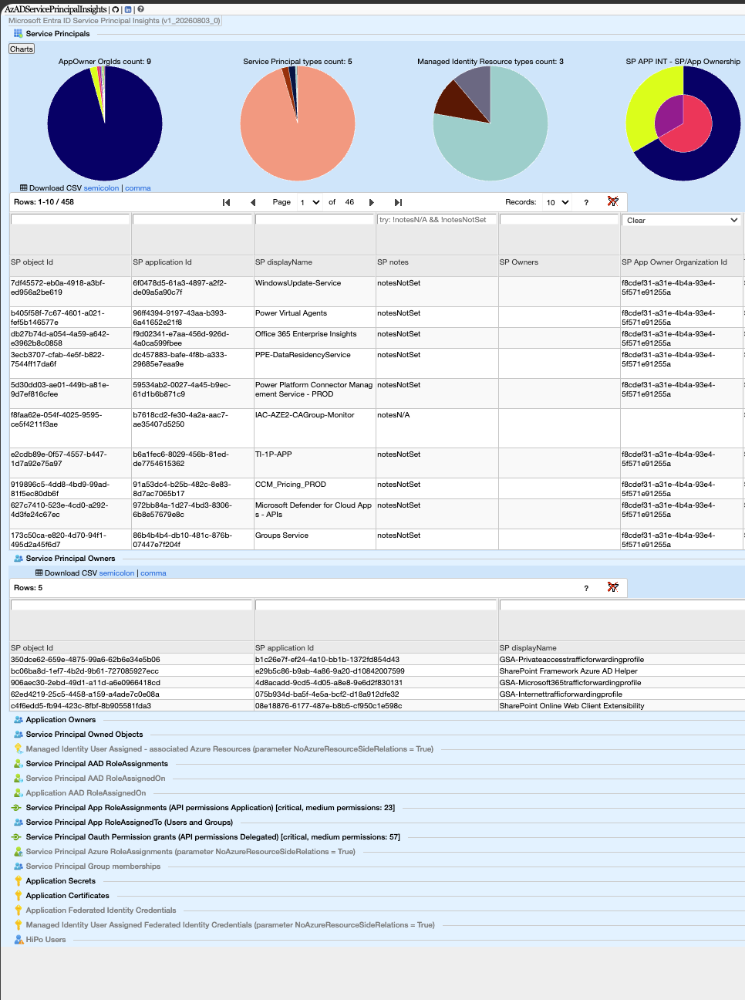

Microsoft Identity — Community

**MSIdentityTools**

[Documentation →](https://azuread.github.io/MSIdentityTools/)

A PowerShell module with cmdlets specifically for Microsoft identity scenarios. For service principal hygiene the key output is a permission export with privilege ranking: PermissionType, ClientDisplayName, Resource, Permission, and a Privilege column colour-coded High, Low, or Unranked. Filter for `Delegated-AllPrincipals` and `High` privilege to surface the consented permissions across your tenant that need immediate attention.

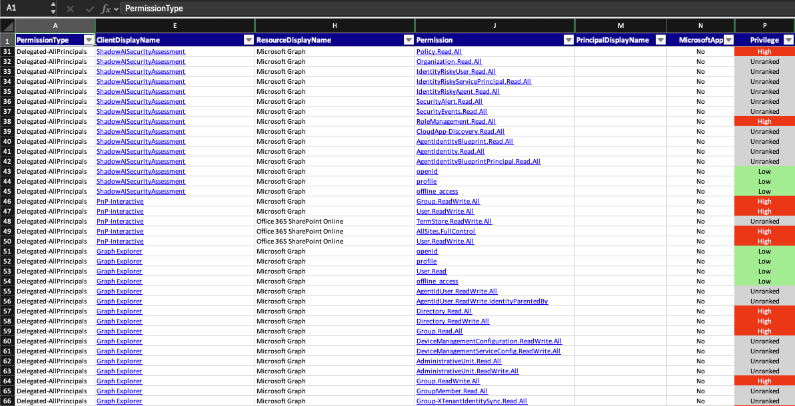

---

## Credential Hygiene and the Secret Sprawl Problem

Client secrets are the weakest link in service principal security. They're static string values that get copied into config files, pasted into emails, and never trigger an MFA prompt. A stolen secret authenticates as cleanly as a legitimate one, from any IP, at any time, with no session to attach anomaly signals to.

The right answer for Azure workloads is managed identities. No credential to store, no credential to rotate, no credential to steal. If your automation runs inside Azure infrastructure that supports managed identities, there's no legitimate reason to use a client secret.

For everything that can't use managed identities: third-party integrations, on-premises workloads, anything outside Azure. Certificates are meaningfully better than secrets. A certificate private key is harder to accidentally leak via email, and the theft surface is smaller than a string you can copy-paste.

> ℹ️ **Priority order:** Priority order Managed identity → certificate → short-lived secret in a vault → long-lived secret in a config file. Most orgs have the last one everywhere and none of the first two in enough places.

### Enforcing secret lifetime at the policy level

Individual guidance about secret rotation only works if someone follows it. App Management Policies let you enforce it at the tenant level via Graph API or the Application policies blade. The tenant-wide `tenantAppManagementPolicy` can cap password credential lifetime (e.g. 90 days), block symmetric key addition, and restrict custom password addition. All apply automatically to new app registrations from a defined date. A developer can't create a two-year secret if the policy caps lifetime at 90 days. Schema and configuration options are documented on [Microsoft Learn: tenantAppManagementPolicy](https://learn.microsoft.com/en-us/graph/api/resources/tenantappmanagementpolicy).

These controls are also surfaced in the Entra admin center under **Enterprise Applications > Application policies**, where you can see and configure password restrictions, certificate lifetime restrictions, identifier URI restrictions, and sign-in audience restrictions without needing to call Graph directly.

### Who can create app registrations right now

By default, any member of your tenant can register an app registration. The setting is `allowedToCreateApps` in the `authorizationPolicy` object. Most organisations have never touched it. That means any user account, including compromised ones and guest accounts with member-equivalent access, can create a new app registration, add credentials to it, and request consent for permissions. Disable the default. Route app registration through a controlled process, whether that's a dedicated Application Developer role assignment or an automated provisioning pipeline.

---

## Guardrails: Assignment Required and Visible to Users

Before reaching for Conditional Access or Workload Identities Premium, there's a simpler control available on every enterprise app in your tenant: **Assignment Required**. By default, any user in your tenant who can authenticate can access any app. Enabling Assignment Required means only users and groups explicitly assigned to the app can sign in or obtain tokens. Everyone else gets an error.

This is an authentication gate, not a visibility setting. Users and services attempting to access the app without an assignment cannot get a token, regardless of whether they know the URL. Per [Microsoft Learn](https://learn.microsoft.com/en-us/entra/identity-platform/howto-restrict-your-app-to-a-set-of-users): *"Users and services attempting to access the application or services need to be assigned to the application, or they won't be able to sign in or obtain an access token."*

### A practical example: Graph Explorer

Graph Explorer is a multi-tenant Microsoft app. When a user in your tenant signs into Graph Explorer, they authenticate against their own tenant. By default, every user in your tenant can do this. You can restrict this. Find Graph Explorer in Enterprise Applications (appId `de8bc8b5-d9f9-48b1-a8ad-b748da725064`), set Assignment Required to Yes, and assign only the users or groups who legitimately need it: typically your identity and security teams.

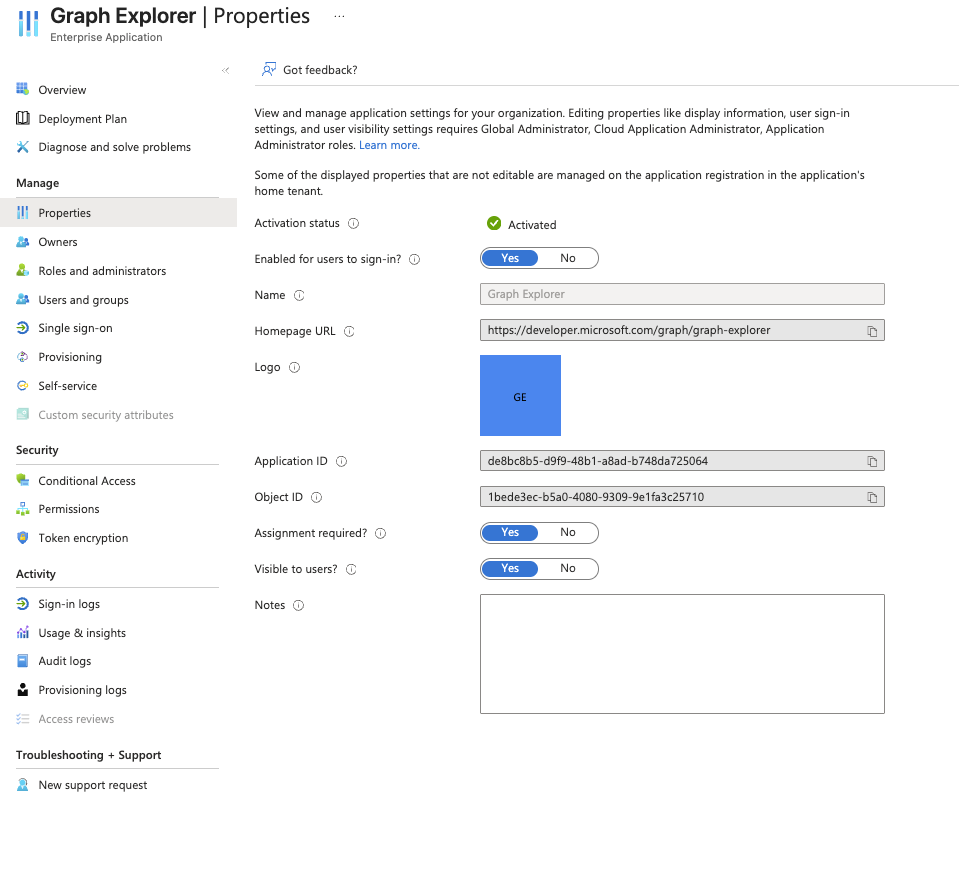

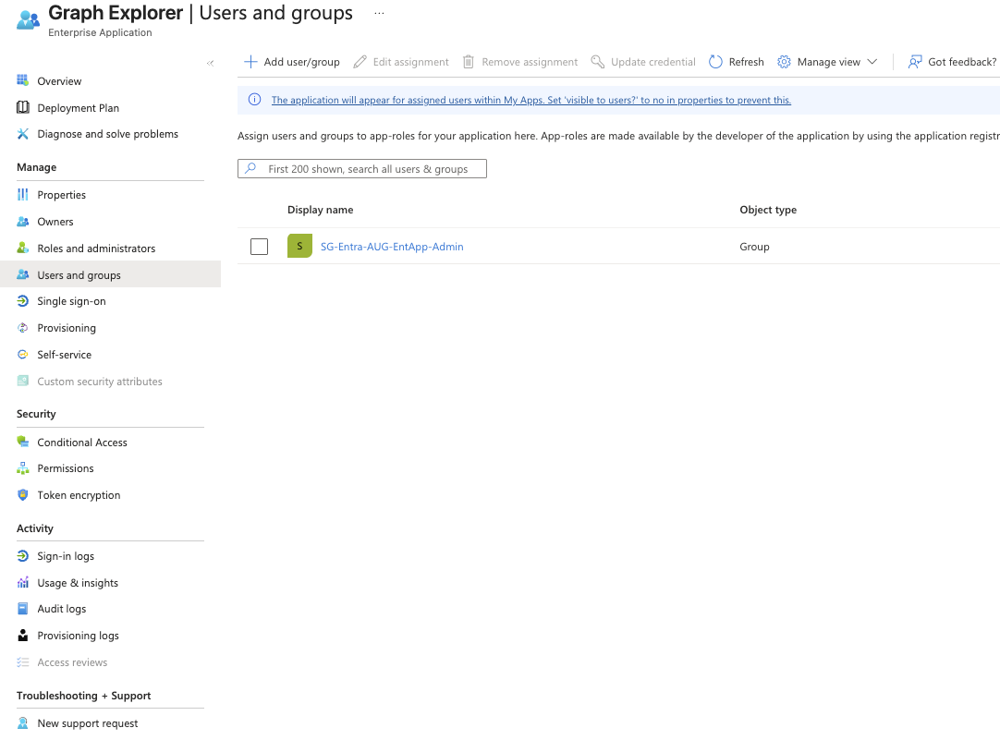

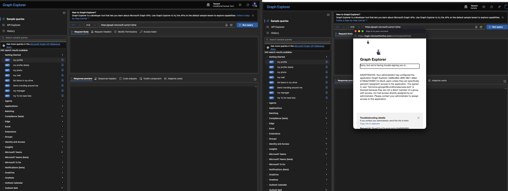

> ⚠️ **GA caveat on Assignment Required:** GA caveat on Assignment Required Global Administrators can sign into applications regardless of Assignment Required settings. Per Microsoft Learn , this is by design. For strict enforcement covering GA accounts, add a Conditional Access policy on top.

Both settings live under **Enterprise Applications > [App Name] > Properties**. You need to be at least a Cloud Application Administrator, or an owner of the enterprise app, to change them.

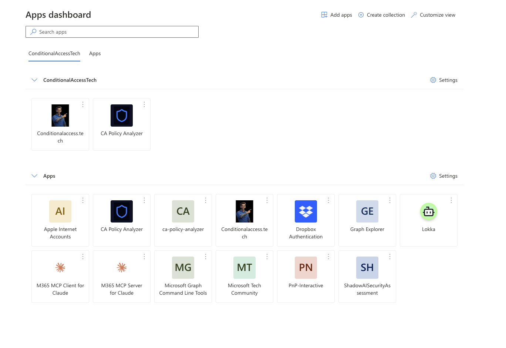

---

## Guardrails: CA Filter for Applications Using Custom Security Attributes

CA for workload identities targets the identity authenticating: the service principal. It is limited to single-tenant service principals you've registered. Multi-tenant SaaS apps that appear in your tenant as enterprise applications but are registered in the publisher's tenant aren't covered by that model. If you need to enforce Conditional Access at scale across any service principal visible in your tenant, including multi-tenant apps, the CA filter for applications mechanism using custom security attributes reaches them.

The architectural difference matters. CA for workload identities controls what a service principal can do when it authenticates as the identity. CA filter for applications controls what access requirements apply when any user or service accesses a tagged resource. You assign a custom security attribute to the enterprise application object in your tenant, and the CA policy evaluates that attribute at token issuance. Per [Microsoft Learn](https://learn.microsoft.com/en-us/entra/identity/conditional-access/concept-filter-for-applications): filters for applications are evaluated at token issuance runtime, not at configuration time.

### Setup in three steps

**1. Define the attribute set and values.** Under Entra ID, create a custom security attribute set (e.g. `apppolicyRequirements`) with a string-type attribute (e.g. `PolicyRequirement`) and predefined values like `HighlySensitive`. CA filter for applications only supports string attributes. Boolean types won't work. The Attribute Definition Reader role is required to create or update CA policies that use custom security attribute filters. Without it you'll hit an insufficient privileges error on save.

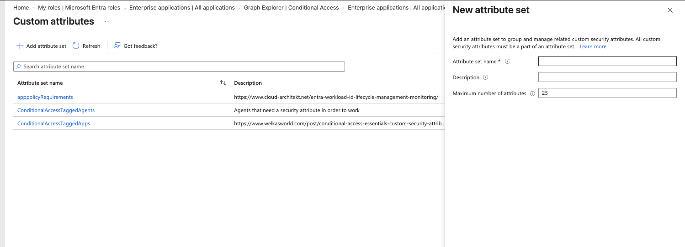

**2. Assign the attribute to enterprise apps.** For each app you want to tag, go to Enterprise Applications > [App] > Custom security attributes > Add assignment. Assign the relevant value. The Custom security attributes menu item is greyed out unless you hold the Attribute Assignment Administrator role. Global Administrator does not have this permission by default. It must be explicitly assigned, even to GA accounts.

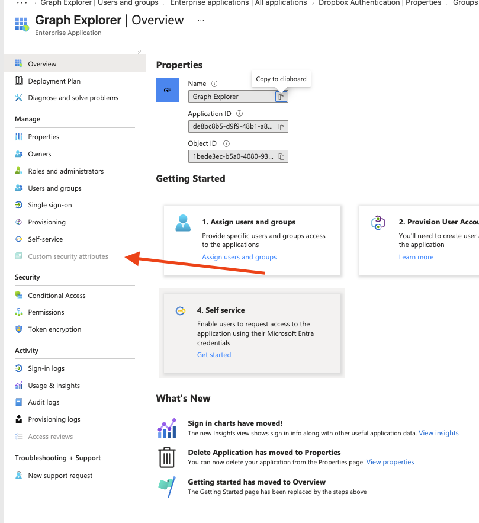

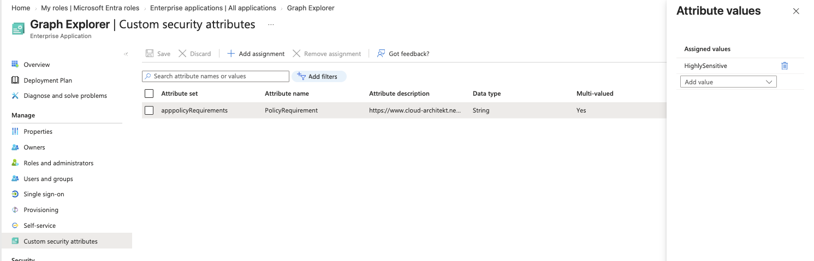

**3. Write the CA policy targeting the attribute.** Under Target Resources, select Resources, then Edit filter. Set the attribute, operator, and value. The rule syntax auto-populates: `CustomSecurityAttribute.apppolicyRequirements_PolicyRequirement -contains "HighlySensitive"`. Any service principal tagged with that value is covered at token issuance, including multi-tenant apps registered outside your tenant.

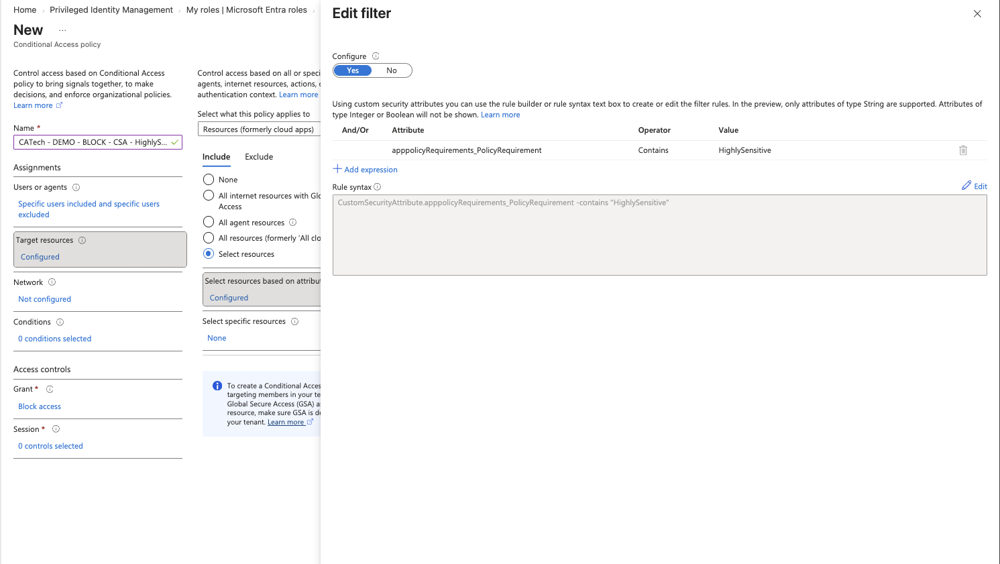

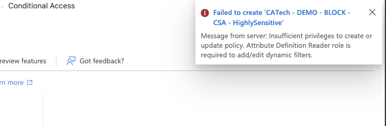

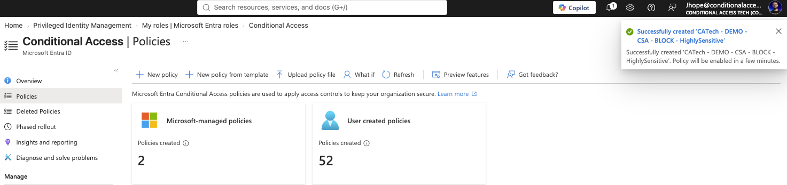

> ℹ️ **Review tagged apps at a glance:** Review tagged apps at a glance Use Lokka or Graph Explorer to review all apps currently in scope for the policy. Query the apppolicyRequirements/PolicyRequirement attribute to return every service principal tagged with a given value.

To find every service principal currently tagged, use the following query. Both require `ConsistencyLevel: eventual` in headers and `CustomSecAttributeAssignment.Read.All` permission:

**Before you run this:** `CustomSecAttributeAssignment.Read.All` is required. `Directory.Read.All` is not sufficient. In Graph Explorer, go to **Modify Permissions**, search for `CustomSecAttributeAssignment.Read.All`, and consent on behalf of your organisation. The `ConsistencyLevel: eventual` header must also be set. In Graph Explorer this goes in the **Request Headers** tab, not the URL.

| Where | Key | Value |
| --- | --- | --- |
| URL field | `https://graph.microsoft.com/beta/servicePrincipals?$filter=customSecurityAttributes/apppolicyRequirements/PolicyRequirement/any(v: v eq 'HighlySensitive')&$select=displayName,appId,customSecurityAttributes&$count=true` |  |
| Request Headers tab | `ConsistencyLevel` | `eventual` |

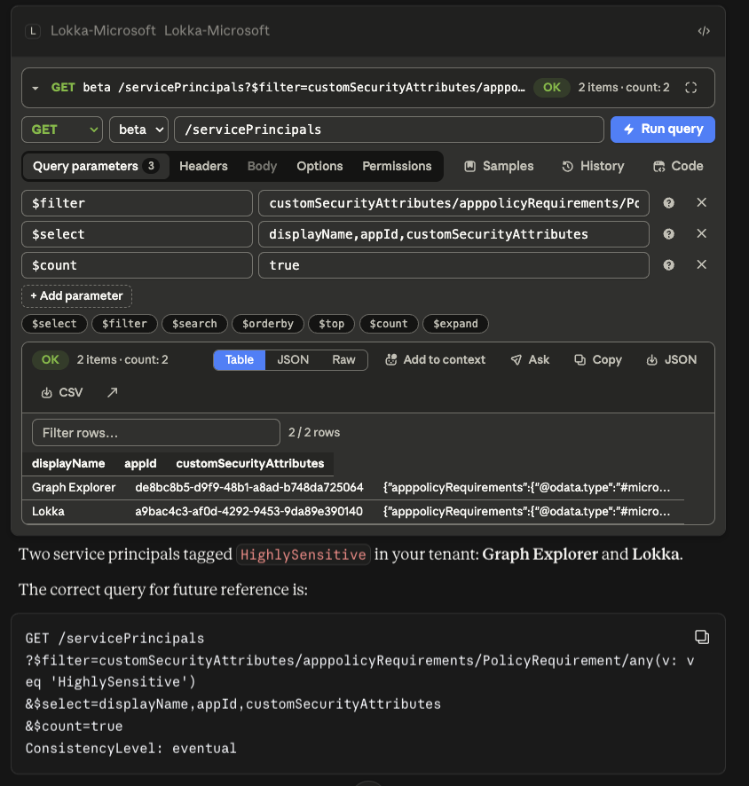

CA policy implemented and working. Notice that unlike the Assignment Required AADSTS error which shows group membership details, the CSA CA block surfaces less information: just no access.

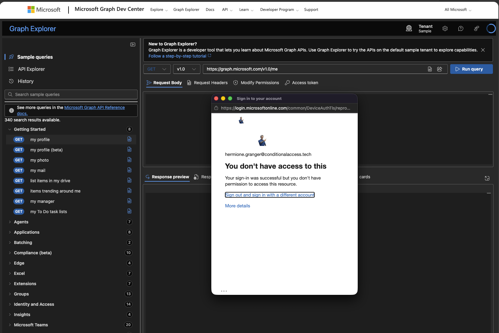

CA for workload identities vs CA filter for applications

| Characteristic | CA for Workload Identities | CA Filter for Applications |
| --- | --- | --- |
| What it targets | The service principal authenticating | The resource being accessed (tagged SP) |
| Scope | Single-tenant SPs registered in your tenant only | Any SP visible in your tenant, incl. multi-tenant apps |
| Licensing | Workload Identities Premium | Entra ID P1 (standard CA) |
| Managed identities | Not covered | Not covered as a target resource |
| Evaluation | Token issuance | Token issuance runtime |

Full configuration walkthrough: [Microsoft Learn: Conditional Access filter for applications](https://learn.microsoft.com/en-us/entra/identity/conditional-access/concept-filter-for-applications).

---

## Guardrails: Conditional Access for Workload Identities

Conditional Access for workload identities applies policies to single-tenant service principals registered in your tenant. Named location restrictions are the most practical control: most legitimate service principals have predictable network origins. An automation pipeline calling Graph should come from a known IP range. Full configuration guidance is on [Microsoft Learn: Conditional Access for workload identities](https://learn.microsoft.com/en-us/entra/identity/conditional-access/workload-identity). For a practical implementation walkthrough, see this [SecureCloudFoundation walkthrough](https://medium.com/@jhope188/securecloudfoundation-entra-connect-and-aba-cabe93b354c7) covering Entra Connect and Workload Identity Premium in practice.

John Savill — Azure Master Class

**Workload Identity and Addressing Compromised Applications**

John Savill walks through how Workload Identity addresses the compromised app scenario: how CA policies apply to service principals, the risk signal model, and how revocation works in practice. Worth watching alongside the IR section of this article if you want to see the containment model demonstrated end to end.

[Watch on YouTube →](https://youtu.be/TASsrY_ilWc)

The caveats matter: the feature requires Workload Identities Premium licensing. Managed identities aren't covered. Multi-tenant SaaS apps from third-party publishers aren't covered. Service principals must be directly assigned to the policy: adding them to a group does nothing.

### Knowing which apps each control can reach

Before applying either guardrail, two Graph queries establish which service principals fall into which category. Both require `ConsistencyLevel: eventual` in request headers and `Application.Read.All` permission.

**Apps registered in your tenant**: Workload Identity Premium CA can target these.

```
GET https://graph.microsoft.com/v1.0/servicePrincipals
?$filter=appOwnerOrganizationId eq {your-tenant-id}
&$select=displayName,appId,servicePrincipalType,appOwnerOrganizationId
&$count=true
Header: ConsistencyLevel: eventual
```

**Everything else**: multi-tenant SaaS, Microsoft first-party, third-party apps. Workload Identity CA cannot target these. Use CA filter for applications instead.

```
GET https://graph.microsoft.com/v1.0/servicePrincipals
?$filter=appOwnerOrganizationId ne {your-tenant-id}
&$select=displayName,appId,servicePrincipalType,appOwnerOrganizationId
&$count=true
Header: ConsistencyLevel: eventual
```

The second query also returns managed identities where `appOwnerOrganizationId` is `null`. Those are a third category. Your tenant created them but neither Workload Identity CA nor CA filter for applications covers them.

Which control reaches which apps

| Category | appOwnerOrganizationId | Workload Identity CA | CA Filter for Applications |
| --- | --- | --- | --- |
| Your app registrations | Your tenant ID | ✓ | ✓ |
| Microsoft first-party | Microsoft tenant ID | ✗ | ✓ |
| Third-party SaaS | Publisher tenant ID | ✗ | ✓ |
| Managed identities | `null` | ✗ | ✗ |

---

## App Ownership as an Attack Path

Erika Zelic flagged app ownership as an underappreciated lateral movement vector. An app owner in Entra isn't an administrative contact: they can add credentials to the application. Compromise a user account that happens to own a service principal with sensitive permissions, and you don't need to touch the existing credentials. Add a new secret, authenticate as the app, operate with whatever the app holds.

App ownership is structurally worse than a directory role assignment for one specific reason: it sits almost entirely outside your governance tooling. Owners can't be made PIM-eligible. There's no approval workflow for becoming one. They don't surface as privileged users in ID Protection. Access reviews don't cover them the same way role assignments do.

The fix is object-scoped role assignment. The Cloud Application Administrator role can be assigned at the scope of a specific app registration rather than directory-wide. That gives the same operational access while making the assignment PIM-eligible, visible in privileged access reporting, and coverable by Conditional Access with authentication context.

> ⚠️ **Ownership review:** Ownership review Run GET /applications?$select=displayName,owners and look for any app with sensitive permissions that has more than two owners, an ex-employee as owner, or no owner at all. No owner doesn't mean nobody can modify the app. It means an Application Administrator can, without being recorded as an owner. For apps holding critical permissions, replace human owners with object-scoped Cloud Application Administrator eligible assignments.

---

## The Illicit Consent Grant: When the User Does the Damage

Everything discussed so far assumes an attacker already has a foothold in your tenant. The illicit consent grant skips that step entirely.

An attacker registers a malicious multi-tenant app in their own tenant, then sends a crafted consent URL to a user in your organisation. The URL is a legitimate Microsoft login URL. The user signs in, sees a permissions dialog, and if user consent isn't locked down, clicks Accept. The attacker's app now has a service principal in your tenant with whatever permissions the user was able to grant.

Microsoft's default settings have changed here over time, and as of current policy, user consent to apps from verified publishers is allowed by default, with some categories requiring admin approval. Verified publisher is a low bar. A publisher can be verified and still be malicious. The safe posture is requiring admin approval for all third-party app consent, with a workflow that routes requests to someone who will actually look at the permission list before approving.

### The delegated permissions seen in 99% of consent phishing attacks

This is a different risk model from the application permissions table earlier in this article. These are **delegated permissions**. They require a user to click Accept on a consent prompt. The attacker targets end users, not admins. The permissions look innocent enough that users approve them without hesitation.

The Microsoft Incident Response team documented the following permissions as appearing in [99% of consent phishing attacks they have observed](https://learn.microsoft.com/en-us/security/operations/incident-response-playbook-app-consent):

| Permission scope | What it covers | Why attackers want it |
| --- | --- | --- |
| `Mail.*` | All Mail permissions except Mail.ReadBasic | Most abused Read, send, and modify email on behalf of the user. |
| `Contacts.*` | Contacts.Read, Contacts.ReadWrite, Contacts.Read.Shared, Contacts.ReadWrite.Shared | Most abused Read the user's full contact list. Used for harvesting targets for follow-on phishing campaigns. |
| `MailboxSettings.*` | Read and write mailbox settings including auto-forward rules | Most abused Configure silent auto-forwarding to an attacker-controlled address. Persists after password resets. |
| `People.*` | Read the user's people list: contacts, colleagues, frequently emailed contacts | High Maps the user's communication network for spear phishing targeting. |
| `Files.*` | Files.Read, Files.ReadWrite, Files.Read.All, Files.ReadWrite.All (delegated) | High Access every file the user can reach. Credential hunters look for config files, scripts, and password documents. |
| `Notes.*` | OneNote notebooks: read and write | High OneNote is frequently used to store passwords, API keys, and internal documentation. |
| `Directory.AccessAsUser.All` | Access the directory as the signed-in user | Critical Effectively grants the app the same directory access as the user. |
| `User_Impersonation` | Azure Resource Manager full impersonation | Critical Grants full access to Azure resources as the user. |

> ⚠️ **The permission that catches most people:** The permission that catches most people The Microsoft IR team specifically notes that most people don't consider the delegated version of Mail.Read or Files.Read as high-risk. These attacks target end users who can only grant delegated permissions, not admins who can consent to application permissions. A regular user clicking Accept on a Contacts.ReadWrite consent prompt causes real damage even though the individual permission looks innocent.

Microsoft Defender for Cloud Apps App Governance includes predefined threat detection policies that detect illicit consent grant patterns. These apply to OAuth apps that have already been authorized in your tenant. The policies fire post-consent, surfacing malicious or suspicious apps that users have already granted access to.

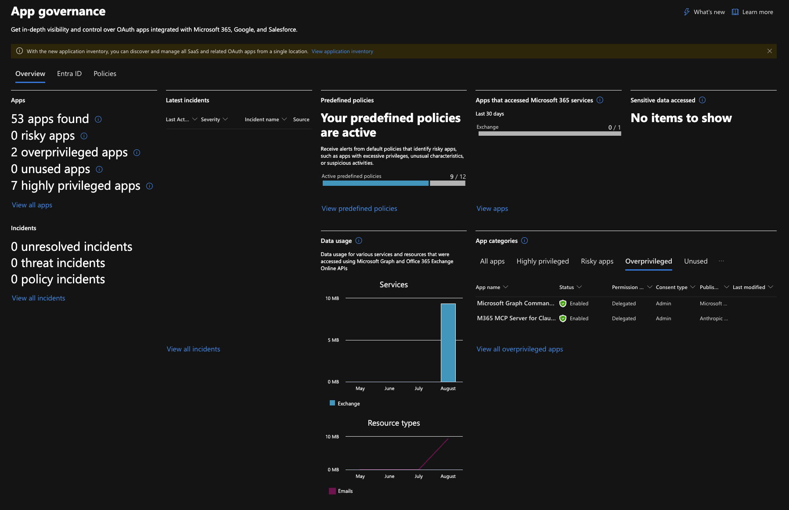

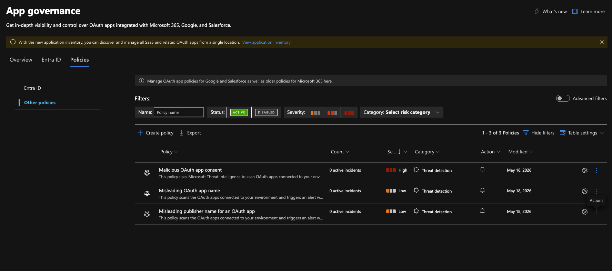

Microsoft Learn

**App Consent Grant Investigation Playbook**

Microsoft's official IR playbook covers the full investigation workflow: how to identify affected users, enumerate consented permissions, confirm breach scope, and remediate. Key practical steps include running [Get-AzureADPSPermissions.ps1](https://gist.github.com/psignoret/41793f8c6211d2df5051d77ca3728c09) to export all OAuth consent grants to CSV, then filtering the ConsentType column for `AllPrincipals`. Any non-Microsoft application with that value has been granted tenant-wide consent and warrants immediate review. Disable rather than delete a malicious app: deletion allows it to return if another user re-consents.

[Read the playbook on Microsoft Learn →](https://learn.microsoft.com/en-us/security/operations/incident-response-playbook-app-consent)

---

## When You Suspect a Service Principal Is Compromised

A compromised service principal is a different incident from a compromised user. There's no password to reset, no session to revoke. If the attacker has a copy of the client secret and the current token hasn't expired, they can keep calling Graph even after credential rotation, until the token lifetime runs out or a revocation event forces re-evaluation.

Two containment actions are available, each with a distinct scope:

**Disable the service principal.** Setting `accountEnabled: false` on the enterprise app stops new authentication attempts. It does not immediately revoke existing tokens unless the workload supports Continuous Access Evaluation. The Graph call requires the `microsoft.directory/servicePrincipals/disable` directory action, which is a [documented custom role permission on Microsoft Learn](https://learn.microsoft.com/en-us/entra/identity/role-based-access-control/custom-enterprise-app-permissions) described as "Disable service principals." Don't use `Application.ReadWrite.All` for IR automation: that permission covers credential management for every service principal in the tenant.

**Confirm compromised in ID Protection.** This raises the risk level of the service principal to high. A Conditional Access policy scoped to workload identities that blocks high-risk principals will then take effect on the next token request. If the workload is CAE-capable and the resource API supports CAE (Microsoft Graph does), revocation can happen within minutes of the risk signal, without waiting for the token to expire.

> ℹ️ **CAE for workload identities:** CAE for workload identities CAE-enabled tokens for workload identities are long-lived tokens with a lifetime of up to 24 hours, longer than the standard one-hour token. CAE revocation is the critical control here, not waiting out the token lifetime. The service principal must declare the cp1 client capability in the token request, and the resource provider must support CAE (Microsoft Graph does; not all do). CAE for workload identities supports single-tenant service principals only. Managed identities and multi-tenant apps are not in scope.

After containment: rotate all credentials on the service principal and its associated app registration. Audit what the principal accessed in the preceding 30 days via sign-in logs and Graph Activity Logs. Check whether additional credentials were added to the app registration during the compromise window, a common persistence move. Review owners of the app registration: if an attacker added themselves as owner, rotating credentials doesn't remove them. Pull the full audit log for the application object, not just sign-ins.

Microsoft has published incident response playbook templates for [compromised and malicious app investigations](https://learn.microsoft.com/en-us/security/operations/incident-response-playbook-compromised-malicious-app) and for [consent grant investigations](https://learn.microsoft.com/en-us/security/operations/incident-response-playbook-app-consent). Have both playbooks bookmarked before you need them.

> 🛑 **Custom security attributes as a triage filter:** Custom security attributes as a triage filter If you've classified your service principals by privilege tier using custom security attributes, your IR automation can use those attributes to scope response. A policy that auto-blocks any high-risk service principal tagged as control plane, without waiting for human triage, cuts dwell time. Custom security attributes aren't readable by tenant members by default, so they don't surface in general enumeration.

---

## The Practical Posture

None of this requires exotic tooling. The controls exist in Entra today. The gap is governance, not capability.

Lock down user consent. Set the user consent policy to require admin approval for all third-party apps, or at minimum restrict it to apps from verified publishers for low-risk permissions only.

Require admin consent workflows. Disabling user consent without giving developers an alternative just pushes shadow IT underground. Build the workflow: who requests, who approves, what justification is required.

Scope Conditional Access to service principals. For first-party apps with privileged permissions, create named location policies. An app running on a known set of servers has a predictable IP range. Lock it to that range.

Run quarterly permission reviews. Entra access reviews can cover service principals. The question isn't just "is this permission still needed?" It's "does the current owner still work here, and do they know they own this?"

Move everything you can to managed identities. Every workload still using a client secret that could use a managed identity is unnecessary risk.

Watch Graph activity, not just sign-ins. Service principal sign-in logs tell you an app authenticated. Graph Activity Logs tell you what it did.

Enforce secret lifetime at the policy layer. The `tenantAppManagementPolicy` enforces credential constraints at provisioning time. A 90-day cap on password credential lifetime, configured once, applies to every new registration from that date forward.

Disable the default app registration permission. `allowedToCreateApps` is true in most tenants. Route registration through a controlled process with a defined owner, classification, and credential governance plan attached from day one.

If you have Microsoft Defender for Cloud Apps with App Governance, use it. The permission usage analysis shows which APIs an app actually called versus what it was granted: data you can't get from Entra alone.

The permission names in Entra are misleading by default. `AppRoleAssignment.ReadWrite.All` sounds like a scoped permission manager. It's a path to Global Administrator. That gap between name and actual capability is why these get approved without scrutiny. When reviewing a consent request, the name is the last thing to look at. Ask what the permission enables, not what it's called.

The shadow admins in your tenant aren't hiding. They're sitting in plain sight in the Enterprise Applications blade. They just don't have a face.
