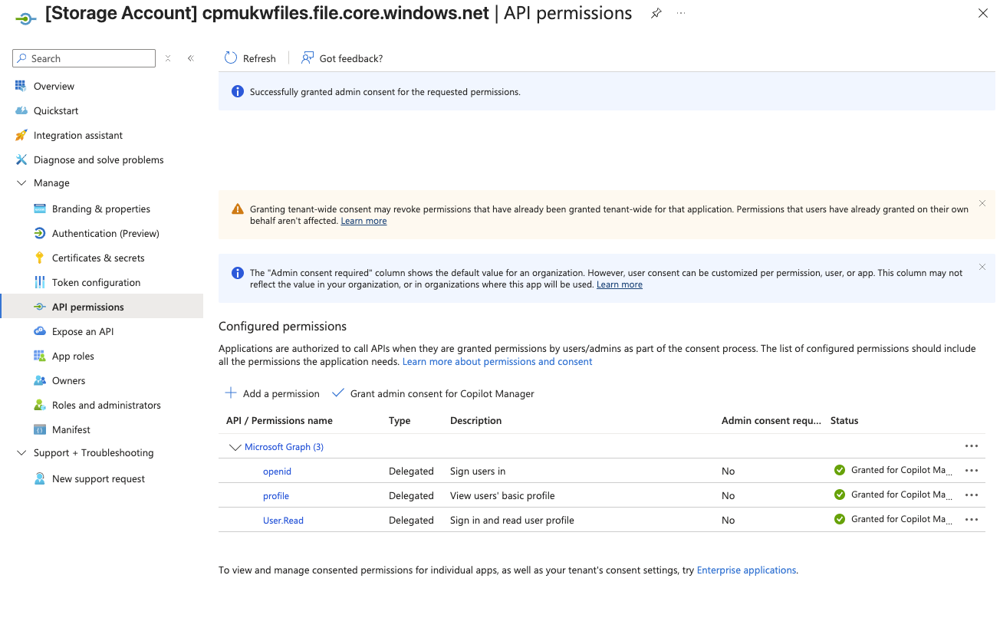
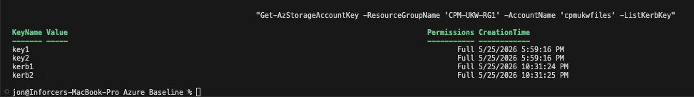
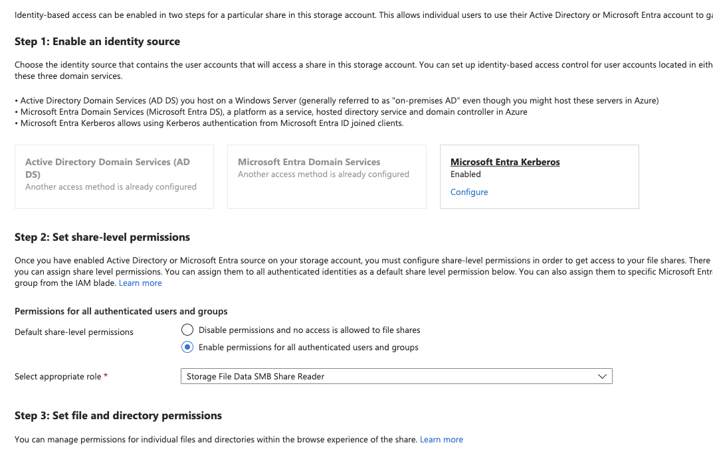
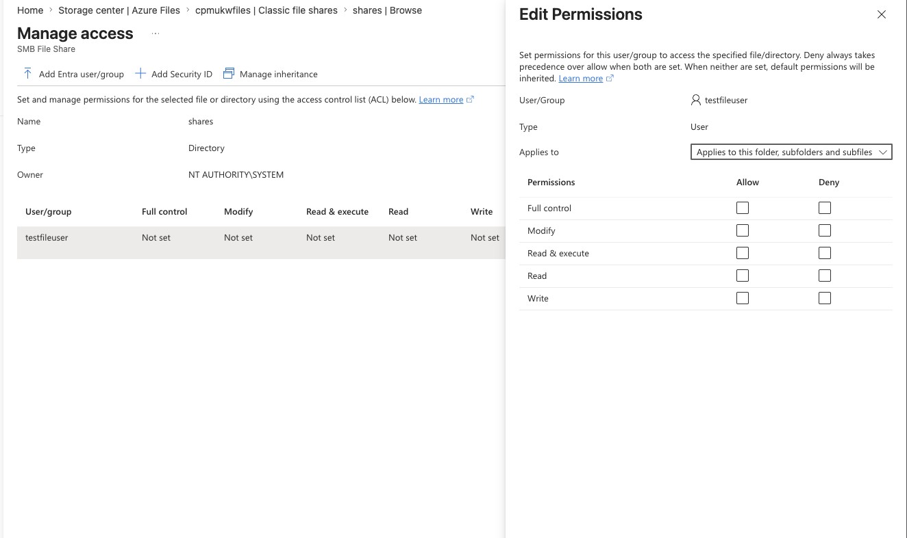
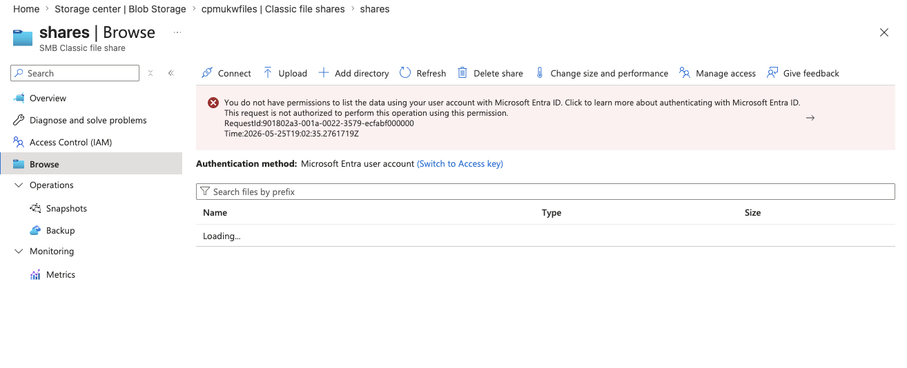

# Entra ID Kerberos (AADKERB) — Post-Deployment Required Steps

The Bicep file configures the storage account for AADKERB, but the steps below are required **once per storage account** after first deployment.
Without these, users will see _"not authorized"_ errors even with correct RBAC assigned.

[Enable EntraID Kerberos on Azure File Share - macOS walkthrough](https://headsinthecloud.blog/2025/12/29/azure-file-share-with-entra-kerberos-authentication-seamless-access-for-windows-and-macos-devices/)
---

## Pre-Flight Checklist

Before troubleshooting access issues, confirm all of the following are complete:

| # | Task | Once per | Done? |
| --- | --- | --- | --- |
| 1 | Admin consent granted on storage account Entra app | Tenant | ✅ |
| 2 | Kerberos key generated (`kerb1`) | Each new storage account | ☐ |
| 3 | RBAC role assignments deployed (Elevated Contributor + Contributor) | Each new storage account | ☐ |
| 4 | Storage account app excluded from MFA Conditional Access policies | Tenant | ☐ |
| 5 | `CloudKerberosTicketRetrievalEnabled` policy enabled on AVD hosts (via Intune) | Each host pool | ☐ |
| 6 | Users are members of the correct Entra groups used in the RBAC assignments | Per user | ☐ |
| 7 | Waited ~30 mins for RBAC to propagate before testing | After each deploy | ☐ |
| 8 | _(macOS only)_ App Registration manifest updated — `cifs` lowercase + `kdc_enable_cloud_group_sids` tag | Tenant | ☐ |
| 9 | _(macOS only)_ PSSO + Kerberos SSO mobileconfig deployed to macOS devices via Intune | Each device | ☐ |

---

## Step 1 — REQUIRED: Grant Admin Consent to Azure Storage App

The auto-generated Entra app for your storage account (named `[Storage Account] <storageAccountName>.file.core.windows.net`) requires tenant-wide admin consent for **openid**, **profile**, and **User.Read** permissions.

> This is a **ONE-TIME step per Entra tenant** — not per deployment.
> Skip if already granted for another AADKERB storage account in the same tenant.

### Option A — Azure Portal

1. Open **Entra ID** > **App registrations** > **All Applications**
2. Find the app: `[Storage Account] <storageAccountName>.file.core.windows.net`
3. Go to **API permissions** > **Grant admin consent for \<Directory Name\>**

Once granted successfully, the **API permissions** page will show a blue banner:
_"Successfully granted admin consent for the requested permissions."_



The three permissions should all show a green ✅ **Granted** status:

| Permission | Type | Description |
| --- | --- | --- |
| `openid` | Delegated | Sign users in |
| `profile` | Delegated | View users' basic profile |
| `User.Read` | Delegated | Sign in and read user profile |

### Option B — PowerShell

```powershell
$azureStorageSPId = (Get-AzADServicePrincipal -ApplicationId 'e406a681-f3d4-42a8-90b6-c2b029497af1').Id
$body = @{
    clientId    = $azureStorageSPId
    consentType = 'AllPrincipals'
    resourceId  = $azureStorageSPId
    scope       = 'User.Read'
} | ConvertTo-Json
Invoke-AzRestMethod -Uri 'https://graph.microsoft.com/v1.0/oauth2PermissionGrants' -Method POST -Payload $body
```

> 📖 [Enable Microsoft Entra Kerberos authentication — MS Learn](https://learn.microsoft.com/en-us/azure/storage/files/storage-files-identity-auth-hybrid-identities-enable)

---

## Step 2 — REQUIRED: Generate Kerberos Key

This registers the storage account as a Kerberos service principal in Entra so it can issue tickets. Must be run after **every fresh storage account deployment**.

```powershell
New-AzStorageAccountKey `
    -ResourceGroupName "<clientid>-<Region>-RG1" `
    -AccountName "<storageAccountName>" `
    -KeyName kerb1
```

```
New-AzStorageAccountKey -ResourceGroupName 'IAC-AZE2-RG1' -AccountName 'iacaze2files' -KeyName kerb1; New-AzStorageAccountKey -ResourceGroupName 'IAC-AZE2-RG1' -AccountName 'iacaze2files' -KeyName kerb2
```

**Verify the key was generated:**

```powershell
Get-AzStorageAccountKey `
    -ResourceGroupName "<clientid>-<Region>-RG1" `
    -AccountName "<storageAccountName>" `
    -ListKerbKey
```

> The output should include `kerb1` and `kerb2` alongside `key1` and `key2`. If only `key1`/`key2` are returned, the command did not complete successfully — re-run it and check for errors.



> 📖 [Enable Microsoft Entra Kerberos authentication — MS Learn](https://learn.microsoft.com/en-us/azure/storage/files/storage-files-identity-auth-hybrid-identities-enable)

---

## Step 3 — REQUIRED: Set NTFS Root Permissions

> ⏱️ Wait ~30 minutes for RBAC to propagate before completing this step.

**Enable Entra Kerberos on the storage account:**



**Assign share-level permissions (RBAC):**




### ⚠️ Cloud-Only Identity + Shared Key Disabled

This storage account has `allowSharedKeyAccess: false`. The **Azure portal Manage Access blade will fail** with _"Failed to get permissions"_ because it uses shared key internally — even if your RBAC role is correct. This is a known portal limitation.

`icacls` and Windows File Explorer ACL editing also do **not** work for cloud-only Entra identities.

The only supported method for this configuration is the **RestSetAcls PowerShell module**.

### Option A — RestSetAcls PowerShell Module _(required for cloud-only + shared key disabled)_

This module sets ACLs via the Azure Files REST API using OAuth, bypassing the shared key restriction.

```powershell
# Install the module
Install-Module -Name RestSetAcls -Force

# Connect to the share using your Entra credentials (must have Elevated Contributor role)
$ctx = New-AzStorageContext -StorageAccountName "cpmukwfiles" -UseConnectedAccount

# Set root folder ACLs - FSLogix standard permissions
Set-AzStorageFileAcl `
    -Context $ctx `
    -ShareName "shares" `
    -FilePath "/" `
    -Acl "O:SYG:SYD:(A;OICI;FA;;;SY)(A;OICI;FA;;;BA)(A;;0x1200a9;;;AU)(A;OICIIO;SDGXGWGR;;;AU)"
```


> The ACL string above grants full control to SYSTEM (`SY`) and Built-in Admins (`BA`), and read/execute + create files/folders to Authenticated Users (`AU`) — standard FSLogix root ACL.

### Option B — Temporarily Enable Shared Key _(use portal or icacls, then re-disable)_

If you need to use the portal or icacls to set permissions, temporarily enable shared key access, set the ACLs, then re-disable:

```powershell
# Temporarily enable
Set-AzStorageAccount -ResourceGroupName "CPM-UKW-RG1" -Name "cpmukwfiles" -AllowSharedKeyAccess $true

# ... set ACLs via portal or icacls ...

# Re-disable when done
Set-AzStorageAccount -ResourceGroupName "CPM-UKW-RG1" -Name "cpmukwfiles" -AllowSharedKeyAccess $false
```

### Option C — icacls / Windows File Explorer _(HYBRID identities only)_

> Only works if users are synced from on-premises AD DS to Entra ID **and** the client has unimpeded connectivity to the on-premises domain controller.

Mount the share using the storage account key, then run:

```cmd
icacls <MountedDriveLetter>: /grant "CREATOR OWNER:(OI)(CI)(IO)(M)"
icacls <MountedDriveLetter>: /grant "Authenticated Users:(RX)"
icacls <MountedDriveLetter>: /inheritance:r
```

---

## Troubleshooting — Common "Not Authorized" Causes

### ❌ Portal "Failed to get permissions" in Manage Access blade

This error occurs when `allowSharedKeyAccess: false` is set on the storage account. The portal's **Manage Access** blade (`ManageAccess.ReactView`) uses shared key access internally to read/write NTFS ACLs — even for users with the correct RBAC role.




**Fix:** Use the `RestSetAcls` PowerShell module (see Step 3, Option A above) or temporarily re-enable shared key access to set the initial ACLs.

### MFA / Conditional Access blocking Kerberos

Microsoft Entra Kerberos does **not** support MFA. If a Conditional Access policy applies MFA to all apps, the storage account app must be explicitly excluded.

1. Open **Entra ID** > **Security** > **Conditional Access**
2. Find the policy applying MFA to all users/apps
3. Under **Exclude** > **Applications**, add: `[Storage Account] <storageAccountName>.file.core.windows.net`

> ⚠️ Without this exclusion, `net use` will fail with: _"System error 1327: Account restrictions are preventing this user from signing in."_

### CloudKerberos ticket retrieval not enabled on AVD hosts

Each AVD session host must have the Kerberos ticket retrieval policy enabled. Deploy via **Intune Settings Catalog**:

- Setting: **Kerberos/CloudKerberosTicketRetrievalEnabled** → set to **1** (Enabled)

> ⚠️ Do **not** use the OMA-URI method for this setting on AVD multisession hosts — use Settings Catalog only.

### RBAC not propagated yet

After deploying role assignments, wait **~30 minutes** before testing. RBAC changes can take up to 30 mins to propagate across Azure.

### User not in the correct Entra group

Verify the user is a **direct member** of the group assigned the SMB Contributor role (`avdUsersGroupObjectId`). Nested groups may not resolve correctly depending on token limits.

### Kerberos key not generated

If Step 2 (Generate Kerberos Key) was skipped, users cannot get a Kerberos ticket. Run the `New-AzStorageAccountKey -KeyName kerb1` command and retry.

---

## macOS Access — Additional Requirements

> macOS SMB access via Entra Kerberos requires **Platform SSO (PSSO)** enrolled via Intune and a **Kerberos SSO mobileconfig** deployed to the device. Without these, macOS cannot obtain a Kerberos ticket from Entra — the SMB mount will fail regardless of RBAC or ACL configuration.
>
> An unmanaged/personal Mac **cannot** connect via AADKERB. Use Azure Storage Explorer with OAuth instead.

### Step A — Update the App Registration Manifest

Two changes are required on the auto-generated Entra app (`[Storage Account] <storageAccountName>.file.core.windows.net`):

1. Open **Entra ID** > **App registrations** > **All Applications** > find the storage account app
2. Go to **Manifest**
3. Ensure `cifs` is **lowercase** in the service principal name (macOS Kerberos is case-sensitive)
4. Add the following tag to enable correct SID handling for cloud groups:

```json
"kdc_enable_cloud_group_sids"
```

> Without `cifs` in lowercase, macOS Kerberos ticket requests will fail silently.

### Step B — Deploy Kerberos SSO Mobileconfig via Intune

Deploy a custom Kerberos SSO extension mobileconfig to macOS devices in addition to your existing PSSO policy. Replace `YOUR_TENANT_ID` with your Entra tenant ID:

```xml
<?xml version="1.0" encoding="UTF-8"?>
<!DOCTYPE plist PUBLIC "-//Apple//DTD PLIST 1.0//EN" "http://www.apple.com/DTDs/PropertyList-1.0.dtd">
<plist version="1.0">
<dict>
    <key>PayloadContent</key>
    <array>
        <dict>
            <key>ExtensionData</key>
            <dict>
                <key>usePlatformSSOTGT</key>
                <true/>
                <key>performKerberosOnly</key>
                <true/>
                <key>preferredKDCs</key>
                <array>
                    <string>kkdcp://login.microsoftonline.com/YOUR_TENANT_ID/kerberos</string>
                </array>
            </dict>
            <key>ExtensionIdentifier</key>
            <string>com.apple.AppSSOKerberos.KerberosExtension</string>
            <key>Hosts</key>
            <array>
                <string>windows.net</string>
                <string>.windows.net</string>
            </array>
            <key>Realm</key>
            <string>KERBEROS.MICROSOFTONLINE.COM</string>
            <key>PayloadDisplayName</key>
            <string>Single Sign-On Extensions Payload for Microsoft Entra ID Cloud Kerberos</string>
            <key>PayloadType</key>
            <string>com.apple.extensiblesso</string>
            <key>Type</key>
            <string>Credential</string>
        </dict>
    </array>
    <key>PayloadDisplayName</key>
    <string>Kerberos SSO Extension for macOS — Microsoft Entra ID Cloud Kerberos</string>
    <key>PayloadEnabled</key>
    <true/>
    <key>PayloadScope</key>
    <string>System</string>
    <key>PayloadType</key>
    <string>Configuration</string>
    <key>PayloadVersion</key>
    <integer>1</integer>
</dict>
</plist>
```

### Step C — Mount from macOS

Once PSSO and the mobileconfig are deployed, mount via Finder:

1. **Finder** > **Go** > **Connect to Server** (`⌘K`)
2. Enter: `smb://<storageAccountName>.file.core.windows.net/<shareName>`
3. Sign in as **Registered User** with your Entra credentials

**Verify Kerberos ticket was issued:**

```bash
klist
```

The output should show a ticket for `cifs/<storageAccountName>.file.core.windows.net@KERBEROS.MICROSOFTONLINE.COM`.

> 📖 [Credit: headsinthecloud.blog — Azure File Share with Entra Kerberos: Windows and macOS](https://headsinthecloud.blog/2025/12/29/azure-file-share-with-entra-kerberos-authentication-seamless-access-for-windows-and-macos-devices/)

---

## Files

The following files accompany this guide and are used to deploy the storage account infrastructure:

| File | Description |
| --- | --- |
| [`iac.afpshare.mainbuild.bicep`](bicep/iac.afpshare.mainbuild.bicep) | Main Bicep template — deploys the storage account, file share, RBAC assignments, and configures AADKERB |
| [`iac.afpshare.mainbuild.bicepparam`](bicep/iac.afpshare.mainbuild.bicepparam) | Parameters file — supply your storage account name, resource group, and Entra group object IDs here before deploying |

### Deploy

```powershell
az deployment group create \
  --resource-group "<clientid>-<Region>-RG1" \
  --template-file iac.afpshare.mainbuild.bicep \
  --parameters iac.afpshare.mainbuild.bicepparam
```

---

## References

| Topic | Link |
| --- | --- |
| Enable Microsoft Entra Kerberos (AADKERB) | [MS Learn](https://learn.microsoft.com/en-us/azure/storage/files/storage-files-identity-auth-hybrid-identities-enable) |
| Assign share-level permissions | [MS Learn](https://learn.microsoft.com/en-us/azure/storage/files/storage-files-identity-assign-share-level-permissions) |
| Configure file-level permissions (NTFS/ACLs) | [MS Learn](https://learn.microsoft.com/en-us/azure/storage/files/storage-files-identity-configure-file-level-permissions) |
| FSLogix profile containers with Entra ID | [MS Learn](https://learn.microsoft.com/en-us/fslogix/how-to-configure-profile-container-entra-id-hybrid) |
| Azure Files Entra-only identities (macOS support) | [Azure Blog](https://azure.microsoft.com/en-us/blog/azure-files-entra-only-identities-advancing-cloud-native-identity-and-security/) |
